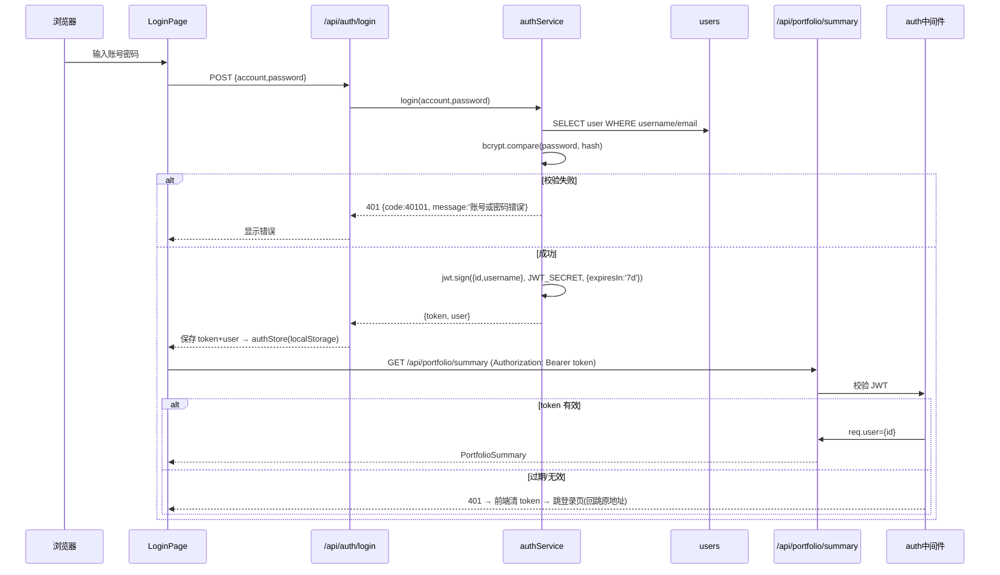
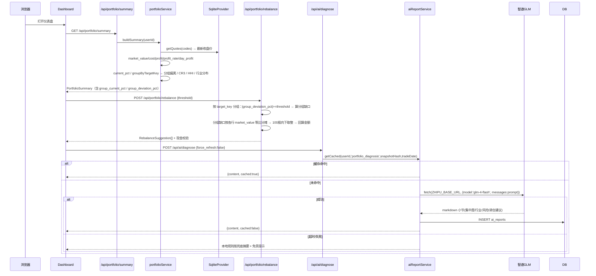
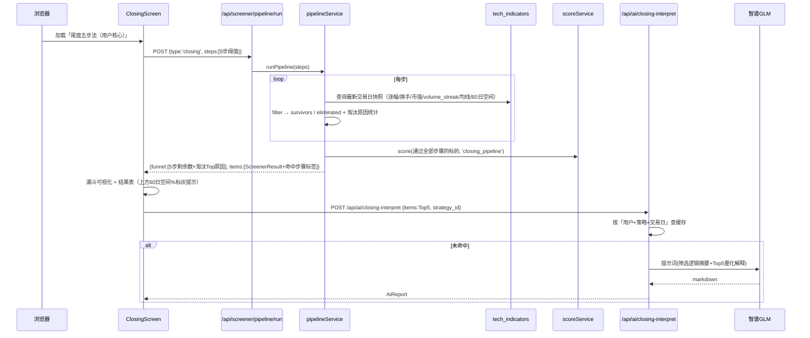
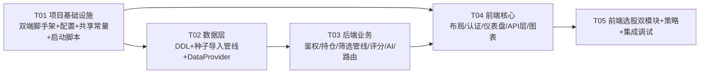

# QuantFolio 系统架构设计（DESIGN）

> 版本：v1.1　|　撰写：高见远（Architect）　|　上游输入：PRD v1.0 + data/README.md + seed-market.json + SCREENING_RULES.md（用户核心方法论）
> 状态：待评审
> 硬约束（已与用户确认，不得推翻）：后端 Node.js + Express + SQLite(better-sqlite3) + JWT + bcrypt；前端 Vite + React + MUI + Tailwind；AI = 智谱 GLM-4-flash 真实调用；本地可运行 + start.bat/start.sh；前后端分离（后端 3001 / 前端 5173，Vite proxy `/api`）。

---

## 0. 种子数据真实性与派生边界（架构前提）

`data/seed-market.json` 实测统计（2026-08-07 通达信真实收盘快照）：

| 项 | 实测值 | 说明 |
|---|---|---|
| 标的池 | **97 个**（77 只 A 股 + 20 只 ETF） | 与 PRD Q7「300~800 只」不符 → UI 全市场数量一律 `SELECT COUNT(*)`，不写死 |
| 交易日 | 仅 1 日（2026-08-07，周五） | 无历史 K 线 → 派生 250 日序列 |
| 技术指标 | 无数值，但有真实 tags | 指标值由派生 K 线计算；tags 作为真实形态标签 |
| 竞价数据 | 无 | 由派生 K 线 open 反推 |
| 资金流 | 仅 19 只有 `mainNetInflow`（单位**元**） | 真实值优先，其余确定性派生（单位统一转**万元**入库） |
| 涨停记录 | 21 只有 `limitUp`（16 只含 sealAmount/firstTime/openTimes） | 直接入库；另按「涨幅≥涨跌停幅」补充派生记录 |
| PE / 股息率 | 仅 16 只低 PE 组真实 | 其余按行业带确定性派生，真实值优先 |
| 换手率 / 流通市值 | 全部有（部分同量级估算） | 直接入库，origin 标 `mixed` |
| 板块 | 52 个 sector / 20 个 industry | hot_sectors 按 sector 聚合真实涨跌幅 |

**三条数据红线（不可协商）**：
1. **绝不编造代码/名称**：标的池恒为这 97 个真实标的。UI 全市场数量 = DB 真实 count。
2. **派生必须确定性**：以 `code` 为种子（mulberry32），同一 code 每次结果完全一致，QA 可写断言。
3. **派生 K 线末根精确锚定**：`close = price` 且该日 `pct_chg = changePct`（`prevClose = price/(1+changePct/100)` 精确反推）。

---

## 1. 实现方案与框架选型

### 1.1 核心难点与对策

| 难点 | 对策 |
|---|---|
| 无历史 K 线但需 MACD/RSI/KDJ/MA | 确定性回溯生成 250 根日线 + 末根锚定；tags 驱动形态模板提高指标命中率 |
| 指标体系存在「真实 tags vs 派生计算值」双源 | 双通道：`indicator_hit`（计算）与 `seed_tags`（真实）并列，筛选用 OR 语义，UI 可交叉校验 |
| 早盘竞价/资金流缺失 | 由 open/amount 确定性反推；真实值优先 |
| 尾盘五步法/早盘七步法是有序漏斗 | 抽象 `ScreeningPipeline`（steps 数组 + 逐级 filter + 淘汰统计），与 PRD 通用指标筛选器并行 |
| 同一用户同一天 AI 重复调用 | `ai_reports` 按 ref_key+trade_date 缓存 |
| Windows 下原生模块 | better-sqlite3 走预编译二进制 + 驱动适配层降级方案 |

### 1.2 框架与第三方库选型

**后端（server/，Node ≥ 18，ESM）**：

| 库 | 版本 | 用途 | 理由 |
|---|---|---|---|
| express | ^4.19.2 | HTTP 框架 | 生态成熟 |
| better-sqlite3 | ^11.3.0 | SQLite 驱动（同步） | 同步 API 简单可靠；原生模块，Windows 有预编译二进制（详见 §9 降级方案） |
| jsonwebtoken | ^9.0.2 | JWT 签发/校验 | 标准实现 |
| bcryptjs | ^2.4.3 | 密码哈希 | 纯 JS，**避免 Windows 编译 bcrypt 原生模块**；saltRounds=10 |
| zod | ^3.23.8 | 请求体校验 | 单一校验源，类型安全 |
| dotenv | ^16.4.5 | 环境变量 | 标准 |
| cors | ^2.8.5 | 跨域（开发期） | Vite proxy 下其实可省，保留兜底 |
| nodemon | ^3.1.0 (dev) | 热重载 | 开发体验 |
| vitest | ^2.0.5 (dev) | 单测 | 与前端统一测试框架 |

> AI 调用：Node ≥18 原生 `fetch` + `AbortController`（20s 超时），**不引入 axios**，少一个依赖。

**前端（client/，Vite + React 18，TypeScript）**：

| 库 | 版本 | 用途 | 理由 |
|---|---|---|---|
| react / react-dom | ^18.3.1 | UI 框架 | 生态稳定（MUI 官方适配 v18） |
| react-router-dom | ^6.26.0 | 路由 | 标准方案 |
| @mui/material + @emotion/* | ^5.16.0 | 组件库 | 表格/表单/弹窗成熟 |
| @mui/x-data-grid | ^7.22.0 | 数据表格 | 排序/分页/列显隐开箱即用；若 peer 冲突降级 ^6.20.4 |
| tailwindcss | ^3.4.10 | 原子 CSS（间距/栅格/微调） | 与 MUI 共存：**关闭 preflight**，避免重置冲突 |
| zustand | ^4.5.4 | 轻量状态（auth/theme） | **不引 Redux 全家桶**；服务端数据走 axios + 自定义 hook |
| axios | ^1.7.4 | HTTP | 拦截器统一 token/信封解包 |
| echarts + echarts-for-react | ^5.5.1 / ^3.0.2 | 图表（环形/K线/雷达） | 唯一同时支持 K 线与雷达图的主流库 |
| vite | ^5.4.0 (dev) | 构建 | 官方指定 |
| typescript | ^5.5.0 (dev) | 类型 | 前端启用（strict 适度） |
| @vitejs/plugin-react | ^4.3.0 (dev) | React 插件 | 官方 |
| vitest | ^2.0.5 (dev) | 单测 | 与后端统一 |

**根目录**：`concurrently`（一键并行起前后端）、`start.bat` / `start.sh`。

> CSV 导出：**手写**（UTF-8 BOM + 引号转义，约 30 行），不引 papaparse；CSV 导入同理手写解析。

### 1.3 架构模式

- 后端：**分层架构**（routes → services → models → providers）+ **DataProvider 适配器模式**（SQLite 默认 / HTTP 预留）。
- 前端：**页面 + 组件 + hooks + 轻量 store**（无重型状态管理）。
- 跨端共享：根目录 `shared/` 纯 ESM 常量（枚举、错误码、默认阈值），前后端各自引入（见 §10）。

---

## 2. 完整文件列表

> 图例：类型 — `cfg` 配置 / `ent` 入口 / `mid` 中间件 / `mod` 数据访问 / `prov` 数据源 / `srv` 业务 / `rt` 路由 / `seed` 种子 / `util` 工具 / `test` 测试 / `comp` 组件 / `page` 页面 / `hook` 钩子 / `api` 前端接口 / `store` 状态。依赖列为主依赖（省略语言内置）。

### 2.1 根目录

| 相对路径 | 类型 | 职责 | 依赖 |
|---|---|---|---|
| `package.json` | cfg | 根脚本：`postinstall`(装前后端)、`dev`(concurrently)、`seed`、`test` | — |
| `start.bat` | cfg | Windows 一键启动：装依赖→初始化→seed→并行起前后端 | — |
| `start.sh` | cfg | macOS/Linux 一键启动 | — |
| `.env.example` | cfg | 全部环境变量示例（PORT/JWT_SECRET/ZHIPU_API_KEY/DATA_PROVIDER/DB_PATH） | — |
| `.env` | cfg | 本地实际配置（不入库 git） | — |
| `README.md` | cfg | 使用说明 | — |
| `shared/constants.js` | util | 前后端共享枚举/错误码/涨跌色/阈值默认值 | — |
| `shared/constants.d.ts` | cfg | constants.js 的 TS 声明（供前端类型提示） | constants.js |

### 2.2 server/

| 相对路径 | 类型 | 职责 | 依赖 |
|---|---|---|---|
| `server/package.json` | cfg | 后端依赖与脚本 | — |
| `server/src/index.js` | ent | 服务启动（读 env→建库→注册路由→listen 3001） | 全部 |
| `server/src/app.js` | ent | Express 装配（json/cors/路由/错误兜底） | routes, middleware |
| `server/src/config/env.js` | cfg | 环境变量解析与校验 | dotenv |
| `server/src/config/scoring.js` | cfg | 通用评分权重（M-03/C-11）与归一化断点 | — |
| `server/src/config/screening-defaults.js` | cfg | 五步法/七步法默认阈值（用户可覆盖保存） | — |
| `server/src/db/driver.js` | mod | **数据库驱动适配层**（唯一允许 import better-sqlite3 的文件；封装 prepare/exec/transaction/pragma；切换 node:sqlite 或 sql.js 只改这里） | better-sqlite3 |
| `server/src/db/schema.js` | mod | 全部 DDL（见 §3）+ 种子元数据表初始化 | driver |
| `server/src/middleware/auth.js` | mid | JWT 校验 → req.user；游客模式放行策略 | jsonwebtoken |
| `server/src/middleware/error.js` | mid | 统一错误处理（ApiError→信封） | util/errors |
| `server/src/middleware/validate.js` | mid | zod 请求体校验 | zod |
| `server/src/models/userModel.js` | mod | users CRUD + bcrypt 哈希 | driver |
| `server/src/models/securityModel.js` | mod | securities / tags / daily_quotes 查询 | driver |
| `server/src/models/portfolioModel.js` | mod | holdings / target_allocations / user_settings | driver |
| `server/src/models/strategyModel.js` | mod | strategies CRUD | driver |
| `server/src/models/aiReportModel.js` | mod | ai_reports 缓存读写 | driver |
| `server/src/models/watchlistModel.js` | mod | watchlist CRUD | driver |
| `server/src/providers/dataProvider.js` | prov | DataProvider 接口定义 + getProvider 工厂（env.DATA_PROVIDER） | config/env |
| `server/src/providers/sqliteProvider.js` | prov | 默认实现：getQuote/getQuotes/getDailyKline/listSecurities/getSectorInfo/getLatestSnapshot | securityModel |
| `server/src/providers/httpProvider.js` | prov | 预留 HTTP 数据源适配位（读 MARKET_API_BASE，抛「未实现」提示） | — |
| `server/src/services/authService.js` | srv | 注册/登录/登出/改密/me；JWT 签发 | userModel, util |
| `server/src/services/portfolioService.js` | srv | 持仓 CRUD、估值、汇总卡片、资产配置偏离 | portfolioModel, sqliteProvider, util/money |
| `server/src/services/rebalanceService.js` | srv | 再平衡建议：按 target_key 分组算缺口 → 按市值等比分摊到行 → 100 股向下取整、现金校验 | portfolioService, util/money |
| `server/src/services/indicatorService.js` | srv | MA/MACD/RSI/KDJ/vol_ratio/volume_streak/high_60d_distance 计算 | util/indicators |
| `server/src/services/screenerService.js` | srv | 通用筛选器：条件解析 + AND 过滤 + 命中标签（C-01~C-09, M-01~M-02） | securityModel, indicatorService |
| `server/src/services/pipelineService.js` | srv | **五步法/七步法有序漏斗**：执行 steps、淘汰统计、命中步骤标签、宽松模式 | screening-defaults, indicatorService |
| `server/src/services/scoreService.js` | srv | M-03 早盘通用评分 + C-11 尾盘通用评分（分位/分段归一化） | config/scoring, util/percentile |
| `server/src/services/aiService.js` | srv | GLM-4-flash 统一封装（fetch + 20s 超时 + 降级文案 + 结构化小节解析） | config/env |
| `server/src/services/aiReportService.js` | srv | 缓存命中/强制刷新/游客 ref_key | aiReportModel, aiService |
| `server/src/services/marketService.js` | srv | 行情快照、板块热度、竞价榜 Top60、数据来源元信息 | securityModel, sqliteProvider |
| `server/src/ai/prompts.js` | util | 三套 Prompt 模板（portfolio_diagnosis / morning_comment / closing_interpretation） | — |
| `server/src/routes/authRoutes.js` | rt | /api/auth/* | authService |
| `server/src/routes/portfolioRoutes.js` | rt | /api/portfolio/*（holdings、summary、targets、rebalance） | portfolioService, rebalanceService |
| `server/src/routes/screenerRoutes.js` | rt | /api/screener/*（morning、closing、pipeline、auction-leaderboard、presets） | screenerService, pipelineService, scoreService |
| `server/src/routes/strategyRoutes.js` | rt | /api/strategies/* | strategyModel |
| `server/src/routes/aiRoutes.js` | rt | /api/ai/*（diagnose/comment/interpret） | aiReportService |
| `server/src/routes/marketRoutes.js` | rt | /api/market/*（overview、search、kline、sectors、meta、lineage、watchlist） | marketService |
| `server/src/util/response.js` | util | ok()/fail() 统一信封 | — |
| `server/src/util/errors.js` | util | ApiError + 错误码枚举 | — |
| `server/src/util/money.js` | util | 金额/百分比精度、股数取整规则（A股100股/基金份） | — |
| `server/src/util/rng.js` | util | mulberry32(code 种子) 确定性伪随机 | — |
| `server/src/util/tradingCalendar.js` | util | 交易日历生成（跳过周末；节假日按固定表） | — |
| `server/src/util/indicators.js` | util | SMA/EMA/MACD/RSI/KDJ 纯函数（可单测） | — |
| `server/src/seed/run.js` | seed | `npm run seed` CLI 入口：清库→建表→导入→派生→验证→写 meta | 全部 seed 模块 |
| `server/src/seed/loadSeed.js` | seed | 读 data/seed-market.json + 字段清洗 | — |
| `server/src/seed/securities.js` | seed | 写 securities + security_tags + 派生 list_date/float_share/total_share/pe/pb/dividend_yield | util/rng |
| `server/src/seed/klineGenerator.js` | seed | 250 日派生 K 线（末根锚定）+ 形态模板注入 + 一致性校验 | util/rng, util/tradingCalendar |
| `server/src/seed/derivedFields.js` | seed | volume_ratio/volume_streak/high_60d_distance_pct 计算 | util/indicators |
| `server/src/seed/indicators.js` | seed | 批量写 tech_indicators（含 indicator_hit 判定） | util/indicators |
| `server/src/seed/moneyFlow.js` | seed | money_flow 派生（真实优先）+ auction_data 反推（含 first_trade_vol_ratio） | util/rng |
| `server/src/seed/limitRecords.js` | seed | limit_records 导入 + 补充派生涨停记录 | — |
| `server/src/seed/hotSectors.js` | seed | hot_sectors 聚合（sector/industry 双维度） | — |
| `server/src/seed/demoPortfolio.js` | seed | demo 持仓（user_id=NULL）+ demo 目标配置 + demo 策略（五步法/七步法模板） | — |
| `server/src/seed/meta.js` | seed | meta_kv 数据来源/版本/合规信息 | — |
| `server/src/seed/verify.js` | seed | 校验：K 线末根锚定、指标无 NaN、tags 命中率、数量=97 | — |
| `server/tests/score.test.js` | test | 评分模型单测 | vitest |
| `server/tests/rebalance.test.js` | test | 再平衡取整/现金校验单测 | vitest |
| `server/tests/rebalance_grouping.test.js` | test | ★ P1 分组口径回归：多行同类别不重复套目标、分摊、阈值、code 维度不回归、取整对账 | vitest |
| `scripts/verify-p1-rebalance.mjs` | script | P1 缺陷端到端复现验证脚本（打真实 HTTP 链路） | node fetch |
| `server/tests/indicators.test.js` | test | 指标纯函数单测 | vitest |
| `server/tests/pipeline.test.js` | test | 五步法/七步法漏斗单测 | vitest |

### 2.3 client/

| 相对路径 | 类型 | 职责 | 依赖 |
|---|---|---|---|
| `client/package.json` | cfg | 前端依赖与脚本 | — |
| `client/vite.config.ts` | cfg | proxy /api→3001、alias `@`、`shared` fs.allow | — |
| `client/tsconfig.json` | cfg | TS 配置 | — |
| `client/tailwind.config.js` | cfg | **corePlugins.preflight=false**（与 MUI 共存） | — |
| `client/postcss.config.js` | cfg | Tailwind 管线 | — |
| `client/index.html` | cfg | 入口 HTML | — |
| `client/src/main.tsx` | ent | React 挂载 + ThemeProvider + Router | — |
| `client/src/App.tsx` | ent | 路由表 + 布局包裹 + 路由守卫 | — |
| `client/src/theme/index.ts` | cfg | MUI 深/浅主题 + **涨跌色常量导入**（红涨绿跌） | shared/constants |
| `client/src/api/http.ts` | api | axios 实例：baseURL=/api、token 注入、信封解包、401 跳登录 | axios |
| `client/src/api/auth.ts` | api | 注册/登录/登出/me | http |
| `client/src/api/portfolio.ts` | api | holdings/summary/targets/rebalance/import | http |
| `client/src/api/screener.ts` | api | morning/closing/pipeline/auction-leaderboard/presets | http |
| `client/src/api/strategy.ts` | api | strategies CRUD | http |
| `client/src/api/ai.ts` | api | diagnose/comment/interpret | http |
| `client/src/api/market.ts` | api | overview/search/kline/sectors/meta/lineage | http |
| `client/src/store/authStore.ts` | store | token/user 持久化（localStorage）+ 登录态 | zustand |
| `client/src/store/uiStore.ts` | store | 主题切换/全局 loading/侧栏折叠 | zustand |
| `client/src/hooks/useApi.ts` | hook | 请求封装（loading/error/data + 手动刷新） | http |
| `client/src/hooks/useTableSort.ts` | hook | 列排序状态机 | — |
| `client/src/hooks/useDebounce.ts` | hook | 防抖（搜索/预计命中数） | — |
| `client/src/utils/format.ts` | util | 金额千分位/百分比/涨跌色/评分色 | shared/constants |
| `client/src/components/layout/AppLayout.tsx` | comp | 顶栏+侧栏+内容区布局 | — |
| `client/src/components/layout/TopBar.tsx` | comp | Logo/搜索框/主题切换/用户菜单 | — |
| `client/src/components/layout/SideBar.tsx` | comp | 导航 + 游客提示卡 | — |
| `client/src/components/layout/DisclaimerBar.tsx` | comp | 底部合规免责声明 | — |
| `client/src/components/common/StatCard.tsx` | comp | 汇总卡片 | — |
| `client/src/components/common/DataTable.tsx` | comp | 通用表格（排序/分页/空态） | @mui/x-data-grid |
| `client/src/components/common/ProgressScore.tsx` | comp | 评分进度条（≥80红/60-80橙/<60灰） | — |
| `client/src/components/common/TagChip.tsx` | comp | 命中指标 Chip | — |
| `client/src/components/common/DataOriginBadge.tsx` | comp | 「真实行情/派生数据」来源徽章 | — |
| `client/src/components/common/ConfirmDialog.tsx` | comp | 确认弹窗 | — |
| `client/src/components/common/Loading.tsx` | comp | Skeleton | — |
| `client/src/components/common/SnackbarProvider.tsx` | comp | 全局提示 | — |
| `client/src/components/charts/DonutChart.tsx` | comp | 配置环形图 | echarts |
| `client/src/components/charts/KlineChart.tsx` | comp | 个股 K 线（标注真实/派生） | echarts |
| `client/src/components/charts/RadarChart.tsx` | comp | 评分雷达图 | echarts |
| `client/src/components/ai/AiPanel.tsx` | comp | AI 输出面板（小节渲染/重新生成/免责声明/降级提示） | — |
| `client/src/components/portfolio/SummaryCards.tsx` | comp | 仪表盘 5 张汇总卡 | — |
| `client/src/components/portfolio/HoldingsTable.tsx` | comp | 持仓明细表（可排序） | — |
| `client/src/components/portfolio/HoldingDialog.tsx` | comp | 添加/编辑持仓弹窗（代码搜索带出） | — |
| `client/src/components/portfolio/CsvImportDialog.tsx` | comp | CSV 导入弹窗 | — |
| `client/src/components/portfolio/TargetDialog.tsx` | comp | 目标配置弹窗（Σ=100 校验） | — |
| `client/src/components/portfolio/AllocationPanel.tsx` | comp | 当前/目标配置对比（维度切换） | DonutChart |
| `client/src/components/portfolio/RebalancePanel.tsx` | comp | 再平衡建议 + 阈值 + 现金警示 | — |
| `client/src/components/screener/ConditionPanelMorning.tsx` | comp | 早盘 7 类条件面板 | — |
| `client/src/components/screener/ConditionPanelClosing.tsx` | comp | 尾盘指标面板（趋势/动能/量能/估值分组） | — |
| `client/src/components/screener/PipelineFunnel.tsx` | comp | **漏斗可视化**（每步剩余数量+淘汰原因 Top3） | — |
| `client/src/components/screener/AuctionLeaderboard.tsx` | comp | 竞价涨幅 Top60 独立榜 | — |
| `client/src/components/screener/ScreenerResultsTable.tsx` | comp | 结果表（命中标签/评分排序/导出CSV） | — |
| `client/src/components/screener/StockDetailDrawer.tsx` | comp | 个股详情抽屉（K线+雷达+数据来源） | — |
| `client/src/components/screener/StrategySaveDialog.tsx` | comp | 保存为我的策略 | — |
| `client/src/pages/LoginPage.tsx` | page | 登录/注册（含演示模式入口） | — |
| `client/src/pages/PortfolioDashboard.tsx` | page | 模块一：仪表盘 | — |
| `client/src/pages/MorningScreen.tsx` | page | 模块二：早盘选股（七步法漏斗+竞价榜+AI） | — |
| `client/src/pages/ClosingScreen.tsx` | page | 模块三：尾盘选股（五步法漏斗+指标筛选+AI） | — |
| `client/src/pages/StrategiesPage.tsx` | page | 我的策略（列表/应用/重命名/删除） | — |
| `client/src/pages/WatchlistPage.tsx` | page | 我的自选 | — |
| `client/src/pages/NotFound.tsx` | page | 404 | — |

---

## 3. 数据库 Schema（SQLite DDL）

> **SQLite 类型取舍**：无原生 BOOLEAN → `INTEGER 0/1` + CHECK；无 DECIMAL → 金额/价格用 `REAL`（双精度 15~16 位有效数字足够），**精度在应用层统一四舍五入**（见 §10）；枚举用 `TEXT` + CHECK；日期用 `TEXT 'YYYY-MM-DD'`；时间戳用 `TEXT` ISO8601 UTC。**所有业务表带 `data_origin` 列**（`real|derived|mixed`）满足合规标注。
>
> 单位约定：`securities.circ_mv / total_mv` 存**亿元**（展示直接读）；`daily_quotes.amount` 存**元**；`money_flow.main_net_inflow` 存**万元**（PRD 口径，seed 原始为元，导入时 ÷10000）；`limit_records.seal_amount` 存**元**；`hot_sectors` 的成交额存**亿元**。

```sql
PRAGMA journal_mode=WAL;
PRAGMA foreign_keys=ON;

-- 1) 用户
CREATE TABLE users (
  id            INTEGER PRIMARY KEY AUTOINCREMENT,
  username      TEXT NOT NULL UNIQUE,
  email         TEXT NOT NULL UNIQUE,
  password_hash TEXT NOT NULL,
  created_at    TEXT NOT NULL DEFAULT (datetime('now')),
  updated_at    TEXT NOT NULL DEFAULT (datetime('now'))
);

-- 2) 证券主表（97 个真实标的）
CREATE TABLE securities (
  id              INTEGER PRIMARY KEY AUTOINCREMENT,
  code            TEXT NOT NULL UNIQUE,          -- 600519 / 516080
  name            TEXT NOT NULL,
  market          TEXT NOT NULL CHECK (market IN ('SH','SZ','BJ')),
  type            TEXT NOT NULL CHECK (type IN ('stock','fund','index')),
  board           TEXT NOT NULL,                 -- SH-Main10/SZ-Main10/ChiNext20/STAR20/BSE30
  price_limit_pct REAL NOT NULL,                 -- 10/20/30（ST 5）
  industry        TEXT,                          -- 行业（20 个）
  sector          TEXT,                          -- 概念板块（52 个）
  list_date       TEXT,                          -- 派生：标签「次新股」→ 近 20~200 日，否则 400~7000 日
  is_st           INTEGER NOT NULL DEFAULT 0 CHECK (is_st IN (0,1)),
  is_index_member INTEGER NOT NULL DEFAULT 0 CHECK (is_index_member IN (0,1)),
  index_name      TEXT,                          -- 沪深300 等
  float_share     REAL,                          -- 流通股（股）由 circ_mv/price 反推
  total_share     REAL,                          -- 总股本（股）= float_share / float_ratio
  circ_mv         REAL,                          -- 流通市值（亿元）
  total_mv        REAL,                          -- 总市值（亿元）派生
  pe_ttm          REAL,                          -- 真实 16 只优先，其余行业带派生
  pb              REAL,
  dividend_yield  REAL,                          -- %（seed 为小数，导入 ×100）
  fund_category   TEXT,                          -- ETF：行业ETF/跨境ETF/科创ETF
  fund_track      TEXT,                          -- ETF 跟踪指数
  data_origin     TEXT NOT NULL DEFAULT 'real' CHECK (data_origin IN ('real','derived','mixed')),
  created_at      TEXT NOT NULL DEFAULT (datetime('now'))
);
CREATE INDEX idx_sec_type   ON securities(type);
CREATE INDEX idx_sec_sector ON securities(sector);
CREATE INDEX idx_sec_industry ON securities(industry);
CREATE INDEX idx_sec_mv     ON securities(circ_mv);

-- 3) 真实形态标签（通达信 tags，双通道之一）
CREATE TABLE security_tags (
  id         INTEGER PRIMARY KEY AUTOINCREMENT,
  code       TEXT NOT NULL,
  tag        TEXT NOT NULL,
  data_origin TEXT NOT NULL DEFAULT 'real',
  UNIQUE (code, tag),
  FOREIGN KEY (code) REFERENCES securities(code)
);
CREATE INDEX idx_tags_tag ON security_tags(tag);

-- 4) 日线行情（末根为真实锚定，前 249 根派生）
CREATE TABLE daily_quotes (
  code          TEXT NOT NULL,
  trade_date    TEXT NOT NULL,
  open          REAL, high REAL, low REAL, close REAL NOT NULL,
  pre_close     REAL,
  volume        REAL NOT NULL,       -- 股/份（基金统一由「手×100」转股）
  amount        REAL,                -- 元
  pct_chg       REAL,
  turnover_rate REAL,
  volume_ratio  REAL,                -- 当日量 / 前5日均量（同 vol_ratio_5）
  pe_ttm        REAL, pb REAL,
  total_mv      REAL, circ_mv REAL,  -- 亿元
  data_origin   TEXT NOT NULL DEFAULT 'derived' CHECK (data_origin IN ('real','derived','mixed')),
  PRIMARY KEY (code, trade_date),
  FOREIGN KEY (code) REFERENCES securities(code)
);
CREATE INDEX idx_dq_date ON daily_quotes(trade_date);
CREATE INDEX idx_dq_code_date ON daily_quotes(code, trade_date DESC);

-- 5) 技术指标（250 日全量，供图表/回测；含真实标签双通道）
CREATE TABLE tech_indicators (
  code        TEXT NOT NULL,
  trade_date  TEXT NOT NULL,
  ma5 REAL, ma10 REAL, ma20 REAL, ma60 REAL,
  macd_dif REAL, macd_dea REAL, macd_bar REAL,
  rsi6 REAL, rsi12 REAL, rsi24 REAL,
  kdj_k REAL, kdj_d REAL, kdj_j REAL,
  vol_ma5 REAL, vol_ratio_5 REAL,
  volume_streak INTEGER NOT NULL DEFAULT 0,      -- 连续放量天数（volume[t]>volume[t-1]）
  high_60d_distance_pct REAL,                    -- (max(high,60d)-close)/close*100
  macd_gold_cross INTEGER NOT NULL DEFAULT 0,    -- 今日金叉（DIF 上穿 DEA）
  macd_dead_cross INTEGER NOT NULL DEFAULT 0,
  macd_positive INTEGER NOT NULL DEFAULT 0,      -- DIF>0
  macd_hist_turn_positive INTEGER NOT NULL DEFAULT 0, -- 柱由负转正
  kdj_gold_cross INTEGER NOT NULL DEFAULT 0,
  kdj_dead_cross INTEGER NOT NULL DEFAULT 0,
  ma_bullish INTEGER NOT NULL DEFAULT 0,         -- MA5>MA10>MA20
  ma_bearish INTEGER NOT NULL DEFAULT 0,
  ma_above_20 INTEGER NOT NULL DEFAULT 0,        -- close>MA20
  ma_cross_above_5 INTEGER NOT NULL DEFAULT 0,   -- close 上穿 MA5
  indicator_hit TEXT NOT NULL DEFAULT '[]',      -- JSON：由计算值命中的标签（如 ["MACD金叉","多头排列"]）
  data_origin TEXT NOT NULL DEFAULT 'derived',
  PRIMARY KEY (code, trade_date),
  FOREIGN KEY (code) REFERENCES securities(code)
);
CREATE INDEX idx_ti_code_date ON tech_indicators(code, trade_date DESC);
CREATE INDEX idx_ti_date ON tech_indicators(trade_date);

-- 6) 资金流向（真实 19 只优先，其余派生；单位万元）
CREATE TABLE money_flow (
  code            TEXT NOT NULL,
  trade_date      TEXT NOT NULL,
  main_net_inflow REAL,        -- 主力净流入（万元）
  net_inflow_3d   REAL,        -- 近3日累计（万元）
  net_inflow_5d   REAL,        -- 近5日累计（万元）
  data_origin     TEXT NOT NULL DEFAULT 'derived',
  PRIMARY KEY (code, trade_date),
  FOREIGN KEY (code) REFERENCES securities(code)
);

-- 7) 竞价数据（由派生 K 线 open 反推；含首笔量比）
CREATE TABLE auction_data (
  code               TEXT NOT NULL,
  trade_date         TEXT NOT NULL,
  auction_price      REAL,
  auction_pct        REAL,     -- (open/pre_close-1)*100
  auction_volume     REAL,
  auction_amount     REAL,
  auction_vol_ratio  REAL,     -- 竞价量 / 昨日成交量
  first_trade_vol_ratio REAL,  -- 首笔成交量 / 前5日首笔均量（七步法第7步）
  data_origin        TEXT NOT NULL DEFAULT 'derived',
  PRIMARY KEY (code, trade_date),
  FOREIGN KEY (code) REFERENCES securities(code)
);

-- 8) 连板/涨停记录（21 只真实 + 补充派生）
CREATE TABLE limit_records (
  id               INTEGER PRIMARY KEY AUTOINCREMENT,
  code             TEXT NOT NULL,
  trade_date       TEXT NOT NULL,
  limit_type       TEXT NOT NULL CHECK (limit_type IN ('limit_up','limit_down','break_board')),
  limit_up_streak  INTEGER NOT NULL DEFAULT 1,
  pattern          TEXT,        -- "4天2板" 等
  reason           TEXT,
  seal_amount      REAL,        -- 封单额（元）
  first_limit_time TEXT,        -- "09:31:01"
  open_times       INTEGER,
  data_origin      TEXT NOT NULL DEFAULT 'real',
  FOREIGN KEY (code) REFERENCES securities(code)
);
CREATE INDEX idx_lr_code_date ON limit_records(code, trade_date);

-- 9) 热点板块（sector/industry 双维度聚合，P1）
CREATE TABLE hot_sectors (
  id              INTEGER PRIMARY KEY AUTOINCREMENT,
  dimension       TEXT NOT NULL CHECK (dimension IN ('sector','industry')),
  sector_name     TEXT NOT NULL,
  trade_date      TEXT NOT NULL,
  sector_pct_chg  REAL,           -- 成分股成交额加权平均涨幅（%）
  hot_rank        INTEGER,        -- 按涨幅降序
  leading_stock   TEXT,           -- 涨幅最高成分股 code
  stock_count     INTEGER,
  total_amount    REAL,           -- 成交额（亿元）
  total_main_inflow REAL,         -- 主力净流入合计（万元）
  data_origin     TEXT NOT NULL DEFAULT 'derived',
  UNIQUE (dimension, sector_name, trade_date)
);

-- 10) 持仓
CREATE TABLE holdings (
  id          INTEGER PRIMARY KEY AUTOINCREMENT,
  user_id     INTEGER,            -- NULL = 游客 demo
  code        TEXT,               -- asset_class='cash' 时为 NULL
  name        TEXT NOT NULL,
  asset_class TEXT NOT NULL CHECK (asset_class IN ('stock','fund','cash','bond','other')),
  quantity    REAL NOT NULL CHECK (quantity >= 0),
  cost_price  REAL NOT NULL DEFAULT 0,
  created_at  TEXT NOT NULL DEFAULT (datetime('now')),
  updated_at  TEXT NOT NULL DEFAULT (datetime('now')),
  FOREIGN KEY (user_id) REFERENCES users(id) ON DELETE CASCADE
);
CREATE INDEX idx_holdings_user ON holdings(user_id);

-- 11) 目标配置（同一 dimension 下 Σtarget_pct=100，应用层校验）
CREATE TABLE target_allocations (
  id         INTEGER PRIMARY KEY AUTOINCREMENT,
  user_id    INTEGER,
  dimension  TEXT NOT NULL CHECK (dimension IN ('asset_class','industry','code')),
  target_key TEXT NOT NULL,       -- stock / 白酒 / 600519
  target_pct REAL NOT NULL CHECK (target_pct >= 0 AND target_pct <= 100),
  created_at TEXT NOT NULL DEFAULT (datetime('now')),
  updated_at TEXT NOT NULL DEFAULT (datetime('now')),
  UNIQUE (user_id, dimension, target_key),
  FOREIGN KEY (user_id) REFERENCES users(id) ON DELETE CASCADE
);

-- 12) 用户设置（再平衡阈值、激活维度）
CREATE TABLE user_settings (
  user_id            INTEGER PRIMARY KEY,
  rebalance_threshold REAL NOT NULL DEFAULT 5,
  active_dimension   TEXT NOT NULL DEFAULT 'asset_class',
  morning_loose_mode INTEGER NOT NULL DEFAULT 0, -- 七步法第4步宽松模式（<10亿→<30亿）
  FOREIGN KEY (user_id) REFERENCES users(id) ON DELETE CASCADE
);

-- 13) 策略（conditions JSON，见 §5 ScreenerCondition）
CREATE TABLE strategies (
  id         INTEGER PRIMARY KEY AUTOINCREMENT,
  user_id    INTEGER,            -- NULL = 预置模板
  name       TEXT NOT NULL,
  type       TEXT NOT NULL CHECK (type IN ('morning','closing','pipeline_morning','pipeline_closing')),
  conditions TEXT NOT NULL,       -- JSON
  is_preset  INTEGER NOT NULL DEFAULT 0,
  created_at TEXT NOT NULL DEFAULT (datetime('now')),
  updated_at TEXT NOT NULL DEFAULT (datetime('now')),
  FOREIGN KEY (user_id) REFERENCES users(id) ON DELETE CASCADE
);
CREATE INDEX idx_strategies_user ON strategies(user_id);

-- 14) AI 报告缓存
CREATE TABLE ai_reports (
  id          INTEGER PRIMARY KEY AUTOINCREMENT,
  user_id     INTEGER,            -- NULL = 游客
  report_type TEXT NOT NULL CHECK (report_type IN ('portfolio_diagnosis','morning_comment','closing_interpretation')),
  ref_key     TEXT NOT NULL,      -- 策略id / 组合快照哈希 / 'demo'
  trade_date  TEXT NOT NULL,
  content     TEXT NOT NULL,
  created_at  TEXT NOT NULL DEFAULT (datetime('now')),
  UNIQUE (user_id, report_type, ref_key, trade_date)
);

-- 15) 自选股
CREATE TABLE watchlist (
  id         INTEGER PRIMARY KEY AUTOINCREMENT,
  user_id    INTEGER NOT NULL,
  code       TEXT NOT NULL,
  created_at TEXT NOT NULL DEFAULT (datetime('now')),
  UNIQUE (user_id, code),
  FOREIGN KEY (user_id) REFERENCES users(id) ON DELETE CASCADE
);

-- 16) 数据来源元信息（合规标注）
CREATE TABLE meta_kv (
  k TEXT PRIMARY KEY,
  v TEXT NOT NULL
);
-- 预置键：seed_version / trade_date / stock_count / fund_count /
--        lineage_json（{"securities":"real+mixed","daily_quotes":"real(末根)+derived(249)","tech_indicators":"derived","money_flow":"real(19)+derived","auction_data":"derived","limit_records":"real(21)+derived","hot_sectors":"derived"}）
```

---

## 4. REST API 契约

统一响应包：`{ success: boolean, data: any, message: string, code: number }`；`code` 前三位 = HTTP 状态（400/401/403/404/409/500/504）。错误码枚举见 §10。

> 游客模式：`/api/portfolio/*`、`/api/strategies`、`/api/ai/*` 在无 token 时自动落到 demo 数据（`user_id IS NULL`）；写操作返回 `code 401` + message「请先登录」。

### 4.1 认证 auth

| Method | Path | 鉴权 | 请求体/查询参数 | 响应 data | 说明 |
|---|---|---|---|---|---|
| POST | /api/auth/register | 无 | `{username, email, password(≥8)}` | `{token, user:{id,username,email}}` | 唯一性冲突→409 |
| POST | /api/auth/login | 无 | `{account(email或username), password}` | `{token, user}` | exp 7 天 |
| POST | /api/auth/logout | 有 | — | `null` | 语义接口，前端清 token |
| GET | /api/auth/me | 有 | — | `{id,username,email,created_at}` | — |
| PUT | /api/auth/password | 有 | `{old_password,new_password}` | `null` | P1 |

### 4.2 组合 portfolio

| Method | Path | 鉴权 | 请求体/查询参数 | 响应 data | 说明 |
|---|---|---|---|---|---|
| GET | /api/portfolio/holdings | 可选 | `?asset_class=` | `{holdings:[Holding], as_of:'2026-08-07'}` | 游客返回 demo |
| POST | /api/portfolio/holdings | 有 | `{code?,name,asset_class,quantity,cost_price}` | `Holding` | 现金行 code=null |
| PUT | /api/portfolio/holdings/:id | 有 | 同 POST | `Holding` | — |
| DELETE | /api/portfolio/holdings/:id | 有 | — | `null` | — |
| POST | /api/portfolio/holdings/import | 有 | `{csv_text}` 或 multipart | `{imported, skipped, errors:[{row,msg}]}` | P1 |
| GET | /api/portfolio/summary | 可选 | — | `PortfolioSummary`（总资产/盈亏/当日盈亏/明细/占比） | — |
| GET | /api/portfolio/targets | 可选 | `?dimension=` | `{dimension, items:[{target_key,target_pct}]}` | — |
| PUT | /api/portfolio/targets | 有 | `{dimension, items:[{target_key,target_pct}]}` | `null` | Σ=100 否则 400 |
| GET | /api/portfolio/settings | 可选 | — | `{rebalance_threshold, active_dimension, morning_loose_mode}` | 游客默认值 |
| PUT | /api/portfolio/settings | 有 | 同 GET | `null` | — |
| POST | /api/portfolio/rebalance | 可选 | `{threshold?, dimension?}` | `{items:[RebalanceSuggestion], summary:{buy_total,sell_total,need_cash,balance_ok,cash_available,threshold,dimension,planned_buy_total,planned_sell_total,rounding_residual_buy,rounding_residual_sell}}` | ★ 先按 target_key 分组算缺口再分摊到行；股票 100 股向下取整 |

#### 4.2.1 ★ 配置偏离与再平衡的「分组口径」契约（P1 修复后）

`target_pct` 的语义始终是 **整个 `target_key` 分组的目标百分比**，不是单行目标。因此偏离度必须用分组当前占比去比：

```
group_current_pct   = Σ(该 key 下所有持仓 market_value) / total_asset × 100
group_deviation_pct = group_current_pct − target_pct
```

**Holding 行上的占比/偏离字段语义：**

| 字段 | 口径 | 用途 |
|---|---|---|
| `current_pct` | **单行**市值 ÷ 总资产 | 明细表「当前占比」列 |
| `target_key` | 该行所属分组键 | 分组标识 |
| `target_pct` | **分组**目标百分比 | 明细表「类别目标」列 |
| `group_current_pct` | **分组**当前占比（Σ 同 key 市值） | 明细表「类别占比」列 |
| `group_market_value` | **分组**市值合计 | 再平衡缺口计算 |
| `group_deviation_pct` | `group_current_pct − target_pct` | 阈值判定唯一依据 |
| `deviation_pct` | **等于 `group_deviation_pct`**（分组口径） | 明细表「类别偏离」列；与 allocation / rebalance 同源 |
| `deviation_ratio` | 分组相对偏离 % | 辅助展示 |
| `row_deviation_pct` | `current_pct − target_pct`（**行级**） | 仅供参考，**不参与任何再平衡判定** |

> ⚠ 契约要点：`deviation_pct` 已统一为分组口径。前端与 AI prompt 一律直接读该字段，**禁止**再用 `current_pct − target_pct` 自行推算——那正是 P1 缺陷的来源。
> `dimension='code'` 时一 key 一行，分组自然退化为单行，`group_current_pct === current_pct`，行为与修复前完全一致。

**AllocationItem** 新增 `market_value`（该分组市值合计）；其 `current_pct/deviation_pct` 与持仓行的 `group_*` 字段由 `groupByTargetKey()` 同一份结果产出，保证三处口径完全一致。

**再平衡算法（分组优先 → 按市值分摊）：**

```
对每个 target_key 分组 g：
  若 |g.group_deviation_pct| < threshold        → 跳过，不生成任何建议
  group_target_value  = total_asset × g.target_pct / 100
  group_current_value = Σ(g 下所有持仓 market_value)
  group_diff_value    = group_target_value − group_current_value   // >0 买入，<0 卖出

  分摊到行（权重 = 该行 market_value ÷ 分组市值合计）：
    row_gap = |group_diff_value| × weight
    SELL：row_gap = min(row_gap, 该行 market_value)        // 单行卖出不超过持仓
    BUY 且分组下无持仓行（如目标含 bond 却未持有）
        → 输出一条 code=null、is_group_level=true 的「类别整体建议」
    现金行（asset_class='cash'）：保持金额建议语义，多行现金按金额等比分摊
    证券行：shares = roundShares(row_gap / price)          // A股100股向下取整、基金按份
            suggest_amount = shares × price               // 取整后回算
            分摊额覆盖整行市值时允许破整手（清仓）
```

**RebalanceSuggestion 字段：**

| 字段 | 说明 |
|---|---|
| `target_key` | 分组键 |
| `group_target_value` / `group_current_value` / `group_diff_value` | 分组口径的目标市值 / 当前市值 / 缺口 |
| `group_current_pct` / `group_deviation_pct` | 分组当前占比 / 分组偏离 |
| `target_value` | = `group_target_value`（向后兼容别名） |
| `deviation_pct` | = `group_deviation_pct`（向后兼容别名） |
| `diff_value` | **该行分摊到的缺口**（带符号：BUY 正 / SELL 负） |
| `suggest_amount` | 取整后回算 = `suggest_shares × current_price`；现金行为分摊金额 |
| `is_group_level` | true = 分组下无持仓行，输出的是类别整体建议（`code=null`） |

**summary 对账字段：** `planned_buy_total` / `planned_sell_total` 为分摊前的分组缺口合计，`rounding_residual_buy/sell = planned − 实际`，即整手取整造成的残差（向下取整故恒 ≥ 0，不强行补齐）。

### 4.3 选股 screener（含方法论管线）

| Method | Path | 鉴权 | 请求体/查询参数 | 响应 data | 说明 |
|---|---|---|---|---|---|
| POST | /api/screener/morning | 可选 | `MorningConditions` | `{total, items:[ScreenerResult], score_weights}` | 通用早盘（M-01~M-03） |
| POST | /api/screener/closing | 可选 | `ClosingConditions` | `{total, items:[ScreenerResult], score_weights}` | 通用尾盘（C-01~C-11），支持分页 `page/page_size` |
| GET | /api/screener/pipeline/presets | 无 | — | `{morning:[Strategy], closing:[Strategy]}` | 预置模板（含用户五步法/七步法） |
| POST | /api/screener/pipeline/run | 可选 | `{type:'morning'\|'closing', steps:[{id,enabled,params}], loose_mode?}` | `{funnel:[{step_id,label,survivors,eliminated,top_reasons:[{reason,count}]}], items:[ScreenerResult]}` | **五步法/七步法执行** |
| GET | /api/screener/auction-leaderboard | 无 | `?top=60` | `{items:[{code,name,auction_pct,auction_vol_ratio,volume_ratio,circ_mv}]}` | 竞价 Top60 独立榜 |
| GET | /api/screener/estimate | 无 | `?type=closing&conditions=...` | `{estimated_count}` | C-18 实时预估（P1） |
| GET | /api/screener/export.csv | 可选 | 同 closing/morning | CSV 文件（UTF-8 BOM） | 文件名 `quantfolio_closing_YYYYMMDD.csv` |

### 4.4 策略 strategies

| Method | Path | 鉴权 | 请求/参数 | 响应 data | 说明 |
|---|---|---|---|---|---|
| GET | /api/strategies | 可选 | `?type=` | `[Strategy]` | 含预置+我的 |
| POST | /api/strategies | 有 | `{name,type,conditions}` | `Strategy` | — |
| PUT | /api/strategies/:id | 有 | `{name?,conditions?}` | `Strategy` | 重命名/更新 |
| DELETE | /api/strategies/:id | 有 | — | `null` | 预置不可删(403) |

### 4.5 AI ai

| Method | Path | 鉴权 | 请求/参数 | 响应 data | 说明 |
|---|---|---|---|---|---|
| POST | /api/ai/diagnose | 可选 | `{force_refresh?}` | `AiReport{report_type, ref_key, trade_date, content, cached, generated_at}` | 组合诊断，按「用户+快照哈希+交易日」缓存 |
| POST | /api/ai/morning-comment | 可选 | `{items?, force_refresh?}` | 同上 | 早盘点评，按交易日缓存 |
| POST | /api/ai/closing-interpret | 可选 | `{items?, conditions?, strategy_id?, force_refresh?}` | 同上 | 尾盘解读，按「用户+策略+交易日」缓存 |

### 4.6 市场 market

| Method | Path | 鉴权 | 请求/参数 | 响应 data | 说明 |
|---|---|---|---|---|---|
| GET | /api/market/overview | 无 | — | `{trade_date, stock_count, fund_count, total_count, up_count, down_count, limit_up_count, avg_pct_chg}` | 全市场数量=真实 count |
| GET | /api/market/search | 无 | `?q=&limit=10` | `[{code,name,type,sector}]` | 代码/名称模糊搜索 |
| GET | /api/market/kline | 无 | `?code=&days=120` | `{code,name,trade_date,data_origin, bars:[{date,open,high,low,close,volume}]}` | 图表数据（含来源标注） |
| GET | /api/market/sectors | 无 | `?dimension=sector&top=20` | `[hot_sectors 行]` | 板块热度 |
| GET | /api/market/meta | 无 | — | `{trade_date, version, stock_count, fund_count, lineage:{表→来源说明}}` | 合规元信息（meta_kv） |
| GET | /api/market/watchlist | 可选 | — | `[{code,name}]` | — |
| POST | /api/market/watchlist | 有 | `{code}` | `null` | — |
| DELETE | /api/market/watchlist/:id | 有 | — | `null` | — |
| GET | /api/health | 无 | — | `{status:'ok', db:'ok'}` | 探活 |

---

## 5. 核心数据结构（类图 / TS 接口）

### 5.1 Mermaid classDiagram

```mermaid
classDiagram
    class Holding {
        +number id
        +number|null user_id
        +string|null code
        +string name
        +string asset_class  // stock|fund|cash|bond|other
        +number quantity
        +number cost_price
        +number current_price
        +number market_value
        +number cost_amount
        +number profit
        +number profit_rate  // %
        +number current_pct  // 单行占比（行级口径）
        +number target_pct   // 分组目标占比（整个 target_key 的目标）
        +string target_key   // 分组键
        +number group_current_pct    // 分组当前占比 = Σ同key市值/总资产
        +number group_market_value   // 分组市值合计
        +number group_deviation_pct  // 分组偏离 = group_current_pct − target_pct
        +number deviation_pct        // ★ 分组口径（= group_deviation_pct），阈值判定唯一依据
        +number deviation_ratio      // 分组相对偏离 %
        +number row_deviation_pct    // 行级偏离，仅供参考、不参与再平衡判定
    }
    class PortfolioSummary {
        +number total_asset
        +number total_cost
        +number total_profit
        +number total_profit_rate
        +number day_profit
        +number holding_count
        +array~Holding~ holdings
        +array~AllocationItem~ allocation
        +string as_of
        +object concentration  // cr3, hhi, industry_map
    }
    class AllocationItem {
        +string dimension
        +string key
        +number current_pct   // 分组当前占比
        +number target_pct    // 分组目标占比
        +number deviation_pct // 分组偏离
        +number market_value  // 分组市值合计
    }
    class RebalanceSuggestion {
        +string action  // BUY|SELL|HOLD
        +string code    // null = 现金行或类别整体建议
        +string name
        +string target_key            // 分组键
        +number group_target_value    // 分组目标市值
        +number group_current_value   // 分组当前市值
        +number group_diff_value      // 分组缺口 = target − current
        +number group_current_pct     // 分组当前占比
        +number group_deviation_pct   // 分组偏离
        +number target_value          // = group_target_value（兼容别名）
        +number deviation_pct         // = group_deviation_pct（兼容别名）
        +number diff_value            // ★ 该行分摊到的缺口（BUY 正 / SELL 负）
        +number suggest_shares
        +number suggest_amount        // = suggest_shares × current_price（取整后回算）
        +number current_pct           // 单行占比
        +number target_pct            // 分组目标占比
        +boolean is_group_level       // true = 分组无持仓行的类别整体建议
        +string unit  // 股/份/元
    }
    class ScreenerCondition {
        +string type  // morning|closing|pipeline_morning|pipeline_closing
        +object universe  // 通用过滤
        +object filters   // 指标条件
        +array~PipelineStepConfig~ steps  // 五步法/七步法
        +boolean loose_mode
    }
    class PipelineStepConfig {
        +string id
        +string label
        +boolean enabled
        +object params  // 阈值等
    }
    class PipelineFunnelStep {
        +string step_id
        +string label
        +number survivors
        +number eliminated
        +array~ReasonCount~ top_reasons
    }
    class ReasonCount {
        +string reason
        +number count
    }
    class ScreenerResult {
        +number rank
        +string code
        +string name
        +number price
        +number pct_chg
        +number score
        +ScoreDetail score_detail
        +array~string~ hit_tags
        +array~string~ hit_step_tags  // 命中的漏斗步骤标签
        +object metrics  // 各因子原始值
        +string data_origin
    }
    class ScoreDetail {
        +number total
        +array~FactorScore~ factors
    }
    class FactorScore {
        +string key
        +string label
        +number score  // 0-100
        +number weight
        +number contribution
        +string note  // 含「数据缺失」标注
    }
    class Strategy {
        +number id
        +number|null user_id
        +string name
        +string type
        +ScreenerCondition conditions
        +boolean is_preset
        +string created_at
        +string updated_at
    }
    class AiReport {
        +number id
        +string report_type
        +string ref_key
        +string trade_date
        +string content
        +boolean cached
        +string generated_at
    }
    class DataProvider {
        <<interface>>
        +getQuote(code) Quote
        +getQuotes(codes) Quote[]
        +getDailyKline(code, n) Bar[]
        +listSecurities(filter) Security[]
        +getSectorInfo(code) SectorInfo
        +getLatestSnapshot() Snapshot
    }
    class SqliteProvider
    class HttpProvider
    DataProvider <|.. SqliteProvider
    DataProvider <|.. HttpProvider
    PortfolioSummary "1" *-- "many" Holding
    PortfolioSummary "1" *-- "many" AllocationItem
    ScreenerResult "1" *-- "1" ScoreDetail
    ScreenerResult "1" *-- "many" PipelineFunnelStep : funnel
    ScoreDetail "1" *-- "many" FactorScore
    Strategy "1" *-- "1" ScreenerCondition
```



### 5.2 关键 TS 接口（conditions JSON 的持久化契约）

```ts
// 通用早盘条件（M-01~M-02）
interface MorningConditions {
  universe?: { excludeST: boolean; excludeNew: boolean; mvRange?: [number, number]; priceRange?: [number, number] };
  prevPctChg?: [number, number];        // 昨日涨跌幅区间 %
  volumeRatio?: { min: number };        // 量比 ≥
  turnover?: [number, number];          // 换手率 %
  auction?: { pct?: [number, number]; volRatio?: { min: number } };
  limitUp?: { minStreak?: number; maxStreak?: number };  // 0=不限
  sectors?: string[];                   // 热点板块多选
  netInflow3d?: { minWanYuan: number };
}

// 通用尾盘条件（C-01~C-09），全部 AND，未勾选不参与
interface ClosingConditions {
  universe?: { excludeST: boolean; excludeNew: boolean; types?: ('stock'|'fund')[] };
  macd?: { status?: 'gold_cross'|'dead_cross'|'dif_positive'|'hist_turn_positive' };
  ma?: { pattern?: 'bullish'|'bearish'|'above_20'|'cross_above_5' };
  rsi?: { period: 6|12|24; range?: [number, number] };
  kdj?: { status?: 'gold_cross'|'dead_cross'|'j_oversold'|'j_overbought'; range?: {k?:[number,number]; d?:[number,number]; j?:[number,number]} };
  volRatio5?: { min?: number; max?: number };
  turnover?: [number, number];
  pe?: { range?: [number, number]; excludeNegative: boolean };
  mv?: { range?: [number, number] };     // 亿元
  pctChg?: [number, number];
  page?: number; pageSize?: 20|50|100; sortBy?: 'score'|'pct_chg'|'turnover_rate'|'pe_ttm'|'total_mv'; order?: 'asc'|'desc';
}

// 五步法/七步法漏斗步骤配置（阈值默认值见 config/screening-defaults.js）
interface PipelineStepConfig {
  id: string;                 // closing: pct3_5 / turnover5_20 / mv50_500 / vol_streak / ma_bullish
                              // morning: auction_top60 / vol_ratio_top30 / auction3_5 / mv_lt10 / ma_bullish60 / hot_sector / first_trade_vol
  label: string;
  enabled: boolean;
  params: Record<string, number | string | string[]>;
}
```

---

## 6. 核心时序图

### 6.1 用户登录 → JWT → 受保护接口



### 6.2 仪表盘：持仓 → 估值 → 偏离 → 再平衡 → AI 诊断（含缓存命中）



### 6.3 尾盘五步法管线（漏斗）→ AI 解读



---

## 7. 两套评分模型算法规格（可直接编码）

> 权重常量存放：通用评分（M-03/C-11）→ `server/src/config/scoring.js`；漏斗管线评分（五步法/七步法）→ `server/src/config/screening-defaults.js`。前端通过 `GET /api/market/meta` 附带权重只读展示。

### 7.1 归一化公共函数

```js
// 分段线性映射：输入 x 与断点表 breakpoints = [[x1,y1],[x2,y2],...]，线性插值，边界外钳制到首尾 y
function piecewise(x, breakpoints) {
  if (x == null) return null;
  if (x <= breakpoints[0][0]) return breakpoints[0][1];
  for (let i = 1; i < breakpoints.length; i++) {
    if (x <= breakpoints[i][0]) {
      const [x0,y0]=breakpoints[i-1], [x1,y1]=breakpoints[i];
      return y0 + (x-x0)*(y1-y0)/(x1-x0);
    }
  }
  return breakpoints[breakpoints.length-1][1];
}
// 分位归一化：值在全市场当日快照中的百分位（0-100）。pool 必须为「当日全市场可筛标的池」，
// 而非筛选后子集 —— 否则同一标的在不同条件下分数漂移，违反可复现。
function percentileScore(value, poolValues) { /* 排序后线性插值分位 */ }
// 缺失值策略：通用模型缺失给 40~50 中性分；漏斗管线缺失记 0 分并标注「数据缺失」。
```

### 7.2 M-03 早盘通用评分（量比20 / 竞价20 / 资金流20 / 连板15 / 换手15 / 板块10）

| 因子 | 权重 | 归一化规则（0-100） | 缺失值 |
|---|---|---|---|
| 量比 volume_ratio | 0.20 | piecewise: (0.3,0)→(0.8,20)→(1.0,40)→(1.5,60)→(3,85)→(5,100)→(10,100) | 40 |
| 竞价表现 | 0.20 | 0.6×auction_pct 分 + 0.4×auction_vol_ratio 分；pct: (−3,0)→(0,50)→(3,80)→(4,95)→(5,100)→(7,80)→(9,50)→(12,20)；vol_ratio: (0,20)→(0.5,60)→(1,90)→(2,100) | 40 |
| 资金流 net_inflow_3d | 0.20 | **分位法**：net_inflow_3d 在全市场当日池中分位 ×100（正值优于负值，天然有区分） | 40 |
| 连板/涨停强度 | 0.15 | 无涨停=0；近20日有涨停=30；当日涨停且 streak: 1板=60, 2板=75, 3板=88, 4板+=100；一字板 +5（封顶100）；炸板 −10 | 0（无涨停是真实零值，不是缺失） |
| 换手率 | 0.15 | 倒U：piecewise (0,0)→(2,55)→(5,80)→(8,95)→(12,100)→(20,80)→(35,55)→(50,30)→(100,10) | 40 |
| 板块热度 | 0.10 | 该标的 sector 在 hot_sectors 当日排名：rank1-3=100, 4-10=85, 11-20=70, 21-40=50, 其余=30；板块涨幅为负→10 | 40 |

`score = Σ(factor_score × weight)`，四舍五入取整，钳制 [0,100]；`score_detail.factors` 输出每项 `{key,label,score,weight,contribution,note}`。

### 7.3 C-11 尾盘通用评分（趋势35 / 动能25 / 量能25 / 估值15）

| 类别 | 权重 | 组成 | 归一化规则（子分 0-100） |
|---|---|---|---|
| 趋势类 | 0.35 | 0.5×MACD + 0.5×MA | MACD: 金叉且DIF>0=95；金叉=85；柱由负转正=70；DIF>0=60；DIF<0=30；死叉=15。MA: 多头排列(MA5>MA10>MA20)=100；close>MA20=65；站上MA5=50；空头排列=15；其余=40 |
| 动能类 | 0.25 | 0.5×RSI(默认12) + 0.5×KDJ | RSI: (0,10)→(20,60)→(30,75)→(40,85)→(50,95)→(60,90)→(70,75)→(80,55)→(90,30)→(100,10) 倒U（超卖反弹强、超买弱）。KDJ: 低位金叉(K<30)=95；金叉=85；死叉=20；J<0=30；J>100=10；其余=50 |
| 量能类 | 0.25 | 0.5×vol_ratio_5 + 0.5×换手 | vol_ratio_5: (0.5,30)→(1,55)→(1.5,80)→(2,95)→(3,100)→(5,85)→(8,60)→(10,40)（过高防见顶回落）；换手同 M-03 倒U |
| 估值类 | 0.15 | 0.6×PE + 0.4×市值 | PE(ttm): 负PE=30（若剔除则不入围）；(0,100)→(10,95)→(15,85)→(20,70)→(30,55)→(50,40)→(100,20)。市值(亿): (10,55)→(50,75)→(100,90)→(300,100)→(500,90)→(1000,70)→(5000,40) 倒U |

> 通用模式缺失值统一 50（中性），并在 note 标注「数据缺失」；命中标签：由各条件判定函数输出（如 `MACD金叉`、`MA多头`、`放量2.1x`、`RSI:58`、`PE:9.0`）。

### 7.4 漏斗管线评分（SCREENING_RULES 权威口径，P0）

**尾盘五步法评分**（仅对通过全部 5 步者，Σ=100）：

| 因子 | 分值 | 规则 |
|---|---|---|
| 放量台阶数 | 30 | volume_streak=3 →30，每多 1 日 +10（4→40，5→50，封顶 50） |
| 涨幅贴近 4% 中枢 | 20 | `20 × max(0, 1 - |pct_chg-4| / 1.5)`（3~5 之外为 0） |
| 换手贴近 12.5% 中枢 | 15 | `15 × max(0, 1 - |turnover-12.5| / 7.5)` |
| 多头排列完整度 | 20 | 站上 MA5/MA10/MA20 各计分，缺 1 条 −7（满分 20） |
| 上方空间 | 15 | `min(15, high_60d_distance_pct × 1.5)`（≥10% 空间即满分） |
| 缺失值 | — | 该因子记 0 分 + note「数据缺失」 |

**早盘七步法评分**（仅对通过全部 7 步者，Σ=100）：

| 因子 | 分值 | 规则 |
|---|---|---|
| 量比排名分位 | 25 | 量比在全市场分位：Top1%=25，每降 1 档 −2.5（线性到 0） |
| 竞价涨幅贴近 4% | 20 | `20 × max(0, 1 - |auction_pct-4| / 1.5)` |
| 竞价量比 | 15 | piecewise: (0.5,0)→(1,60)→(2,90)→(3,100) |
| 连板/涨停强度 | 20 | 有涨停记录 +5，连板数每 1 板 +5，封顶 20 |
| 板块热度 | 15 | 主线第一档=15，第二档=10，第三档=5，非主线=0 |
| 首笔量比 | 5 | first_trade_vol_ratio≥2 →5，每 +1 加 1，封顶 5 |
| 缺失值 | — | 记 0 分 + note「数据缺失」 |

**五步法/七步法漏斗执行伪代码**：

```js
function runPipeline({ type, steps, loose_mode }) {
  const defaults = SCREENING_DEFAULTS[type];           // config/screening-defaults.js
  const configs = steps.map(s => ({ ...defaults[s.id], ...s.params, enabled: s.enabled }));
  let pool = await listSecurities({ types: ['stock'] }); // 早盘/尾盘均只筛股票，基金不参与
  const funnel = [];
  const hits = new Map();                               // code → Set(命中步骤标签)
  for (const step of configs) {
    if (!step.enabled) { funnel.push({ step_id: step.id, survivors: pool.length, eliminated: 0, top_reasons: [] }); continue; }
    const { pass, fail } = await stepFilter(step, pool, { type, loose_mode });
    const reasons = tallyFailReasons(fail, step.reasonLabels);  // 淘汰原因统计
    fail.forEach(f => hits.get(f.code)?.delete(step.label));    // 未通过即不算命中
    pass.forEach(p => { if (!hits.has(p.code)) hits.set(p.code, new Set()); hits.get(p.code).add(step.label); });
    funnel.push({ step_id: step.id, label: step.label, survivors: pass.length, eliminated: fail.length, top_reasons: reasons.slice(0,3) });
    pool = pass;
    if (pool.length === 0) break;                       // 提前终止
  }
  const scored = await (type === 'closing' ? scoreClosingPipeline(pool) : scoreMorningPipeline(pool));
  return { funnel, items: scored.map(r => ({ ...r, hit_step_tags: [...hits.get(r.code)] })) };
}
// stepFilter 每步为硬过滤；volume_streak 用 tech_indicators.volume_streak；
// high_60d_distance_pct 用 tech_indicators.high_60d_distance_pct；
// first_trade_vol_ratio 用 auction_data.first_trade_vol_ratio（缺失默认不通过，可配置降级）。
```

---

## 8. 有序任务列表（工程师施工顺序）

> 批次按依赖拓扑排序；每个任务内文件属同一功能层，工程师可批量编写。**任务总数 5（硬上限）**，T05 验收后可交付。

| 任务号 | 任务名 | 涉及文件 | 前置 | 验收标准 |
|---|---|---|---|---|
| **T01** | 项目基础设施：目录骨架、双端脚手架、配置、共享常量、启动脚本 | 根：package.json, start.bat, start.sh, .env.example, README.md, shared/constants.js(+d.ts)；server/package.json, src/index.js, src/app.js, src/config/env.js, src/db/driver.js, src/db/schema.js, src/util/{response,errors,rng,tradingCalendar,money}.js；client/package.json, vite.config.ts, tsconfig.json, tailwind.config.js, postcss.config.js, index.html, src/main.tsx, src/App.tsx, src/theme/index.ts | 无 | `npm run dev` 可并行起前后端；`GET /api/health` 返回 ok；前端空页面 5173 可访问；`shared/constants.js` 被双端成功 import；涨跌色/错误码已定义 |
| **T02** | 数据层：DDL 建库 + 种子导入管线（K线派生/指标/资金流/竞价/涨停/板块/demo）+ meta 合规元信息 | server/src/db/schema.js（若未完成）, src/seed/{run,loadSeed,securities,klineGenerator,derivedFields,indicators,moneyFlow,limitRecords,hotSectors,demoPortfolio,meta,verify}.js, src/util/indicators.js, src/models/{securityModel}.js, src/providers/{dataProvider,sqliteProvider,httpProvider}.js | T01 | `npm run seed` 幂等可重跑；DB 中 securities=97；daily_quotes=97×250；末根 close=price 且 pct_chg=changePct（verify 通过）；indicator 无 NaN；money_flow 真实 19 只优先；meta_kv.lineage 完整；同 code 两次 seed 结果一致 |
| **T03** | 后端业务：鉴权 + 持仓/汇总/再平衡 + 通用筛选 + 五步法/七步法管线 + 评分 + 市场 + 策略 + AI（GLM+缓存+降级）+ 全部路由 | server/src/models/{userModel,portfolioModel,strategyModel,aiReportModel,watchlistModel}.js, src/middleware/{auth,error,validate}.js, src/services/{authService,portfolioService,rebalanceService,indicatorService,screenerService,pipelineService,scoreService,aiService,aiReportService,marketService}.js, src/ai/prompts.js, src/routes/*.js, src/config/{scoring,screening-defaults}.js, server/tests/{score,rebalance,indicators,pipeline}.test.js | T02 | 单测全绿（vitest run）；注册→登录→JWT→me 闭环；持仓 CRUD + 汇总正确；再平衡 100 股向下取整 + 现金警示；筛选器 AND 生效；五步法/七步法返回 funnel 统计与命中步骤标签；AI 超时返回兜底文案；错误信封统一 |
| **T04** | 前端核心：布局/主题/路由守卫/认证页/API 层/store/hooks/通用组件/仪表盘（含配置环形图、再平衡、AI 面板） | client/src/api/{http,auth,portfolio,strategy,ai,market}.ts, store/{authStore,uiStore}.ts, hooks/{useApi,useTableSort,useDebounce}.ts, utils/format.ts, components/layout/*, components/common/*, components/charts/{DonutChart,RadarChart}.tsx, components/portfolio/*, components/ai/AiPanel.tsx, pages/{LoginPage,PortfolioDashboard,NotFound}.tsx | T01, T03 | 登录/注册可用；游客演示模式（写操作引导登录）；仪表盘 5 卡 + 明细表 + 配置对比 + 再平衡建议 + AI 诊断渲染；涨红跌绿全站统一；响应式 ≥768px |
| **T05** | 前端选股双模块 + 漏斗 + 策略页 + 自选 + 图表/CSV + 集成调试 | client/src/api/screener.ts, components/screener/*, components/charts/KlineChart.tsx, pages/{MorningScreen,ClosingScreen,StrategiesPage,WatchlistPage}.tsx | T04 | 早盘/尾盘默认加载「早盘七步法/尾盘五步法」模板并展示漏斗（每步剩余数+淘汰Top原因）；通用指标筛选与管线并行可用；结果含命中标签/评分/上方空间提示；策略保存/应用/重命名/删除；CSV 导出中文不乱码（UTF-8 BOM）；三处 AI 均有输出且失败不白屏；`start.bat` 一键启动全流程可用 |

---

## 9. 依赖包清单

### 9.1 根目录

```
- concurrently@^8.2.2 : 一键并行启动前后端（start.bat/sh 内也可直接两个窗口）
```

### 9.2 后端 server/package.json

```
dependencies:
- express@^4.19.2
- better-sqlite3@^11.3.0      # 原生模块，Windows 依赖 prebuilt 二进制
- jsonwebtoken@^9.0.2
- bcryptjs@^2.4.3             # 纯 JS，避免 bcrypt 原生编译
- zod@^3.23.8
- dotenv@^16.4.5
- cors@^2.8.5
devDependencies:
- nodemon@^3.1.0
- vitest@^2.0.5
```

> **better-sqlite3 Windows 安装失败降级方案（按序尝试）**：
> 1. 确保 Node 为 LTS x64（18/20/22），`npm install` 会自动下载 prebuilt；失败时先 `npm cache clean --force` 重试。
> 2. 安装 VS Build Tools + Python 走本地编译（重，不推荐）。
> 3. **推荐降级**：Node ≥22.5 使用内置 `node:sqlite`（零依赖）；或纯 JS `sql.js@^1.12.0`（内存库 + 手动 flush 文件）。**前提：数据库访问只集中在 `server/src/db/driver.js`，业务层不得直接 import better-sqlite3** —— 降级仅需改 driver.js 一个文件。

### 9.3 前端 client/package.json

```
dependencies:
- react@^18.3.1
- react-dom@^18.3.1
- react-router-dom@^6.26.0
- @mui/material@^5.16.0
- @emotion/react@^11.13.0
- @emotion/styled@^11.13.0
- @mui/x-data-grid@^7.22.0    # peer 冲突时降级 ^6.20.4
- tailwindcss@^3.4.10         # 注意关闭 preflight
- zustand@^4.5.4
- axios@^1.7.4
- echarts@^5.5.1
- echarts-for-react@^3.0.2
devDependencies:
- vite@^5.4.0
- typescript@^5.5.0
- @vitejs/plugin-react@^4.3.0
- @types/react@^18.3.0
- @types/react-dom@^18.3.0
- vitest@^2.0.5
- tailwindcss@^3.4.10 (含 postcss 依赖)
```

---

## 10. 跨文件共享约定

| 主题 | 约定 |
|---|---|
| 统一响应包 | `{ success, data, message, code }`；成功 code=0；错误码枚举放 `shared/constants.js`：`40000 参数错误`、`40001 校验失败(zod)`、`40100 未登录`、`40101 账号或密码错误`、`40102 token过期`、`40300 无权限`、`40400 资源不存在`、`40900 唯一性冲突`、`50000 服务器内部错误`、`50400 AI超时` |
| 共享常量位置 | `shared/constants.js`（纯 ESM）：资产类别枚举 `ASSET_CLASS`、指标状态枚举 `MACD_STATUS/MA_PATTERN/RSI_PRESET/KDJ_STATUS`、策略类型 `STRATEGY_TYPE`、错误码 `ERROR_CODE`、涨跌色、默认阈值 `DEFAULT_REBALANCE_THRESHOLD=5`。后端 `import` 相对路径；前端 `vite alias '@shared'` + `server.fs.allow=['..']`。常量变动须同步 `.d.ts` |
| 金额精度 | 存储 REAL（元/万元/亿元按 §3 单位表）；**展示前统一 `round2()`**（先乘100四舍五入再除100，规避浮点误差）；千分位分隔 + tabular-nums；不逐项舍入后求和，先求和后舍入 |
| 百分比精度 | 存储为实际百分数（10.0 表示 10%）；展示保留 2 位（`+12.69%`）；AI prompt 中传原始值 |
| 股数取整 | A股/场内基金（ETF）：**向下取整到 100 股/份**；场外基金：保留 2 位份；现金：不取整。SELL 时不超过持仓；清仓可破整 |
| 涨跌颜色 | `shared/constants.js` 唯一来源：涨=红 `#F5222D`、跌=绿 `#00B578`、平=灰 `#8B949E`；前端 theme + format.ts 统一引用；后端不涉及颜色 |
| 日期/交易日 | 日期 `YYYY-MM-DD`（TEXT）；时间戳 `ISO8601 UTC`；交易日历 = 跳过周六日 + 固定节假日表（`util/tradingCalendar.js`），派生 K 线 250 根 ≈ 350 自然日 |
| 数据来源标注 | 所有行情/指标/资金/竞价表带 `data_origin`；前端 `DataOriginBadge` 展示「真实行情/派生数据」；`GET /api/market/meta` 返回 lineage 全量说明；页面顶部统一「行情截至 2026-08-07 收盘，历史 K 线为模拟数据，最新价为真实行情」 |
| 合规免责 | 全站底部 + AI 面板底部：「本内容由 AI 生成，仅供研究参考，不构成投资建议」；选股页另附「本平台内容为量化模型输出，不构成投资建议，据此操作风险自担」 |

---

## 11. 待明确事项（风险 / 需用户拍板）

| # | 事项 | 现状 / 建议 | 影响 |
|---|---|---|---|
| U1 | 早盘七步法第 4 步「流通市值 <10亿」在现有 97 只池中命中极少（仅 1~3 只），可能经常空结果 | 已设计 `morning_loose_mode`（默认关，可切 <30亿），并保留通用早盘筛选器兜底。建议产品确认默认展示宽松模式提示 | 影响早盘模块演示效果 |
| U2 | 早盘/尾盘口径：种子只有 8-07 一个交易日 | 架构将 8-07 收盘快照作为「昨日/当日」统一基线：早盘用其 open 反推竞价、尾盘用其 close 计算涨幅；UI 明示数据日期。真实部署时由 DataProvider 换真实两日数据 | 影响「昨日 vs 当日」语义 |
| U3 | better-sqlite3 原生模块在 Windows 上偶发安装失败 | 已做 driver 适配层 + node:sqlite/sql.js 降级；建议工程师在 CI 或本机先验证 | 阻塞启动 |
| U4 | 派生 K 线的形态模板与真实 tags 不能 100% 一致（如「MACD金叉」标签可能在派生序列上计算不出金叉） | 采用双通道（indicator_hit 计算值 + seed_tags 真实标签），筛选用 OR；verify.js 输出命中率报告供 QA 评估，不做硬性 100% 保证 | 影响筛选一致性与测试断言 |
| U5 | 尾盘 C-11 通用评分与五步法评分并存，PRD 验收项 8 只要求通用指标筛选可用 | 已设计两者并行：默认模板=用户方法论，通用指标面板为高级可选项 | 影响 UI 复杂度 |
| U6 | 场外基金无实时行情 | 按 Q1 约定：净值存 daily_quotes.close，无数据时按成本价估值并标注「净值待更新」；ETF 视为场内基金按实时价 | 影响估值准确性 |
| U7 | AI 输出格式 | 按 Q10：GLM 返回固定小节标题 Markdown，后端按小节切分，不做 JSON 强解析 | 影响 AI 面板渲染 |
| U8 | CSV 导入（P-13）的模板与容错规则 | 建议严格按「代码,名称,资产类别,数量,成本价」，跳过表头与非法行并返回错误清单 | 影响 P1 范围 |

---

## 12. 任务依赖图


