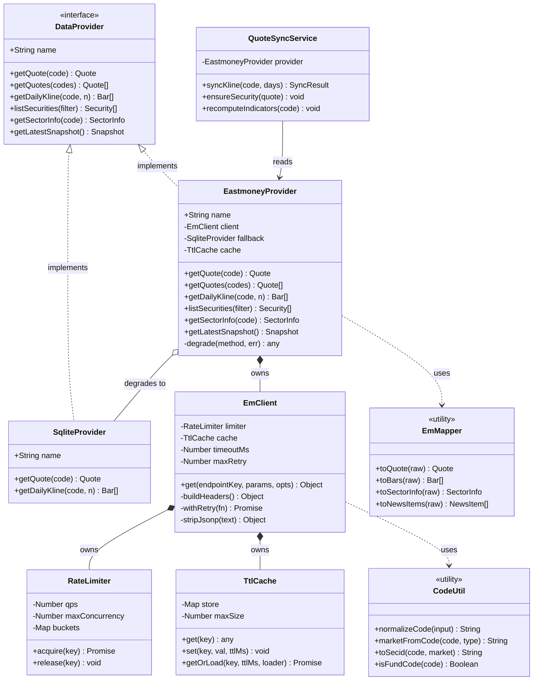
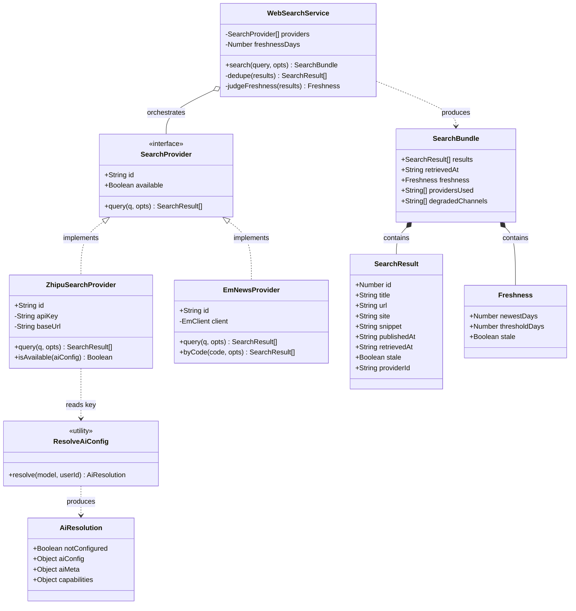
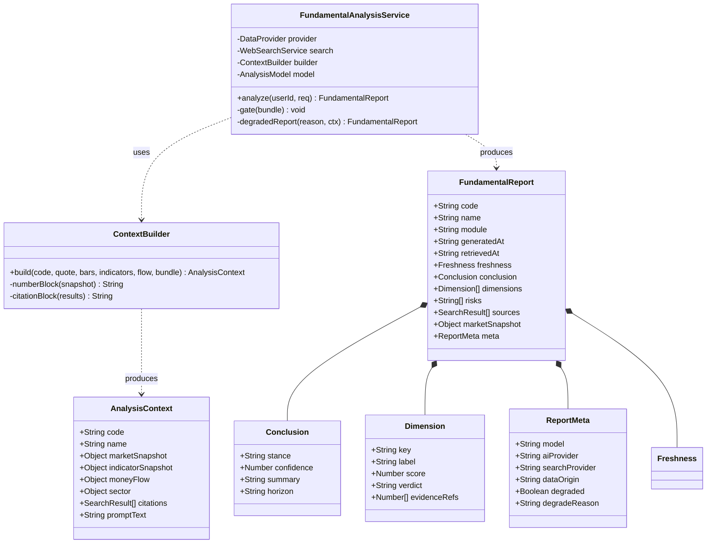
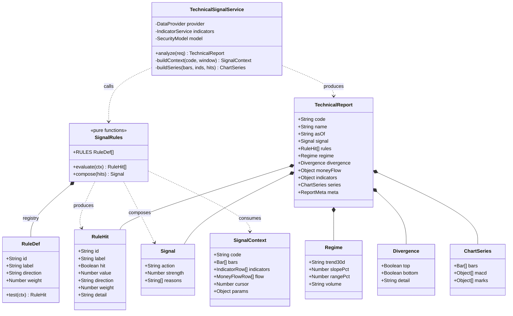
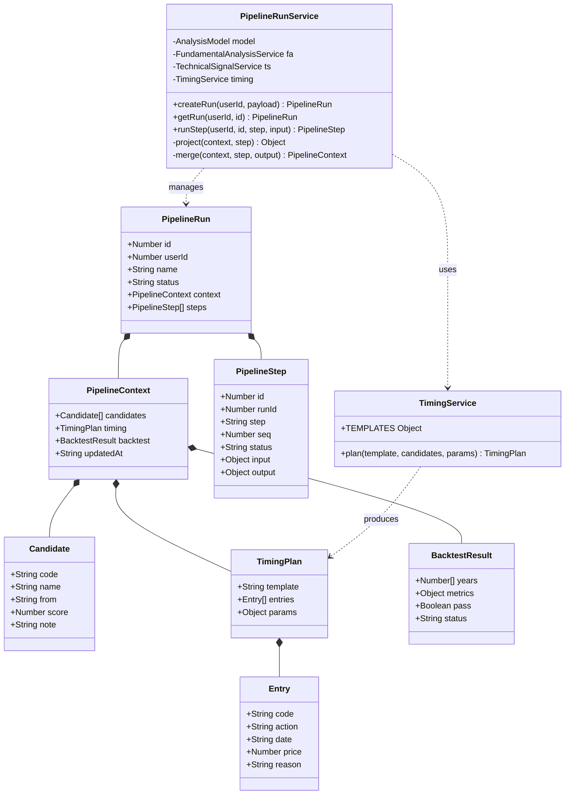
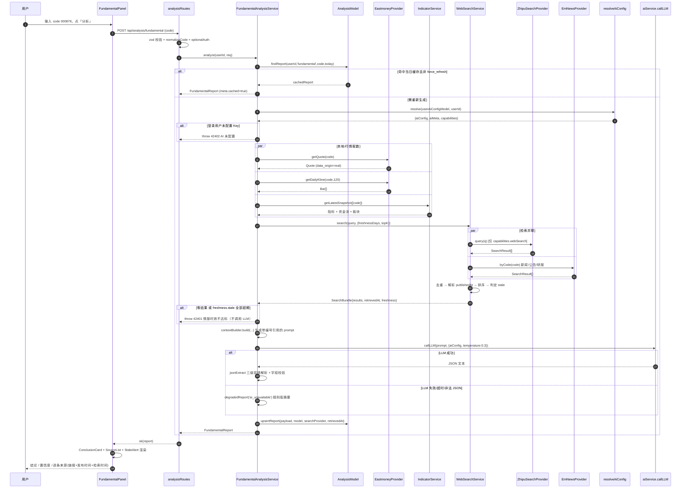
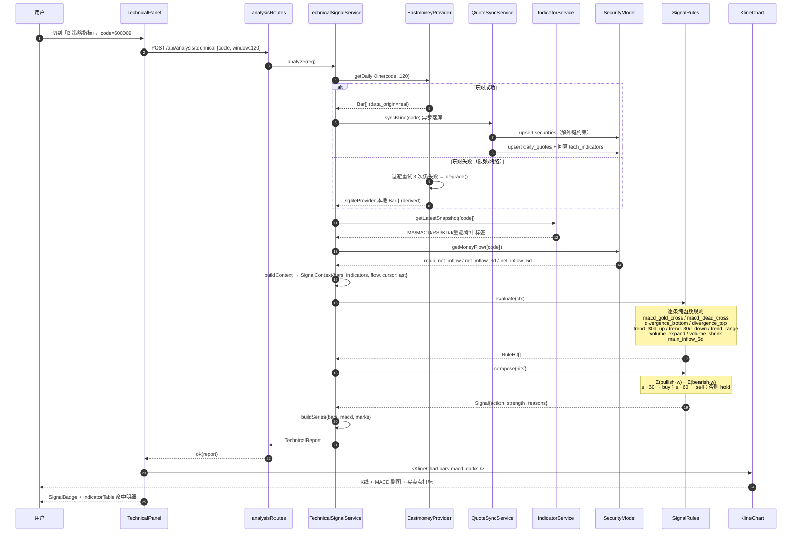
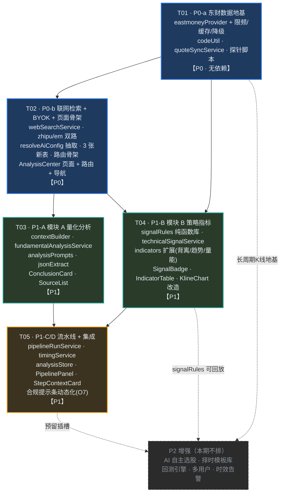

# 智能分析中心 系统架构设计 + 任务分解

> 版本 v1.0 · 架构师 高见远（Gao）· 日期 2026-08-08
> 上游输入：`docs/prd-analysis-center.md`（许清楚 v0.1）
> 范围：quantfolio 新模块 `analysis_center` 的实现方案、文件清单、接口契约、调用流程与工程师任务清单。**本文不含实现代码。**

---

## 0. 设计总纲（先看这一页）

| 决策项 | 结论 |
|---|---|
| 技术栈 | **零新框架**。后端沿用 Express + better-sqlite3 + 原生 fetch；前端沿用 Vite + React + TS + MUI + Tailwind + ECharts + react-router + zustand |
| 行情数据 | 新增 `eastmoneyProvider`，**实现现有 `PROVIDER_METHODS` 契约**，通过 `DATA_PROVIDER=eastmoney` 切换，业务层零改动 |
| 东财接入 | 官方公开 HTTP 接口（push2 / push2his / search-api-web），**免 KEY 免费**，自建令牌桶限频 + 双层缓存 + 指数退避 + 降级 sqlite |
| 联网检索 | 双路并联：**智谱 Web Search（主，复用 BYOK Key）** + **东方财富财经信源（常驻兜底，免 KEY）**；结果强制带 `url + published_at + retrieved_at` |
| AI 模型 | **复用现有 BYOK 框架**，不锁死任一厂商；把 `resolveAiConfig` 从 `aiReportService` 抽为共享模块 |
| 代理 | 逐通道可配。东财/智谱均为**境内直连**（默认不走代理）；`HTTP_PROXY_URL=http://127.0.0.1:7890` 为**海外出站预留开关**，按通道 `*_USE_PROXY` 生效 |
| 新增 npm 包 | **1 个（可选）**：`undici`（仅启用代理时懒加载）。其余零新增 |
| 红线 | **绝不编造数据**。检索为空 / 全部超期 → 不产出 AI 结论，明确降级提示，而非硬编一个说法 |
| 任务数 | **5 个**：T01 东财地基 → T02 检索+骨架 → {T03 模块A ∥ T04 模块B} → T05 流水线+集成 |

---

## 1. 实现方案与框架选型

### 1.1 需求难点拆解

| # | 难点 | 本质 | 解法 |
|---|---|---|---|
| D1 | 接入东方财富实时/历史行情，且不破坏现有业务层 | 适配器边界问题 | 新增 `eastmoneyProvider` 严格实现 `PROVIDER_METHODS` 六方法；`getProvider` 工厂加一个 `case`。`marketService` / `screenerService` / `pipelineService` **一行不改** |
| D2 | 公开接口无 SLA、有隐性限频，一旦被限整站瘫痪 | 稳定性问题 | 三道闸：**令牌桶限频**（全局 QPS + 单端点 QPS + 并发上限）→ **双层缓存**（内存 TTL + SQLite 落库）→ **失败降级**（指数退避 3 次后回落 `sqliteProvider`，永不 500 白屏） |
| D3 | AI 情报必须实时，"拿到一个月前旧闻就会给错结论" | 时效可验证性问题 | 检索层强制三元组 `url / published_at / retrieved_at`；`freshnessDays` 阈值判定 `stale`；**全部 stale 或零结果 → 拒绝出结论**，返回 `degraded` 卡片。前端逐条展示来源与发布时间（US5） |
| D4 | 用户无海外双币卡，SerpAPI/Bing 等付费搜索不可用 | 成本/可得性约束 | 只用**免费且境内可达**的两路：智谱 Web Search（用户已有 BYOK Key，走同一个 Key，零新增开销）+ 东方财富新闻/公告/研报接口（免 KEY）。预留 `customSearchProvider` 适配位供后续自建 SearxNG |
| D5 | LLM 输出必须是可渲染的结构化 JSON，但小模型易跑偏 | 输出可靠性问题 | Prompt 内联 JSON Schema + few-shot 骨架；`jsonExtract` 三级容错（直接 parse → 剥 ```json 围栏 → 首尾花括号切片）；仍失败则降级规则版摘要（复用 `localFallback` 模式） |
| D6 | 模块 B 的信号规则将来要被 P2 回测复用，不能写死在 service 里 | 可复用/可测试性 | 信号规则抽成**无副作用纯函数库** `signalRules.js`：`evaluate(SignalContext) -> RuleHit[]`。实时分析喂"最新一根"，P2 回测喂"历史逐根回放"，**同一套规则，零分叉** |
| D7 | 流水线要在步骤间传数据（ETF 埋伏→转龙头→择时买→择时卖） | 状态编排问题 | 引入 **PipelineContext 数据总线**（JSON）：`pipeline_runs.context` 持久化 + 前端 `analysisStore` 内存镜像。每步 `input = 上游 output 投影`，步骤纯函数化，可单步重跑 |
| D8 | 东财返回的 code 可能不在本地 `securities` 表，而 `daily_quotes` 有外键 | 数据完整性陷阱 | **⚠️ 关键约束**：`daily_quotes / tech_indicators / money_flow` 均 `FOREIGN KEY(code) REFERENCES securities(code)`。落库前必须先 `upsert securities`（复用 `securityResolver.cacheSecurity` 思路）。新增的 `analysis_reports` **刻意不设 code 外键**，允许分析任意代码 |

### 1.2 框架与库选型（沿用 > 新增）

**后端（`server/`）**

| 能力 | 选型 | 理由 |
|---|---|---|
| HTTP 客户端 | **Node 18 原生 `fetch` + `AbortController`** | `aiService.js` 已是这个写法，保持一致；零依赖 |
| 代理支持 | **`undici` 的 `ProxyAgent`（懒加载、可选依赖）** | 原生 fetch 不认 `HTTP_PROXY` 环境变量，必须显式 `dispatcher`。封装在 `util/httpAgent.js`，未开启代理时**不 import**，做到"不用即零依赖" |
| 限频 | **自研 `util/rateLimiter.js`（令牌桶 + 信号量）** | 需求仅是单进程本地服务，引 `bottleneck`/`p-limit` 属过度依赖；约 60 行可控代码 |
| 缓存 | **自研 `util/ttlCache.js`（Map + TTL + 容量淘汰）** | 同上，避免引 `lru-cache` |
| 参数校验 | **`zod`（已有）** | 与现有 routes 一致，`validateBody` 中间件直接复用 |
| 数据库 | **`better-sqlite3`（已有）** | 新增 3 张表，DDL 追加进 `schema.js` |

**前端（`client/`）**

| 能力 | 选型 | 理由 |
|---|---|---|
| 路由 | `react-router-dom`（已有）新增 `/analysis` | — |
| 状态 | `zustand`（已有）新增 `analysisStore` | 与 `aiConfigStore`/`uiStore` 同构 |
| 图表 | `echarts` + `echarts-for-react`（已有）| 改造 `KlineChart` 支持 MACD 副图 + 信号打点 |
| 请求 | `api/http.ts` 的 axios 实例 + `unwrap`（已有） | 信封解包、token 注入、401 跳转全部免费继承 |
| 设计系统 | `PageHeader` / `SectionCard` / `EmptyState` / `DataOriginBadge` / `StatCard` / `TagChip` + `darkTheme` | **红涨绿跌唯一来源仍是 `@shared/constants` 的 `COLORS`**，新代码禁止出现色值字面量 |

### 1.3 架构模式

**后端分层（严格单向依赖，不得反向）**

```
routes/analysisRoutes.js          ← HTTP 边界：zod 校验 + optionalAuth + ok() 信封
    ↓
services/analysis/*.js            ← 业务编排：基本面 / 技术面 / 流水线
    ↓
services/webSearch/*  ·  providers/eastmoney/*  ·  services/aiService.js
    ↓
util/{rateLimiter,ttlCache,httpAgent,codeUtil,jsonExtract}  ·  models/*
```

- **适配器模式**：`eastmoneyProvider` / `webSearchProvider` 都是可替换实现，业务层只见接口。
- **策略模式**：`signalRules` 是规则策略集合，`timingService` 是择时模板策略集合（P1 只落地 `signal_follow` 一种，P2 补凯利/网格/马丁/右侧）。
- **管道 + 上下文总线**：流水线三步共享一个 `PipelineContext`。

**前端**：容器页 `AnalysisCenter` 持有 `code` 与 tab 状态 → 分发给 `FundamentalPanel` / `TechnicalPanel` / `PipelinePanel` 三个展示组件；跨步骤数据走 `analysisStore`。

### 1.4 东方财富接入方式（O1 技术裁定详见 §6.1）

- **协议**：直连官方公开 HTTP JSON 接口，**无需 KEY、无需签名、免费**。
- **必带 Header**：`User-Agent`（桌面浏览器 UA）+ `Referer: https://quote.eastmoney.com/`。缺失易被风控拒绝，这是最常见的踩坑点。
- **secid 规则**：东财用 `{emMarket}.{code}`，`emMarket`：`1` = 上交所，`0` = 深交所/北交所。优先取本地 `securities.market` 映射，miss 时按代码前缀推断（复用并抽取 `securityResolver.marketFromCode`）。
- **首版覆盖范围**：A 股 + **场内**基金（ETF/LOF，与股票同源 secid）。**场外开放式基金**净值走 `fund.eastmoney.com` 另一套接口，**明确不在首版范围**（见 §6.8）。
- **落库**：日 K 线经 `quoteSyncService` 写入 `daily_quotes`（`data_origin='real'`），并触发该 code 的 `tech_indicators` 回算，使模块 B 与现有筛选器共用同一张指标表。

### 1.5 联网检索方式（O2 技术裁定详见 §6.2）

```
webSearchService.search(query, opts)
   ├─ 路 1  zhipuSearchProvider   智谱 Web Search（需 BYOK provider==='zhipu'）  ─┐
   ├─ 路 2  emNewsProvider        东方财富新闻/公告/研报（免 KEY，常驻执行）      ─┼→ 合并
   └─ 路 3  customSearchProvider  预留适配位（P2，自建 SearxNG 等）              ─┘
                                                                                  ↓
                              URL 归一化去重 → published_at 解析 → 按新鲜度+相关度排序
                                                                                  ↓
                              freshness 判定：newest_days > threshold → stale=true
                                                                                  ↓
                              SearchBundle{ results[], retrievedAt, freshness, providers[] }
```

- 两路**并联而非串联**：即使用户 BYOK 选的不是智谱（路 1 不可用），路 2 仍保证有实时金融信源，模块 A 不会失能。
- `Promise.allSettled` 容错，单路失败不影响整体，但会记入 `meta.degraded_channels`。
- **零结果或全部 stale → 抛 `ApiError.failedDependency`，不调用 LLM**（D3 红线）。

---

## 2. 文件列表（按 P0 → P1 → P2 分期组织）

图例：🆕 新建 · ✏️ 修改 · 路径相对项目根 `quantfolio/`

### 2.1 P0 共享地基

**后端 — 东方财富数据层（P0-1 / P0-2）**

| 状态 | 路径 | 职责 |
|---|---|---|
| 🆕 | `server/src/providers/eastmoney/emClient.js` | 底层 HTTP：UA/Referer 注入、限频、超时、指数退避重试、代理 dispatcher、JSONP 剥壳、统一错误 |
| 🆕 | `server/src/providers/eastmoney/emEndpoints.js` | 端点与字段常量表（`f43/f57/f116…` → 语义名的映射字典），端点集中管理便于探测校准 |
| 🆕 | `server/src/providers/eastmoney/emMapper.js` | 东财原始 JSON → 项目内 `Quote / Bar / SectorInfo / SecurityLite / NewsItem` 结构；单位换算（分→元、手→股、万元） |
| 🆕 | `server/src/providers/eastmoneyProvider.js` | 实现 `PROVIDER_METHODS` 六方法 + 降级委托给 `sqliteProvider` |
| ✏️ | `server/src/providers/dataProvider.js` | `getProvider` 增加 `case 'eastmoney'` |
| 🆕 | `server/src/util/rateLimiter.js` | 令牌桶（QPS）+ 信号量（并发）+ 端点级子桶 |
| 🆕 | `server/src/util/ttlCache.js` | 内存 TTL 缓存 + 容量淘汰 + `getOrLoad` 单飞（同 key 并发只打一次源） |
| 🆕 | `server/src/util/httpAgent.js` | 按通道返回 fetch `dispatcher`；未启用代理时返回 `undefined`（不 import `undici`） |
| 🆕 | `server/src/util/codeUtil.js` | `normalizeCode` / `toSecid` / `marketFromCode` / `isFundCode`；**从 `securityResolver.js` 抽取共用** |
| ✏️ | `server/src/services/securityResolver.js` | 改为 import `codeUtil`，删除内部重复的 `marketFromCode` |
| 🆕 | `server/src/services/quoteSyncService.js` | 东财 K 线 → `upsert securities`（解 D8 外键）→ `upsert daily_quotes(data_origin='real')` → 触发 `tech_indicators` 回算 |
| ✏️ | `server/src/config/env.js` | 新增 `EM_* / WEB_SEARCH_* / HTTP_PROXY_URL / ANALYSIS_*` 变量 |
| ✏️ | `.env.example`、`.env` | 同步新增变量与注释 |
| 🆕 | `scripts/probe-eastmoney.mjs` | **接口探针脚本**：逐个打端点、打印字段与耗时，用于开工首日校准 `emEndpoints` 常量（见 §6.1 落地要求） |

**后端 — 联网检索 + BYOK + 存储（P0-3）**

| 状态 | 路径 | 职责 |
|---|---|---|
| 🆕 | `server/src/services/webSearch/webSearchService.js` | 检索编排：并联调度、去重、时效判定、`SearchBundle` 组装 |
| 🆕 | `server/src/services/webSearch/zhipuSearchProvider.js` | 智谱 Web Search 适配（复用用户 BYOK Key） |
| 🆕 | `server/src/services/webSearch/emNewsProvider.js` | 东财新闻/公告/研报适配（复用 `emClient`） |
| 🆕 | `server/src/ai/resolveAiConfig.js` | **从 `aiReportService.js` 抽取**的 BYOK 解析器，附加 `capabilities.webSearch` 判定 |
| ✏️ | `server/src/services/aiReportService.js` | 改为 import 上述共享模块，删除内部私有 `resolveAiConfig`（行为保持不变） |
| ✏️ | `server/src/db/schema.js` | 追加 3 张表：`analysis_reports` / `pipeline_runs` / `pipeline_steps`；`SCHEMA_VERSION` → `1.2` |
| 🆕 | `server/src/models/analysisModel.js` | 上述 3 表的 CRUD |
| 🆕 | `server/src/routes/analysisRoutes.js` | `/api/analysis/*` 路由（P0 先落 `capabilities` + 骨架，P1 逐步填充） |
| ✏️ | `server/src/app.js` | `app.use('/api/analysis', createAnalysisRoutes(db))` |
| ✏️ | `server/src/services/marketService.js` | `meta()` 增补 `quote_source / quote_updated_at / kline_origin`（O7） |

**前端 — 页面骨架（P0-4）**

| 状态 | 路径 | 职责 |
|---|---|---|
| 🆕 | `client/src/pages/AnalysisCenter.tsx` | 容器页：`PageHeader` + 代码输入区 + 模块 Tab + 结果区 + 流水线入口 |
| 🆕 | `client/src/components/analysis/CodeInputBar.tsx` | 统一 code 输入（股/基不分），回车即分析，联想复用 `/api/market/search` |
| 🆕 | `client/src/components/analysis/ModuleTabs.tsx` | A/B 模块切换（`ToggleButtonGroup`，主题已定制） |
| 🆕 | `client/src/components/analysis/PipelineStepper.tsx` | ①选股→②择时→③回测 步骤导航（P0 只渲染，P1-C 通电） |
| 🆕 | `client/src/api/analysis.ts` | 前端 API 封装（`unwrap` 解包） |
| 🆕 | `client/src/types/analysis.ts` | 与后端契约 1:1 的 TS 类型定义 |
| ✏️ | `client/src/App.tsx` | 新增 `<Route path="/analysis" element={<AnalysisCenter />} />` |
| ✏️ | `client/src/components/layout/SideBar.tsx` | `NAV_ITEMS` 新增「智能分析中心」（`InsightsIcon`，置于「尾盘选股器」之后） |

### 2.2 P1-A 模块 A 量化分析（AI 基本面 + 消息面）

| 状态 | 路径 | 职责 |
|---|---|---|
| 🆕 | `server/src/services/analysis/contextBuilder.js` | 组装 LLM 上下文：行情快照 + 本地指标/评分 + 资金流 + 板块 + 检索片段 → 带编号引用的紧凑文本 |
| 🆕 | `server/src/services/analysis/fundamentalAnalysisService.js` | 模块 A 主编排：取数 → 检索 → 时效闸 → `callLLM` → 解析 → 落库/缓存 |
| 🆕 | `server/src/ai/analysisPrompts.js` | 模块 A prompt 模板（内联 JSON Schema、引用编号规则、时效强调、禁止编造声明） |
| 🆕 | `server/src/util/jsonExtract.js` | LLM 文本 → JSON 三级容错解析 |
| ✏️ | `server/src/routes/analysisRoutes.js` | 挂载 `POST /fundamental`、`GET /history` |
| 🆕 | `client/src/components/analysis/FundamentalPanel.tsx` | 模块 A 面板容器（loading / error / degraded / empty 四态） |
| 🆕 | `client/src/components/analysis/ConclusionCard.tsx` | 结论卡片：立场徽标 + 置信度环（复用 `ProgressScore`）+ 分维度评述 + 风险列表 |
| 🆕 | `client/src/components/analysis/SourceList.tsx` | 来源链：标题 / 站点 / 发布时间 / 检索时间 / `stale` 高亮 |

### 2.3 P1-B 模块 B 策略指标（技术面）

| 状态 | 路径 | 职责 |
|---|---|---|
| 🆕 | `server/src/services/analysis/signalRules.js` | **纯函数规则库**（P2 回测复用）：MACD 金/死叉、顶/底背离、30 日趋势、缩量/放量、大资金流入；加权合成 |
| 🆕 | `server/src/services/analysis/technicalSignalService.js` | 模块 B 主编排：`indicatorService` + `money_flow` + K 线 → `signalRules.evaluate` → 信号 + 图表序列 |
| ✏️ | `server/src/util/indicators.js` | 新增 `findPivots` / `detectDivergence` / `trendRegime` / `volumeRegime`（纯函数，可单测） |
| ✏️ | `server/src/routes/analysisRoutes.js` | 挂载 `POST /technical` |
| 🆕 | `client/src/components/analysis/TechnicalPanel.tsx` | 模块 B 面板容器 |
| 🆕 | `client/src/components/analysis/SignalBadge.tsx` | 买/卖/观望徽标 + 强度条（颜色取自 `COLORS.UP/DOWN/FLAT`） |
| 🆕 | `client/src/components/analysis/IndicatorTable.tsx` | 规则命中明细表（规则名 / 命中 / 实测值 / 方向 / 权重） |
| ✏️ | `client/src/components/charts/KlineChart.tsx` | 扩展 props：`macd?` 副图、`marks?` 买卖点打标、`overlays?` 均线组（**向后兼容，现有调用方不改**） |

### 2.4 P1-C 流水线 + P1-D 可视化与集成

| 状态 | 路径 | 职责 |
|---|---|---|
| 🆕 | `server/src/services/analysis/pipelineRunService.js` | 流水线编排：创建 run、单步执行、`PipelineContext` 读写、步骤间投影 |
| 🆕 | `server/src/services/analysis/timingService.js` | 择时：P1 仅 `signal_follow`（跟随模块 B 信号）；凯利/网格/马丁/右侧止盈留 P2 插槽 |
| ✏️ | `server/src/routes/analysisRoutes.js` | 挂载 `/pipeline/runs` 系列 |
| 🆕 | `client/src/store/analysisStore.ts` | zustand：`code` / `activeModule` / `lastFundamental` / `lastTechnical` / `pipelineContext` |
| 🆕 | `client/src/components/analysis/PipelinePanel.tsx` | 三步执行面板 + 「把当前标的送入流水线」 |
| 🆕 | `client/src/components/analysis/StepContextCard.tsx` | 展示上游产出如何成为下游输入（US3 的可解释性） |
| 🆕 | `client/src/utils/analysisFormat.ts` | 置信度/强度/新鲜度的展示格式化 |
| ✏️ | `client/src/components/layout/DisclaimerBar.tsx` | 改为读 `/api/market/meta` 动态渲染行情来源与截止时间（O7） |
| ✏️ | `client/src/components/layout/TopBar.tsx` | 合规提示条同步动态化（O7） |

### 2.5 P2 增强（本期不排任务，仅预留位）

`aiStockPickService.js`（P2-1）· `timingTemplates/`（P2-2）· `backtestService.js`（P2-3）· 多用户隔离收敛（P2-4）· `StaleAlert.tsx`（P2-5，地基 `freshness` 字段 P0 已埋）

---

## 3. 数据结构与接口（类图）

### 3.1 数据提供方与检索层





### 3.2 分析模块 A / B 与流水线







### 3.3 HTTP 接口契约

统一响应信封（沿用 `util/response.js`）：`{ success, data, message, code }`；鉴权统一 `optionalAuth`（O5 建议默认，见 §6.5）。

| 方法 | 路径 | 请求体 / Query | 响应 `data` |
|---|---|---|---|
| GET | `/api/analysis/capabilities` | — | `{ aiProvider, aiProviderLabel, model, custom, webSearch:boolean, searchProviders:[], dataProvider, quoteSource, notConfigured }` |
| POST | `/api/analysis/fundamental` | `{ code, force_refresh?, freshness_days? }` | `FundamentalReport` |
| POST | `/api/analysis/technical` | `{ code, window?=120, params? }` | `TechnicalReport` |
| GET | `/api/analysis/history` | `?code=&module=&limit=` | `AnalysisReportRow[]` |
| POST | `/api/analysis/pipeline/runs` | `{ name?, candidates? }` | `PipelineRun` |
| GET | `/api/analysis/pipeline/runs/:id` | — | `PipelineRun` |
| POST | `/api/analysis/pipeline/runs/:id/steps/:step/run` | `{ input? }`，`step ∈ select\|timing\|backtest` | `PipelineStep`（含合并后 `context`） |

**关键错误码约定**（前三位 = HTTP 状态，沿用现有风格）

| code | 含义 | 前端表现 |
|---|---|---|
| `40001` | code 非法（非 6 位数字） | 输入框内联报错 |
| `40401` | 标的不存在（东财与本地均未命中） | `EmptyState` |
| `42401` | **情报时效不达标**（零结果 / 全部超期） | 醒目黄条：「未获取到 N 天内的实时情报，已拒绝生成结论」 |
| `42402` | AI 未配置（登录用户无 Key） | 引导跳「模型设置」 |
| `50301` | 上游数据源不可用且降级也失败 | `EmptyState` + 重试按钮 |

### 3.4 新增数据表 DDL 摘要

```sql
-- 18) 智能分析报告（模块 A/B 结果存档与缓存）
CREATE TABLE IF NOT EXISTS analysis_reports (
  id              INTEGER PRIMARY KEY AUTOINCREMENT,
  user_id         INTEGER,                      -- 游客为 NULL，与 ai_reports / holdings 同构
  module          TEXT NOT NULL CHECK (module IN ('fundamental','technical')),
  code            TEXT NOT NULL,                -- 刻意不设外键：允许分析本地库尚未收录的代码
  trade_date      TEXT NOT NULL,
  payload         TEXT NOT NULL,                -- JSON：完整 Report
  model           TEXT,                         -- 生效模型（BYOK 透明化）
  search_provider TEXT,
  retrieved_at    TEXT,
  data_origin     TEXT NOT NULL DEFAULT 'mixed' CHECK (data_origin IN ('real','derived','mixed')),
  created_at      TEXT NOT NULL DEFAULT (datetime('now')),
  UNIQUE (user_id, module, code, trade_date)    -- 同日同标的复用缓存，force_refresh 时 REPLACE
);
CREATE INDEX IF NOT EXISTS idx_ar_code ON analysis_reports(code, created_at DESC);

-- 19) 流水线运行
CREATE TABLE IF NOT EXISTS pipeline_runs (
  id         INTEGER PRIMARY KEY AUTOINCREMENT,
  user_id    INTEGER,
  name       TEXT,
  status     TEXT NOT NULL DEFAULT 'draft' CHECK (status IN ('draft','running','done','failed')),
  context    TEXT NOT NULL DEFAULT '{}',        -- JSON：PipelineContext 数据总线
  created_at TEXT NOT NULL DEFAULT (datetime('now')),
  updated_at TEXT NOT NULL DEFAULT (datetime('now'))
);

-- 20) 流水线步骤
CREATE TABLE IF NOT EXISTS pipeline_steps (
  id         INTEGER PRIMARY KEY AUTOINCREMENT,
  run_id     INTEGER NOT NULL,
  step       TEXT NOT NULL CHECK (step IN ('select','timing','backtest')),
  seq        INTEGER NOT NULL,
  status     TEXT NOT NULL DEFAULT 'pending' CHECK (status IN ('pending','running','done','failed','skipped')),
  input      TEXT NOT NULL DEFAULT '{}',
  output     TEXT NOT NULL DEFAULT '{}',
  error      TEXT,
  created_at TEXT NOT NULL DEFAULT (datetime('now')),
  FOREIGN KEY (run_id) REFERENCES pipeline_runs(id) ON DELETE CASCADE
);
CREATE INDEX IF NOT EXISTS idx_ps_run ON pipeline_steps(run_id, seq);
```

> ⚠️ `SCHEMA_VERSION` 升至 `1.2`。三张表全部 `CREATE TABLE IF NOT EXISTS`，`initSchema` 幂等，**存量库无需 drop、无需迁移脚本**。

---

## 4. 程序调用流程（时序图）

### 4.1 模块 A：一次量化分析调用链



### 4.2 模块 B：一次技术面信号调用链



### 4.3 流水线：选股 → 择时 → 回测 的数据流

```mermaid
sequenceDiagram
    autonumber
    participant U as 用户
    participant PP as PipelinePanel
    participant ST as analysisStore
    participant API as analysisRoutes
    participant PR as PipelineRunService
    participant AM as AnalysisModel
    participant FA as FundamentalAnalysisService
    participant TSV as TechnicalSignalService
    participant TM as TimingService

    U->>PP: 在模块 A/B 结果页点「把当前标的送入流水线」
    PP->>ST: setCandidate({code, from:'fundamental'|'technical', score})
    PP->>API: POST /pipeline/runs {name, candidates}
    API->>PR: createRun(userId, payload)
    PR->>AM: insert pipeline_runs(context={candidates})
    AM-->>PR: run{id, context}
    PR-->>PP: PipelineRun

    rect rgb(24,32,44)
    Note over PP,PR: ① 选股 select（首版：手动指定，AI 仅分析 —— 见 O3）
    U->>PP: 执行「①选股」
    PP->>API: POST /runs/:id/steps/select/run {input:{codes}}
    API->>PR: runStep(id,'select',input)
    PR->>PR: project(context,'select') → 取 candidates
    loop 每个候选 code
        PR->>FA: analyze(userId,{code})
        FA-->>PR: FundamentalReport.conclusion
        PR->>TSV: analyze({code})
        TSV-->>PR: TechnicalReport.signal
    end
    PR->>PR: merge → context.candidates[i] 补 score/stance/signal
    PR->>AM: update pipeline_steps(output) + pipeline_runs(context)
    PR-->>PP: PipelineStep{output:{candidates}}
    end

    rect rgb(24,32,44)
    Note over PP,TM: ② 择时 timing（P1 仅 signal_follow；凯利/网格/马丁/右侧 → P2-2）
    U->>PP: 执行「②择时」
    PP->>API: POST /runs/:id/steps/timing/run {input:{template:'signal_follow'}}
    API->>PR: runStep(id,'timing',input)
    PR->>PR: project(context,'timing') → 取上游 candidates（含 signal）
    PR->>TM: plan('signal_follow', candidates, params)
    TM-->>PR: TimingPlan{entries:[{code,action,date,price,reason}]}
    PR->>PR: merge → context.timing
    PR->>AM: 持久化
    PR-->>PP: PipelineStep{output:{timing}}
    end

    rect rgb(24,32,44)
    Note over PP,PR: ③ 回测 backtest（P2-3 —— 见 O4；P1 返回 status='not_implemented' 占位）
    U->>PP: 执行「③回测」
    PP->>API: POST /runs/:id/steps/backtest/run {input:{years:[2,5,10]}}
    API->>PR: runStep(id,'backtest',input)
    PR->>PR: project(context,'backtest') → 取 timing.entries
    PR-->>PP: PipelineStep{status:'skipped', output:{status:'not_implemented'}}
    Note right of PR: P2 落地时：<br/>getDailyKline(code, 2500) 取 10 年<br/>+ signalRules 逐根回放（同一套规则）<br/>→ 年化/最大回撤/胜率/达标判定
    end

    PP->>ST: setPipelineContext(context)
    PP-->>U: StepContextCard 展示「上游产出 → 下游输入」的传递链路
```



---

## 5. 依赖包列表

### 5.1 需新增（1 个，且为可选）

| 包 | 版本 | 位置 | 用途 | 备注 |
|---|---|---|---|---|
| `undici` | `^6.19.0` | `server/` | 为原生 `fetch` 提供 `ProxyAgent`，支持出站走 `127.0.0.1:7890` | **懒加载**：`util/httpAgent.js` 仅在 `HTTP_PROXY_URL` 非空且通道 `*_USE_PROXY=true` 时才 `await import('undici')`。默认配置下**完全不加载**，等价于零新增 |

### 5.2 明确不引入（及理由）

| 候选 | 不引入的理由 |
|---|---|
| `axios`（后端） | 后端现有 `aiService.js` 全用原生 `fetch`，引入第二套 HTTP 栈会造成超时/重试/错误处理双实现 |
| `bottleneck` / `p-limit` | 单进程本地服务，`util/rateLimiter.js` 约 60 行自研即可，可控且可单测 |
| `lru-cache` | 同上，`util/ttlCache.js` 自研 |
| `node-eastmoney` 等第三方封装 | 维护性不可控、字段口径不透明、易随东财改版失效；直连官方端点 + 自建映射表更可控 |
| `serpapi` / Bing Search SDK | **需海外双币卡绑卡，用户明确不可用**（硬约束） |
| `cheerio` / `jsdom` | 首版检索只消费 JSON 接口，不做 HTML 抓取；若 P2 需要再评估 |
| 任何新前端库 | ECharts + MUI + zustand 已完全覆盖需求 |

### 5.3 新增环境变量（`.env` / `.env.example`）

```ini
# ---- 数据源切换 ----
DATA_PROVIDER=eastmoney            # sqlite | http | eastmoney

# ---- 东方财富（公开接口，免 KEY 免费）----
EM_BASE_PUSH2=https://push2.eastmoney.com
EM_BASE_PUSH2HIS=https://push2his.eastmoney.com
EM_BASE_SEARCH=https://search-api-web.eastmoney.com
EM_QPS=5                           # 全局令牌桶速率（保守值）
EM_ENDPOINT_QPS=2                  # 单端点速率
EM_MAX_CONCURRENCY=4
EM_TIMEOUT_MS=8000
EM_MAX_RETRY=3                     # 指数退避 300/900/2700ms
EM_CACHE_QUOTE_TTL_MS=10000        # 盘中实时报价
EM_CACHE_QUOTE_TTL_CLOSED_MS=300000  # 非交易时段
EM_CACHE_KLINE_TTL_MS=1800000
EM_CACHE_SECTOR_TTL_MS=60000
EM_FALLBACK_PROVIDER=sqlite        # 降级目标
EM_USE_PROXY=false                 # 境内源，默认直连

# ---- 实时联网检索 ----
WEB_SEARCH_ENABLED=true
WEB_SEARCH_PRIMARY=zhipu           # 主路（需 BYOK provider=zhipu）
WEB_SEARCH_FALLBACK=eastmoney      # 常驻兜底
WEB_SEARCH_FRESHNESS_DAYS=7        # 超过则标 stale
WEB_SEARCH_TOPK=8
WEB_SEARCH_TIMEOUT_MS=15000
WEB_SEARCH_USE_PROXY=false         # 智谱/东财均境内，默认直连

# ---- 本机代理（为海外出站预留；仅在通道 *_USE_PROXY=true 时生效）----
HTTP_PROXY_URL=http://127.0.0.1:7890

# ---- 分析中心 ----
ANALYSIS_KLINE_WINDOW=120
ANALYSIS_CACHE_SAME_DAY=true       # 同日同标的复用报告
```

---

## 6. 待明确事项（O1~O7 技术裁定）

### 6.1 O1 东方财富接口选型与限频 —— ✅ **直接定方案**

**裁定：用官方公开 push2 系列接口，不用第三方封装；无需 KEY、无需签名、免费。**

候选端点清单（工程师第一天用 `scripts/probe-eastmoney.mjs` 逐个实测校准后固化进 `emEndpoints.js`）：

| 契约方法 | 端点 | 关键参数 |
|---|---|---|
| `getQuote` | `{PUSH2}/api/qt/stock/get` | `secid={0\|1}.{code}` + `fields=f43,f44,f45,f46,f47,f48,f57,f58,f60,f107,f116,f117,f162,f167,f168,f169,f170` |
| `getQuotes` / `listSecurities` | `{PUSH2}/api/qt/clist/get` | `pn,pz,fs=m:0+t:6,m:0+t:80,m:1+t:2,m:1+t:23` + `fields=f12,f14,f2,f3,f5,f6,f8,f9,f10,f20,f21,f23,f62` |
| `getDailyKline` | `{PUSH2HIS}/api/qt/stock/kline/get` | `secid` + `klt=101`(日) + `fqt=1`(前复权) + `lmt=N` + `fields1/fields2` |
| 资金流（模块 B） | `{PUSH2}/api/qt/stock/fflow/daykline/get` | `secid` + `fields1/fields2` |
| `getSectorInfo` | `{PUSH2}/api/qt/clist/get` | `fs=m:90+t:2`(行业板块) / `m:90+t:3`(概念板块) |
| 新闻检索（模块 A） | `{SEARCH}/search/jsonp` | 关键词 + 分页；**JSONP 需 `stripJsonp` 剥壳** |

**⚠️ 端点为社区通行口径，非官方文档承诺。`emEndpoints.js` 必须做成"一处改、全局生效"的常量表；`emMapper` 对缺字段返回 `null` 而非崩溃。这是本模块最大的外部不确定性，T01 的探针脚本是硬性验收项。**

**限频策略（东财无公开配额，取保守自律值）**

| 维度 | 值 | 说明 |
|---|---|---|
| 全局 QPS | 5 | 令牌桶 |
| 单端点 QPS | 2 | 端点级子桶 |
| 最大并发 | 4 | 信号量 |
| 批量分片 | ≤ 50 code / 请求，片间串行 | `getQuotes` 走 `clist` 分片 |
| 重试 | 3 次，指数退避 300 / 900 / 2700 ms + ±20% 抖动 | 仅对 5xx / 超时 / 网络错误重试；4xx 不重试 |
| 熔断 | 60 秒内失败 ≥ 10 次 → 熔断 5 分钟，期间**直接走 sqlite 降级** | 防止把本机 IP 打进黑名单 |

**缓存策略**

| 数据 | 内存 TTL | 持久化 |
|---|---|---|
| 实时报价 | 盘中 10s / 盘后 300s（用现有 `util/tradingCalendar.js` 判定） | 否 |
| 日 K 线 | 30 min | ✅ 落 `daily_quotes`，`data_origin='real'` |
| 板块 | 60s | 否 |
| 新闻 | 300s | 否（`analysis_reports.payload` 内含引用快照） |

**降级链**：`东财 → 重试 → 熔断 → sqliteProvider（本地收盘价，data_origin='derived'）→ 前端 `DataOriginBadge` 显式标注`。**永不返回 500 白屏，永不编造数字。**

### 6.2 O2 实时联网检索方案 —— ✅ **直接定方案**

**裁定：智谱 Web Search 为主 + 东方财富财经信源常驻兜底，双路并联；不引入任何需绑卡的海外搜索服务。**

| 路 | 提供方 | 触发条件 | 成本 | 时间戳来源 |
|---|---|---|---|---|
| 1（主） | 智谱 Web Search（`open.bigmodel.cn`） | 用户 BYOK `provider === 'zhipu'` 且有 Key | 复用用户已有 Key，无额外开销 | 返回体的 `publish_date` |
| 2（常驻兜底） | 东方财富新闻 / 公告 / 研报 | 始终执行 | **免费免 KEY** | 接口自带发布时间，金融领域相关性最高 |
| 3（预留） | `customSearchProvider` | P2，用户自建 SearxNG 等 | — | — |

- **调用方式**：优先用智谱**独立 Web Search 接口**（返回结构化 `{title, link, content, publish_date}`，可直接映射 `SearchResult`）；若该接口不可用，退化为 `chat/completions` 携带 `tools:[{type:'web_search'}]` 并从 `web_search` 返回块中抽取来源。两种形态都封装在 `zhipuSearchProvider` 内部，对上层透明。
- **时效保障（D3 红线的具体实现）**：
  1. 每条结果必须解析出 `published_at`；解析失败的条目**丢弃**，不参与推理。
  2. `newestDays = min(now - published_at)`；`> WEB_SEARCH_FRESHNESS_DAYS(默认7)` → `stale=true`。
  3. **零结果 或 全部 stale → 抛 `42401`，不调用 LLM。** 宁可不出结论，也不基于旧闻给错结论。
  4. Prompt 中每条引用带 `[n] 标题（站点，YYYY-MM-DD）`，要求模型在 `dimensions[].evidence_refs` 里回引编号 —— 让结论可溯源、可证伪（US5）。
  5. 响应携带 `retrieved_at`，前端在来源列表显式展示"检索时间"。
- **代理**：智谱与东财**均为境内域名，默认直连**（走代理反而增加延迟与失败率）。`HTTP_PROXY_URL=http://127.0.0.1:7890` 已写入配置，由 `WEB_SEARCH_USE_PROXY` / `EM_USE_PROXY` 单独开关控制，**为将来接入海外信源预留**，一行配置即可切换，无需改代码。

### 6.3 O3 选股阶段范围 —— 🟡 **建议默认值（待用户最终确认）**

**建议：首版仅"用户手动指定代码，AI 只分析"；AI 自主选股（板块→龙头/潜力股）后置 P2-1。**

- 理由：自主选股需要全市场扫描（`listSecurities` + 逐只取指标），在东财限频 5 QPS 下，全市场 5000+ 标的一轮扫描需十几分钟，首版体验不可接受；且"价值/趋势"的选股口径本身需要产品侧再定义。
- 首版补偿：选股步骤支持**多来源带入**候选 —— 手动输入、从「我的自选」勾选、从「早盘/尾盘选股器」结果一键送入。既满足 US3 的流水线闭环，又零额外扫描成本。
- P2 落地路径已预留：`pipelineRunService.runStep('select')` 内部留 `strategy: 'manual' | 'ai_auto'` 分支，P2 只需补 `aiStockPickService` 实现。

### 6.4 O4 回测引擎 —— 🟡 **建议默认值（待用户最终确认）**

**建议：回测引擎后置 P2-3；但 P0/P1 必须埋好两个地基，否则 P2 会推倒重来。**

| 地基 | 落地任务 | 说明 |
|---|---|---|
| ① 长周期 K 线能力 | T01 | `getDailyKline(code, n)` 的 `n` 上限放宽到 **2500**（≈10 年，东财 `lmt` 支持），并在 `quoteSyncService` 支持分批落库 |
| ② 规则可回放 | T04 | `signalRules.evaluate(ctx)` 为**纯函数**，`SignalContext.cursor` 指定"当前算到第几根"。实时分析传 `cursor=last`，P2 回测 `for cursor in 0..N` 逐根回放 —— **同一套规则，零口径分叉** |

- 数据来源：**东财前复权日 K（`fqt=1`）**，非派生 K 线。现有 `daily_quotes` 的派生数据只做降级展示，不作为回测输入（回测必须 `data_origin='real'`，否则结论无意义）。
- 与现有服务的关系：`scoreService` / `rebalanceService` 服务于「组合再平衡」，与「策略回测」是两条正交线，**不复用、不耦合**。回测产出 `{年化收益, 最大回撤, 胜率, 盈亏比, 是否达标}`，只写入 `pipeline_steps.output`。
- P1 表现：`POST /steps/backtest/run` 返回 `status:'skipped'` + `output:{status:'not_implemented'}`，前端 `PipelineStepper` 第三步置灰并标注「P2 开放」。**接口先在、逻辑后补**，前端零返工。

### 6.5 O5 登录/多用户 —— 🟡 **建议默认值（待用户最终确认）**

**建议：暂不做强制多用户隔离，单机本地用；但数据模型按 `user_id` 存，为将来开放留门。**

- 鉴权：分析中心全部路由用 **`optionalAuth`**（与 `/api/market`、`/api/ai` 现状完全一致），游客可直接用。
- 存储：`analysis_reports.user_id` / `pipeline_runs.user_id` 游客写 `NULL`，与现有 `holdings` / `ai_reports` 的游客约定同构 —— 将来开多用户时只需改查询条件，不改表结构。
- **唯一例外（必须遵守现有规则）**：AI 配置遵循 `aiReportService` 既定优先级 —— 游客回落服务端 `.env` 默认；**登录用户若未配置 Key 则强制要求先配置**（返回 `42402`），不静默用服务端 Key。这是既有安全约定，新模块不得破坏。

### 6.6 O6 AI 模型一致性 —— ✅ **直接定方案**

**裁定：完全复用现有 BYOK 框架，不锁死任何厂商。**

- 模块 A 调用 `callLLM(prompt, { aiConfig })`，`aiConfig` 由抽取后的 `ai/resolveAiConfig.js` 提供，与 `aiReportService` 走**同一条解析链**（用户配置 > `.env` 默认）。用户在「模型设置」选智谱 GLM-4-flash 即生效，选别家也照常工作。
- **不新接任何第三方 Key**。检索能力所需的智谱 Key，就是用户在模型设置里已经填的那一个。
- 引入 `capabilities` 概念让能力差异对用户透明：

```js
capabilities = {
  webSearch: aiMeta.provider === 'zhipu' && hasKey,   // 是否可用模型内置联网
  vision:    !!env.AI_VISION_MODEL,
}
```

前端 `AnalysisCenter` 顶部展示：
- `webSearch === true` → 「联网检索：智谱 Web Search + 东方财富财经信源」
- `webSearch === false` → 「联网检索：东方财富财经信源（切换到智谱模型可启用全网检索）」+ 一个跳「模型设置」的链接

**既不锁死模型，又让用户清楚知道自己拿到的情报覆盖面。**

### 6.7 O7 行情合规标注 —— ✅ **直接定方案**

**裁定：合规文案由 `meta_kv` 驱动动态渲染，禁止前端硬编码。**

`marketService.meta()` 新增三个键：

| key | 示例值 | 写入时机 |
|---|---|---|
| `quote_source` | `eastmoney` / `seed-tdx` | 服务启动时按 `DATA_PROVIDER` 写入 |
| `quote_updated_at` | `2026-08-08T14:03:11+08:00` | 每次东财取数成功后更新 |
| `kline_origin` | `real` / `derived` / `mixed` | `quoteSyncService` 落库后按实际统计更新 |

前端 `DisclaimerBar` / `TopBar` 改为读 `/api/market/meta` 渲染：

- **东财实时生效时**：「行情来源：东方财富（公开接口）· 更新于 14:03:11 · 历史 K 线为前复权真实数据」
- **降级到本地时**：「⚠ 实时行情源暂不可用，当前展示 2026-08-07 收盘快照，历史 K 线含模拟数据」
- 免责声明固定尾巴（沿用 `SCREENER_DISCLAIMER`）：「本平台所有分析结论、买卖信号与回测结果均为基于公开数据的技术性演示，不构成任何投资建议。数据来自第三方公开接口，可能存在延迟或误差，据此操作风险自负。」

### 6.8 架构师追加的待确认事项（PRD 未覆盖）

| # | 事项 | 我的建议默认值 | 影响 |
|---|---|---|---|
| **A1** | **场外开放式基金**是否支持？其净值走 `fund.eastmoney.com` 另一套接口，与股票 secid 不同源 | **首版仅支持 A 股 + 场内基金（ETF/LOF）**；输入场外基金代码时明确提示「暂不支持场外基金」，不静默出错 | 影响 PRD「股票/基金统一 code」的实际边界，**建议优先与用户确认** |
| **A2** | 港美股是否在范围内 | 首版**不支持**，`normalizeCode` 只接受 6 位数字 | 与 PRD「A 股/基金」表述一致 |
| **A3** | 模块 A 单次分析耗时预期（检索 + LLM ≈ 10~25 秒） | 前端做**分阶段进度提示**（取数中 → 检索中 → AI 生成中），不用无反馈转圈 | 影响用户体感，T03 需实现 |
| **A4** | 分析并发上限 | 单用户同时只允许 1 个模块 A 分析在途（前端按钮置灰 + 后端按 `userId+code` 去重） | 防止用户狂点把东财打限频 |
| **A5** | `tech_indicators` 回算触发时机 | `quoteSyncService` 落 K 线后**同步回算该 code**（单只约几十毫秒，可接受），不做后台任务队列 | 避免引入调度框架 |

---

## 7. 共享知识（跨文件约定 —— 工程师开工前必读）

### 7.1 代码（code）格式 —— 全链路唯一口径

| 层 | 格式 | 示例 |
|---|---|---|
| 前端输入 / URL / API 请求体 | **6 位纯数字裸码**（无市场前缀） | `000878`、`600009`、`510300` |
| DB `securities.code` 及所有关联表 | **6 位纯数字裸码**（与存量一致，不改） | `000878` |
| 东财内部 secid | `{emMarket}.{code}`，`1`=SH，`0`=SZ/BJ | `0.000878`、`1.600009` |

- **唯一转换入口**：`server/src/util/codeUtil.js`。任何文件**禁止**自己拼 secid 或自己判断市场。
- `normalizeCode(input)`：去空格 / 去 `sh|sz|SH.|SZ.` 前后缀 / 校验 `^\d{6}$`，不合法抛 `40001`。
- `marketFromCode(code, type)`：从 `securityResolver.js` 抽取，**行为保持不变**（`6/9/5` 开头 → SH；`8/4/920` → BJ；其余 SZ）。抽取后 `securityResolver` 改为 import，**禁止两处并存**。
- 股票与基金在 API 层**不区分**（PRD 硬要求）；类型差异只在 `emMapper` 与展示层体现。

### 7.2 `data_origin` 标注规则

| 值 | 含义 | 产生场景 |
|---|---|---|
| `real` | 来自东方财富公开接口的真实行情 | 东财实时报价、东财前复权日 K |
| `derived` | 本地确定性派生 | seed 生成的历史 K 线、由派生 K 线算出的指标 |
| `mixed` | 一条记录内真实与派生混合 | 分析报告（真实行情 + 派生指标 + 实时情报） |

- **规则**：任何写入 `daily_quotes` / `securities` / `analysis_reports` 的记录，必须显式带 `data_origin`，**不允许依赖默认值**。
- 一次东财取数成功 → `real`；走了降级 → 沿用本地记录原有值（通常 `derived`）。
- 前端**所有**展示真实/派生混合数据的位置，必须挂 `<DataOriginBadge />`。这是既有合规体系，新模块不得开天窗。

### 7.3 配色与设计系统

- **红涨绿跌唯一来源：`@shared/constants` 的 `COLORS`**（`COLORS.UP` / `COLORS.DOWN` / `COLORS.FLAT` / `COLORS.PRIMARY`）。
- 新代码**禁止出现十六进制色值字面量**；MUI 组件用 `theme.palette.up/down/flat`，ECharts 用 `COLORS.*`。
- 组件复用清单（不要重造）：`PageHeader` / `SectionCard` / `EmptyState` / `Loading` / `DataTable` / `StatCard` / `TagChip` / `ProgressScore` / `DataOriginBadge` / `ConfirmDialog` / `SnackbarProvider`。
- 数字一律等宽（主题已全局 `fontVariantNumeric: 'tabular-nums'`，勿覆盖）。
- 深色为默认主题；新页面必须在深/浅两套主题下都可读。

### 7.4 API 与错误约定

- 响应信封：`{ success, data, message, code }`，成功 `code=0`。**只用 `util/response.js` 的 `ok()`**，禁止裸 `res.json`。
- 错误：`throw ApiError.xxx()` 交由 `errorHandler` 统一处理，路由内 `try/catch` 后 `next(e)`（与现有路由完全一致）。
- 错误码前三位 = HTTP 状态（沿用现状）。新增码见 §3.3。
- 请求校验一律 `zod` + `validateBody`，路由内不写手工校验。
- 时间：**存储与传输统一 ISO 8601**；日期型字段（`trade_date`）沿用 `YYYY-MM-DD`。展示层本地化，服务层不做时区转换。

### 7.5 错误降级策略总表（工程师照此实现，不要自行发挥）

| 失败点 | 降级动作 | 用户可见表现 | 是否算失败 |
|---|---|---|---|
| 东财实时报价失败 | 回落 `sqliteProvider` 最新收盘 | `DataOriginBadge=derived` + 「实时源不可用，展示本地收盘」 | 否，继续 |
| 东财 K 线失败 | 回落本地 `daily_quotes` | 同上 | 否，继续 |
| 东财熔断中 | 直接走 sqlite，不再发请求 | 同上 + 「数据源冷却中，约 N 分钟后恢复」 | 否，继续 |
| 智谱检索不可用（非智谱 Key / 接口失败） | 仅用东财财经信源 | 「本次检索使用东方财富财经信源」 | 否，继续 |
| **检索零结果 或 全部超期** | **不调用 LLM，直接返回 `42401`** | **醒目黄条：「未获取到 N 天内的实时情报，已拒绝生成结论」+ 重试按钮** | **是，硬失败** |
| LLM 超时 / 报错 | 返回 `degraded` 规则版摘要（含真实行情与指标，标注非 AI 产出） | 「AI 服务暂不可用，以下为本地规则版摘要」 | 否，降级 |
| LLM 返回非法 JSON | `jsonExtract` 三级容错；仍失败则同上降级 | 同上 | 否，降级 |
| 登录用户未配 Key | 返回 `42402` | 引导跳「模型设置」 | 是 |
| 本地指标缺失（新 code 无 `tech_indicators`） | `quoteSyncService` 现算现落 | 首次分析稍慢，加进度提示 | 否，继续 |

> **最高优先级红线：宁可少给结论，绝不编造数据。** 任何降级路径都必须在响应 `meta.degraded=true` + `meta.degrade_reason` 中如实标注，并在 UI 上可见。

### 7.6 模块 B 规则的量化定义（避免工程师各自解读）

| 规则 id | 判定口径 | 方向 | 建议权重 |
|---|---|---|---|
| `macd_gold_cross` | `tech_indicators.macd_gold_cross === 1`（DIF 上穿 DEA） | bullish | 25 |
| `macd_dead_cross` | `macd_dead_cross === 1` | bearish | 25 |
| `divergence_bottom` | 近 `window=60` 根内，取左右各 `k=3` 根确认的摆动低点；最近两个低点价格 `P2 < P1` 而 `DIF2 > DIF1` | bullish | 20 |
| `divergence_top` | 对称：`P2 > P1` 而 `DIF2 < DIF1` | bearish | 20 |
| `trend_30d_up` | 近 30 根 close 最小二乘斜率 > 0 且区间涨幅 ≥ +5% | bullish | 15 |
| `trend_30d_down` | 斜率 < 0 且区间跌幅 ≤ −5% | bearish | 15 |
| `trend_30d_range` | 区间涨跌幅绝对值 < 5% 且 `(max−min)/mean < 12%` | neutral | 0（仅打标） |
| `volume_expand` | `vol_ratio_5 ≥ 1.5` | 跟随趋势方向 | 10 |
| `volume_shrink` | `vol_ratio_5 ≤ 0.7` | 跟随趋势反向 | 10 |
| `main_inflow_5d` | `money_flow.net_inflow_5d > 0` 且 `main_net_inflow > 0`（双确认） | bullish | 20 |
| `main_outflow_5d` | 两者均 < 0 | bearish | 20 |

**合成**：`raw = Σ(bullish 命中权重) − Σ(bearish 命中权重)`；`strength = clamp(raw, −100, 100)`；`raw ≥ +60 → buy`，`raw ≤ −60 → sell`，其余 `hold`。
`reasons` 取命中权重 Top3 的 `label`。**权重集中在 `signalRules.RULES` 一张表，可配置、可单测、P2 回测直接复用。**

---

## 8. 任务依赖图



**并行说明**：`T01 → T02` 完成后，**T03 与 T04 可由两名工程师同时认领**（T04 对 T02 的依赖仅为路由骨架，接口先定好即可解耦）。T05 需两者都完成。

---

## 9. 给工程师的有序任务清单

> 认领规则：按 ID 顺序优先；T03 / T04 可并行。每个任务完成后必须自测「验收点」全部通过再标 completed。

---

### T01 · 东方财富数据地基 【P0 · 优先级 P0 · 无依赖】

**目标**：让 `DATA_PROVIDER=eastmoney` 一开，全站行情自动换成东财真实数据，且业务层零改动、失败自动降级。

**文件**
- 🆕 `server/src/providers/eastmoney/emClient.js`
- 🆕 `server/src/providers/eastmoney/emEndpoints.js`
- 🆕 `server/src/providers/eastmoney/emMapper.js`
- 🆕 `server/src/providers/eastmoneyProvider.js`
- 🆕 `server/src/util/rateLimiter.js`
- 🆕 `server/src/util/ttlCache.js`
- 🆕 `server/src/util/httpAgent.js`
- 🆕 `server/src/util/codeUtil.js`
- 🆕 `server/src/services/quoteSyncService.js`
- 🆕 `scripts/probe-eastmoney.mjs`
- ✏️ `server/src/providers/dataProvider.js`（加 `case 'eastmoney'`）
- ✏️ `server/src/services/securityResolver.js`（改用 `codeUtil`，删重复实现）
- ✏️ `server/src/config/env.js`、`.env`、`.env.example`

**依赖**：无

**实施顺序**：探针脚本 → 固化 `emEndpoints` → `emClient`（限频/缓存/重试/代理）→ `emMapper` → `eastmoneyProvider` → `quoteSyncService` → 工厂注册

**验收点**
1. `node scripts/probe-eastmoney.mjs 600009 000878 510300` 六类端点全部返回，打印字段映射与耗时；结果与 `emEndpoints.js` 常量一致。
2. `DATA_PROVIDER=eastmoney` 启动后，`/api/market/kline?code=600009&days=120` 返回**真实**前复权 K 线，`data_origin='real'`。
3. `PROVIDER_METHODS` 六方法**全部实现**（可写一个断言测试遍历数组逐个检查存在且可调用），现有 `/api/screener/*`、`/api/portfolio/*` 全部接口回归通过。
4. **限频生效**：并发发起 50 次 `getQuote`，实测 QPS ≤ 5，无 4xx/429。
5. **降级生效**：把 `EM_BASE_PUSH2` 改成不可达地址，接口仍 200 返回本地数据，`data_origin='derived'`，日志有降级告警，**无 500**。
6. `getDailyKline(code, 2500)` 能取到约 10 年数据（回测地基，O4）。
7. `quoteSyncService.syncKline` 对**本地 `securities` 表不存在**的新 code 也能成功落库（先 upsert securities，验证外键约束不报错 —— 见 §1.1 D8）。
8. `codeUtil.marketFromCode` 与原 `securityResolver` 行为完全一致（补一个对照单测）。
9. 不设 `HTTP_PROXY_URL` 时，`undici` **不被 import**（`node --experimental-loader` 或日志验证）。

---

### T02 · 联网检索 + BYOK 抽取 + 页面骨架 【P0 · 优先级 P0】

**目标**：交付"带来源链接与时间戳的实时检索能力"、共享 BYOK 解析器、数据表与路由骨架、可点开的分析中心页面。

**文件**
- 🆕 `server/src/services/webSearch/webSearchService.js`
- 🆕 `server/src/services/webSearch/zhipuSearchProvider.js`
- 🆕 `server/src/services/webSearch/emNewsProvider.js`
- 🆕 `server/src/ai/resolveAiConfig.js`
- 🆕 `server/src/models/analysisModel.js`
- 🆕 `server/src/routes/analysisRoutes.js`（P0 先落 `GET /capabilities` + 三个 501 占位）
- ✏️ `server/src/services/aiReportService.js`（改用共享 `resolveAiConfig`，**行为不得变化**）
- ✏️ `server/src/db/schema.js`（3 张新表，`SCHEMA_VERSION` → `1.2`）
- ✏️ `server/src/app.js`
- ✏️ `server/src/services/marketService.js`（`meta()` 增补三键，O7）
- 🆕 `client/src/pages/AnalysisCenter.tsx`
- 🆕 `client/src/components/analysis/CodeInputBar.tsx`
- 🆕 `client/src/components/analysis/ModuleTabs.tsx`
- 🆕 `client/src/components/analysis/PipelineStepper.tsx`
- 🆕 `client/src/api/analysis.ts`
- 🆕 `client/src/types/analysis.ts`
- ✏️ `client/src/App.tsx`、`client/src/components/layout/SideBar.tsx`

**依赖**：T01（`emNewsProvider` 复用 `emClient`；全链路复用 `codeUtil`）

**验收点**
1. `GET /api/analysis/capabilities` 正确返回；用户 BYOK 切智谱 → `webSearch:true`，切 SiliconFlow → `webSearch:false`。
2. `webSearchService.search('云南铜业 铜价')` 返回 ≥ 3 条结果，**每条都有非空 `url` 与可解析的 `published_at`**，且 `retrievedAt` 为本次调用时间。
3. **断网/关掉智谱路**，东财路仍能返回结果（`degradedChannels` 如实记录）。
4. 构造"全部结果超过 7 天"的场景，`freshness.stale === true`（为 T03 的时效闸做准备）。
5. `aiReportService` 三个报告接口**回归无差异**（抽取重构不得改变行为）。
6. 全新数据库 `npm run seed` 与**存量数据库**直接启动，`initSchema` 均能幂等建出 3 张新表，无报错。
7. 前端 `/analysis` 可访问，侧栏出现「智能分析中心」并高亮；输入 `000878` 回车不报错（模块面板显示 `EmptyState`「等待 P1 实现」）。
8. 页面在深色/浅色主题下均正常；`grep` 新增前端文件**无十六进制色值字面量**。

---

### T03 · 模块 A 量化分析（AI 基本面 + 消息面）【P1-A · 优先级 P1 · 可与 T04 并行】

**目标**：输入一个 code，产出带来源、带置信度、可溯源的结构化 AI 结论（US1 / US5）。

**文件**
- 🆕 `server/src/services/analysis/contextBuilder.js`
- 🆕 `server/src/services/analysis/fundamentalAnalysisService.js`
- 🆕 `server/src/ai/analysisPrompts.js`
- 🆕 `server/src/util/jsonExtract.js`
- ✏️ `server/src/routes/analysisRoutes.js`（`POST /fundamental`、`GET /history`）
- 🆕 `client/src/components/analysis/FundamentalPanel.tsx`
- 🆕 `client/src/components/analysis/ConclusionCard.tsx`
- 🆕 `client/src/components/analysis/SourceList.tsx`

**依赖**：T02

**验收点**
1. `POST /api/analysis/fundamental {code:'000878'}` 返回完整 `FundamentalReport`，字段与 §3.2 类图一致。
2. **时效闸生效**：把 `WEB_SEARCH_FRESHNESS_DAYS=0` 模拟全 stale → 返回 `42401`，**服务端日志确认未发生 LLM 调用**（这是用户红线，必测）。
3. `dimensions[].evidence_refs` 中的编号能在 `sources[]` 中找到对应条目（引用可溯源）。
4. LLM 返回带 ```json 围栏 / 前后有说明文字 / 尾部截断 三种脏输出，`jsonExtract` 均能正确解析或干净降级。
5. 断开 AI 服务 → 返回 `meta.degraded=true` 的规则版摘要，页面不白屏。
6. 同日同 code 二次请求命中缓存（`meta.cached=true`）；`force_refresh:true` 时重新生成。
7. 前端展示每条来源的**站点 + 发布时间 + 检索时间**；`stale` 条目有视觉区分。
8. 分析过程有分阶段进度提示（取数 → 检索 → AI 生成，见 §6.8 A3）；分析中按钮置灰防重复提交（A4）。
9. 登录但未配 Key → 引导跳「模型设置」，不静默用服务端 Key。

---

### T04 · 模块 B 策略指标（技术面）【P1-B · 优先级 P1 · 可与 T03 并行】

**目标**：输入一个 code，只看盘面已形成的指标，给出买卖信号与可视化（US2）。

**文件**
- 🆕 `server/src/services/analysis/signalRules.js`
- 🆕 `server/src/services/analysis/technicalSignalService.js`
- ✏️ `server/src/util/indicators.js`（`findPivots` / `detectDivergence` / `trendRegime` / `volumeRegime`）
- ✏️ `server/src/routes/analysisRoutes.js`（`POST /technical`）
- 🆕 `client/src/components/analysis/TechnicalPanel.tsx`
- 🆕 `client/src/components/analysis/SignalBadge.tsx`
- 🆕 `client/src/components/analysis/IndicatorTable.tsx`
- ✏️ `client/src/components/charts/KlineChart.tsx`（新增可选 props，**向后兼容**）

**依赖**：T01（行情）+ T02（路由与页面骨架）

**验收点**
1. `POST /api/analysis/technical {code:'600009'}` 返回完整 `TechnicalReport`。
2. `signalRules` 是**纯函数**：给定同一 `SignalContext` 多次调用结果完全一致，**无 I/O、无 `Date.now()`、无随机数**（P2 回测复用的前提，必查）。
3. §7.6 表中 11 条规则全部实现，判定口径与表格**逐字一致**；每条规则至少 1 个单测（含边界）。
4. 顶/底背离用构造数据验证：人工造一段"价格新低 + DIF 抬高"的序列，`divergence.bottom === true`。
5. 信号合成正确：命中 `macd_gold_cross(25) + trend_30d_up(15) + main_inflow_5d(20) = 60` → `action='buy'`。
6. `SignalContext.cursor` 可指定历史位置，传 `cursor=N` 时只用前 N 根数据计算（**不得穿越未来数据** —— 回测正确性前提，必测）。
7. 前端 K 线图正确叠加 MACD 副图与买卖点标记；**涨绿跌红方向不能反**（取 `COLORS.UP/DOWN`）。
8. `KlineChart` 改造后，现有 `StockDetailDrawer` 等旧调用方**无需改代码即可正常渲染**。
9. 报告中**不出现任何"公司好坏/基本面"类文字**（PRD 明确要求模块 B 只看盘面）。

---

### T05 · 流水线 + 集成收尾 【P1-C / P1-D · 优先级 P1】

**目标**：打通「选股→择时→回测」步骤间数据传递，完成可视化与合规标注收尾（US3 / US4 / O7）。

**文件**
- 🆕 `server/src/services/analysis/pipelineRunService.js`
- 🆕 `server/src/services/analysis/timingService.js`
- ✏️ `server/src/routes/analysisRoutes.js`（`/pipeline/runs` 系列）
- 🆕 `client/src/store/analysisStore.ts`
- 🆕 `client/src/components/analysis/PipelinePanel.tsx`
- 🆕 `client/src/components/analysis/StepContextCard.tsx`
- 🆕 `client/src/utils/analysisFormat.ts`
- ✏️ `client/src/components/analysis/PipelineStepper.tsx`（通电）
- ✏️ `client/src/components/layout/DisclaimerBar.tsx`、`TopBar.tsx`（动态合规文案）

**依赖**：T03 + T04

**验收点**
1. 在模块 A 或 B 的结果页点「把当前标的送入流水线」→ 自动创建 run，候选带 `from` 来源标记。
2. 「①选股」执行后，`context.candidates[]` 补齐 `score` / `stance` / `signal` 三类上游产出。
3. 「②择时」`signal_follow` 模板能基于上游 signal 产出 `entries[]`，每条带 `reason`（可解释）。
4. 「③回测」返回 `status:'skipped'` + `output.status:'not_implemented'`，前端第三步置灰并标注「P2 开放」，**不报错、不白屏**。
5. **单步重跑幂等**：重复执行同一步骤，`context` 不出现重复累加或脏数据。
6. `StepContextCard` 能明确展示"上游哪个产出 → 成为下游哪个输入"（PRD 的 ETF 埋伏→转龙头场景可讲通）。
7. 刷新页面后，通过 `GET /pipeline/runs/:id` 能完整恢复 `context`（持久化生效）。
8. `DisclaimerBar` / `TopBar` 文案随 `/api/market/meta` 动态变化：东财生效 vs 降级本地，两种文案都验证一遍（O7）。
9. 游客与登录用户都能完整走完流水线（`user_id` 分别为 `NULL` / 实际 id，O5）。
10. **全流程回归**：输入 `000878` → 模块 A 出结论 → 切模块 B 出信号 → 送入流水线 → 三步执行 → 无 console error，深浅主题均正常。

---

## 10. 不明确事项汇总（需用户拍板）

| 编号 | 事项 | 状态 | 我的建议默认值 |
|---|---|---|---|
| O1 | 东财接口与限频 | ✅ **已定** | 官方 push2 公开接口，免 KEY；5 QPS 自律 + 缓存 + 熔断 + 降级 sqlite |
| O2 | 联网检索方案 | ✅ **已定** | 智谱 Web Search（复用 BYOK Key）+ 东财财经信源常驻兜底；境内直连，代理留开关 |
| O6 | AI 模型一致性 | ✅ **已定** | 完全复用 BYOK，不锁死；用 `capabilities.webSearch` 让能力差异对用户透明 |
| O7 | 行情合规标注 | ✅ **已定** | `meta_kv` 驱动动态文案，前端禁止硬编码 |
| **O3** | 选股范围 | 🟡 **待确认** | 首版仅手动指定（支持从自选/持仓/选股器带入）；AI 自主选股 → P2-1 |
| **O4** | 回测引擎 | 🟡 **待确认** | 后置 P2-3；但 T01 埋长周期 K 线、T04 埋纯函数可回放规则，P2 不返工 |
| **O5** | 登录/多用户 | 🟡 **待确认** | 单机本地用，`optionalAuth` 不强制登录；数据按 `user_id` 存（游客 NULL）留门 |
| **A1** | 场外开放式基金 | 🟡 **待确认（建议优先）** | 首版仅 A 股 + 场内基金（ETF/LOF）；场外基金明确提示不支持 |
| **A2** | 港美股 | 🟡 待确认 | 首版不支持，仅 6 位 A 股/基金代码 |
| **A3** | 模块 A 耗时体感 | 🟡 待确认 | 10~25 秒，做分阶段进度提示 |
| **A4** | 分析并发上限 | 🟡 待确认 | 单用户同时 1 个模块 A 分析在途 |
| **A5** | 指标回算时机 | 🟡 待确认 | 落 K 线后同步回算，不引调度框架 |

> **最大外部不确定性**：东方财富公开端点的具体路径与字段编号属社区通行口径而非官方承诺契约。T01 的 `scripts/probe-eastmoney.mjs` 探针是**硬性前置验收项**，必须在动手写 Provider 之前完成实测校准。若某端点已失效，`emEndpoints.js` 的集中式常量表可将改动收敛在单文件内。

---

*文档结束 · 架构师 高见远（Gao）· 与《PRD 智能分析中心 v0.1》配套使用*
