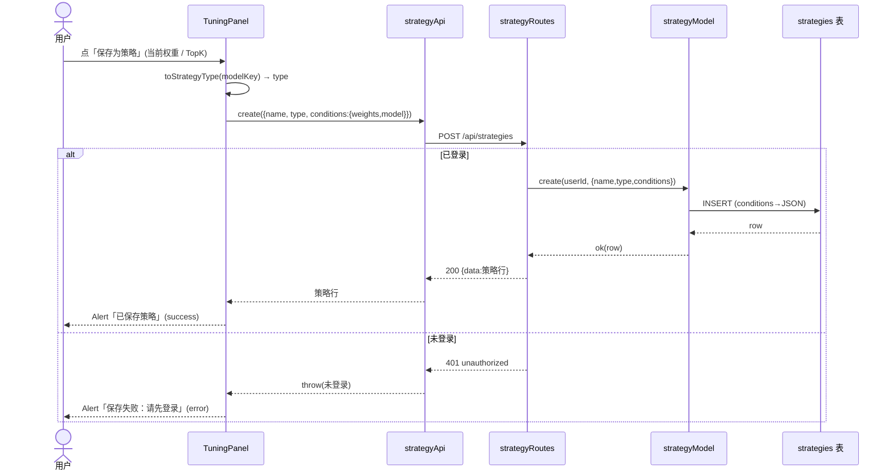
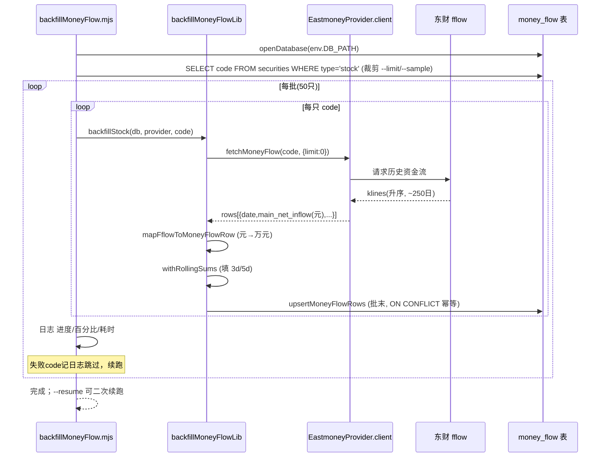
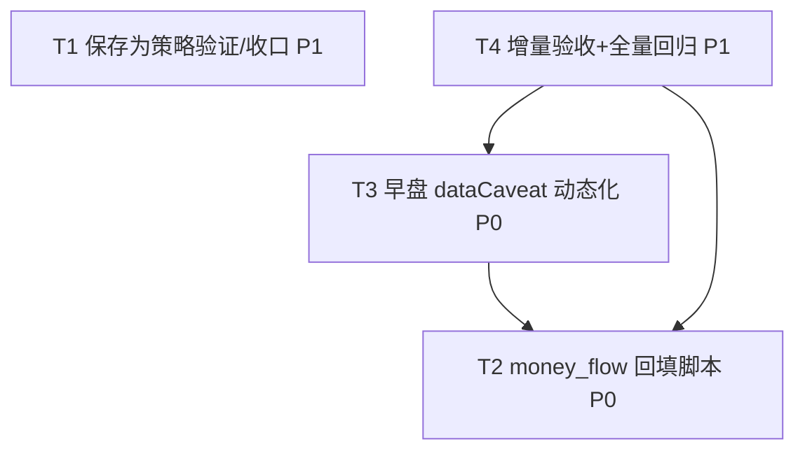

# 回测 + 调参 增量设计文档（v1）

> **架构师**：高见远（Gao） ｜ **范围**：在已测试稳定的基座（T01–T04 + QA T05，159/159 绿）上做最小必要改动
> **硬约束**：不改核心引擎评分/选股/落库逻辑；零新增运行时依赖；保住 `server/tests/backtest.test.js` 对 morning `dataCaveat` 的断言（非空字符串、faithful=false）。

---

## 0. 现状核查结论（决定本设计的关键）

| 增量 | 仓库实际状态 | 结论 |
|---|---|---|
| **增量1 前端「保存为策略」接线** | **已实现**。`client/src/components/backtest/TuningPanel.tsx` 已有 `toStrategyType()`（模型 key→STRATEGY_TYPE 映射）、`handleSave()` 调用 `strategyApi.create({name,type,conditions})`、当前权重按钮 + 每个 TopK 结果行的「存」按钮；`client/src/api/strategy.ts` 已有 `strategyApi.create`；后端 `strategyRoutes`/`strategyModel`/`STRATEGY_TYPE` 齐全。 | **不再需要新代码**，本增量降为「验证 + 可选收口」。 |
| **增量2 money_flow 真实历史回填** | 不存在，需新建脚本。 | 净新增，独立实现。 |
| **增量3 早盘 dataCaveat 动态化** | `backtestService.run()` 调用静态 `getDataCaveat()`。 | 最小改动 `run()` 一处。 |

> ⚠️ 说明：brief 中「保存为策略缺的只是前端接线」与仓库现状不符。本设计以**实际代码**为准，增量1 以验证为主，避免重复造轮子、引入回归风险。

---

## 1. 实现方案总览（框架 / 库 —— 零新增依赖）

全部沿用现有栈，不新增任何 npm 包：

- **后端**：Node ESM（`.mjs` 脚本）；SQLite 经 `db/driver.js`（`openDatabase`，自动 better-sqlite3 / node:sqlite / sql.js 降级）；数据获取经现有 `eastmoneyProvider` → `emClient.fetchMoneyFlow`（fflow 接口，内部已带缓存 + 三道闸 + 熔断）。
- **前端**：React + MUI + axios（`http`/`unwrap`/`httpLong`）+ ECharts，复用 `strategyApi`。
- **测试**：Vitest（`server/tests/*`），mock provider 注入。

---

## 2. 三块增量实现方案

### 2.1 增量1：前端「保存为策略」接线（确认 + 收口）

**已存在接线（无需重写）**：

- `TuningPanel.tsx` 的 `toStrategyType(modelKey)` 已正确映射：

  | 回测模型 key | → 策略 `type`（STRATEGY_TYPE） |
  |---|---|
  | `morning` | `morning` |
  | `closing` | `closing` |
  | `morningPipeline` | `pipeline_morning` |
  | `closingPipeline` | `pipeline_closing` |

- `handleSave(weightsToSave, labelSuffix)` 已调用 `strategyApi.create({ name, type: toStrategyType(modelMeta.key), conditions: { weights: weightsToSave, model: modelMeta.key } })`。
- 反馈用内联 MUI `Alert`（`saveMsg` 成功/失败），**零新依赖**；未登录点击 → 后端 `POST /api/strategies` 返回 401 → `saveMsg` 显示失败且不崩溃（符合期待）。
- 后端契约已对齐：`strategyRoutes` 用 `z.enum(Object.values(STRATEGY_TYPE))` 校验 `type`，`conditions: z.any()`；`strategyModel.create(userId,{name,type,conditions})` 将 conditions 统一 `JSON.stringify` 入库。

**收口动作（仅必要项）**：

1. **端到端验证**（见任务 T1）：登录态保存 → `strategies` 表新增行，`type` 命中枚举、`conditions` 含 `{weights, model}`；未登录 → 401。
2. **可选增强（非必需，不阻塞）**：当前策略名自动生成（`回测策略-{label}-{suffix}-{日期}`）。若希望用户自定义名称，可加一个 MUI `Dialog` 输入 `name`（仍走 `strategyApi.create`），但**不引入 notistack 等新依赖**，用现有 `Alert` 或 MUI `Snackbar` 即可。建议先做自动命名，验证通过后再决定是否加 Dialog。

**明确不改动**：`strategyModel` / `strategyRoutes` / `schema`（strategies 表）/ `shared/constants.js`。

---

### 2.2 增量2：money_flow 真实历史回填脚本（新文件）

#### 2.2.1 文件构成
- `server/scripts/backfillMoneyFlow.mjs`（**新增**，CLI 入口）
- `server/scripts/backfillMoneyFlowLib.mjs`（**新增**，纯函数 + 批处理/断点/重试逻辑，便于单测）
- `server/tests/backfillMoneyFlow.test.js`（**新增**，mock provider 单测）

#### 2.2.2 复用（不新建）
- `db/driver.js` → `openDatabase(env.DB_PATH)` 打开真实库。
- `providers/eastmoneyProvider.js` → `createEastmoneyProvider(db)`；取其 `.client.fetchMoneyFlow(code, { limit: 0 })`（fflow 接口）。`fetchMoneyFlow` 内部已做缓存/三道闸/熔断，脚本无需重复实现闸；仅做礼貌性批间限速。
- `emClient.fetchMoneyFlow` 返回：按日期升序的数组，每元素 `decodeOrdered` 解析为 `{ date, main_net_inflow, small/medium/large/super_net_inflow, main/small/medium/large/super_net_pct, close, pct_chg }`（均带 `code`）。

#### 2.2.3 ⚠️ 单位口径（最高优先级约定）
- **fflow 返回的 `main_net_inflow` 单位为「元」**（`FFLOW_FIELDS` 中 `unit:'元'`，但 `decodeOrdered` 仅 `toNum(v, def.scale ?? 1)`，`scale` 未定义 → 不换算，原值「元」）。
- **`money_flow.main_net_inflow` 历史口径为「万元」**：`seedMoneyFlow` 将真实值 `÷10000` 入库，`scoreService` 读取 `net_inflow_3d` 时注释与展示均为「万」。
- **结论**：回填脚本必须将 `main_net_inflow = fflow.main_net_inflow / 10000`（万元）。**若漏掉 ÷10000，净流入量级放大万倍，分位池 `netInflow3d` 失真，早盘评分彻底失准**。这是本增量唯一不可妥协的口径红线。

#### 2.2.4 net_inflow_3d / net_inflow_5d 口径
- fflow **不返回** 3d/5d 字段（只有每日 `main_net_inflow` 及 small/medium/large/super 拆分）。
- 回填采用**序列滚动求和**（与 seed 的「随机系数派生」不同，回填用真实滚动和，量级一致、语义正确）：对单只股票按 `date` 升序，`net_inflow_3d = 近 3 个交易日 main_net_inflow(万元) 之和`，`net_inflow_5d = 近 5 个交易日之和`。
- 注意：`getBaseSnapshotsAsOf(T)` 用 `LEFT JOIN money_flow mf ON mf.trade_date = ?` 取 `mf.net_inflow_3d`，`computeAsOfPool(T)` 取当日全市场 `net_inflow_3d` 做分位池——回填后每只股票在**历史每个交易日**都有对应 `money_flow` 行，AS-OF-T 连接才真正生效，早盘从历史"单点派生"升级为"历史真实序列"。

#### 2.2.5 纯函数签名（便于 QA 单测）
```js
// 单只股票单行映射：fflow 行 -> money_flow 行（单位换算在此时发生）
mapFflowToMoneyFlowRow(code: string, rawRow: {
  date: string; main_net_inflow: number; /* 元 */
  small_net_inflow?: number; medium_net_inflow?: number;
  large_net_inflow?: number; super_net_inflow?: number; /* 元，备用 */
  close?: number; pct_chg?: number;
}): {
  code: string; trade_date: string;            // = rawRow.date
  main_net_inflow: number;                     // = rawRow.main_net_inflow / 10000  (万元)
  net_inflow_3d: number | null;               // 本函数置 null，由 withRollingSums 填
  net_inflow_5d: number | null;               // 同上
  data_origin: 'real';
}

// 单只股票有序序列 -> 填好滚动 3d/5d（纯函数，可单测）
withRollingSums(rows: MoneyFlowRow[]): MoneyFlowRow[]
//   前置：rows 已按 trade_date 升序
//   逻辑：net_inflow_3d[i] = sum(main_net_inflow[i-2..i]); net_inflow_5d[i] = sum(i-4..i)
//        边界（不足 N 日）取可用窗口之和

// 幂等 upsert（键 code+trade_date）
upsertMoneyFlowRows(db, rows: MoneyFlowRow[]): void
//   SQL 契约：
//   INSERT INTO money_flow (code, trade_date, main_net_inflow, net_inflow_3d, net_inflow_5d, data_origin)
//   VALUES (?,?,?,?,?,?)
//   ON CONFLICT(code, trade_date) DO UPDATE SET
//     main_net_inflow=excluded.main_net_inflow,
//     net_inflow_3d=excluded.net_inflow_3d,
//     net_inflow_5d=excluded.net_inflow_5d,
//     data_origin=excluded.data_origin;
```

#### 2.2.6 CLI / 批处理 / 限流 / 断点 / 重试
- **入口**：`node server/scripts/backfillMoneyFlow.mjs [--limit N] [--sample] [--delay MS] [--resume] [--dry-run]`。
  - `--limit N` / `--sample`：只取前 N 只（或随机抽样）便于测试，避免全市场数千只触发东财风控。
  - `--delay MS`：批间 sleep（默认如 200ms），与 emClient 内置闸叠加，礼貌限速。
  - `--resume`：跳过 `money_flow` 行数 ≥ 阈值（如 ≥240）的 code，实现断点续跑。
  - `--dry-run`：只打印计划，不写库。
- **主流程**（lib 内，`backfillStock(db, provider, code, opts)` 可注入 provider 便于测试）：
  1. `codes = db.all("SELECT code FROM securities WHERE type='stock'")`；按 `--limit/--sample` 裁剪。
  2. 分批（如 50 只/批），每批内逐只 `provider.client.fetchMoneyFlow(code,{limit:0})` → `rows.map(mapFflowToMoneyFlowRow)` → `withRollingSums` → 收集 → 批末 `upsertMoneyFlowRows(db, batch)`（事务提交）。
  3. **失败处理**：fetch 返回 `[]` 或抛错 → 记日志、跳过该 code、**继续**全量，不中断。
  4. **进度日志**：每批打印 `已完成/总数 百分比 本批耗时 累计耗时`。
- **数据范围**：`daily_quotes` 覆盖 2025-08-12~2026-08-12（约 243 交易日）；fflow 一次约返回近 250 日 → 每只 1 次调用即拿全量历史。全市场数千只 → 必须分批 + 日志 + 重试/跳过，避免东财风控。

---

### 2.3 增量3：早盘 dataCaveat 动态化（改 backtestService.js）

#### 2.3.1 现状
`run()` 第 364 行 `const dataCaveat = getDataCaveat(model);` → morning 永远返回静态 `MORNING_DATA_CAVEAT`。

#### 2.3.2 新设计（仅改 `run()` 内这部分）
- 新增内部 helper `computeMorningAuxCoverage(db, range)`：
  - 期望行数 `expected = (SELECT COUNT(*) FROM securities WHERE type='stock') × (SELECT COUNT(DISTINCT trade_date) FROM daily_quotes WHERE trade_date BETWEEN ? AND ?)`。
  - 实际行数 `actual = SELECT COUNT(*) FROM money_flow WHERE trade_date BETWEEN ? AND ? AND main_net_inflow IS NOT NULL`。
  - `coverage = actual / expected`（区间占比）。
- `run()` 内：
  ```js
  const dataCaveat = isMorningModel(model)
    ? buildMorningDataCaveat(db, req.range)   // 动态
    : null;                                   // closing 系不变
  ```
  `buildMorningDataCaveat` 规则：
  - `cov = computeMorningAuxCoverage(db, range)`
  - 若 `cov.moneyFlowReal`（默认 `coverage ≥ 0.5`）→ `'morning aux partial: money_flow real, auction/limit/sector derived'`
  - 否则 → 兜底 `MORNING_DATA_CAVEAT`（`'morning aux data sparse, results not faithful'`，恒定非空）
- **硬性约束（保住 backtest.test.js）**：
  - morning 的 `dataCaveat` **永远非空字符串**；`faithful` **永远 false**（由 `getModels()` 静态元数据决定，不改）。
  - backfill 前 coverage≈0.4% → 走兜底分支，返回原静态串（断言保持通过）。
  - backfill 后 coverage≈100% → 返回 "money_flow real…" 串（仍非空）。
- `auction`/`limit`/`hot_sectors` 无历史接口、恒为派生 → 动态文本里如实标注 `auction/limit/sector derived`。
- **getModels() 保持静态**：`faithful=false`、`dataCaveat=MORNING_DATA_CAVEAT`（非空，保住 getModels 断言）。动态细节只在 `run()` 结果里体现（brief 二选一选项，本文选「保持静态，动态仅在 run 结果」）。如后续需要，可在 `run()` 结果上附可选字段 `auxCoverage`，但**本期最小改动不加**。

#### 2.3.3 明确不改
`run()` 评分/选股/落库核心、`buildSnapshots`、`getAsOfPool`/`poolCache`、`summarize`、`closing`/`closingPipeline` 行为、`MORNING_DATA_CAVEAT` 常量（保留为兜底）。

---

## 3. 文件清单（新增 / 修改 + 状态 + 依赖）

| 文件 | 状态 | 增量 | 说明 |
|---|---|---|---|
| `client/src/components/backtest/TuningPanel.tsx` | 已存在（待验证） | 1 | 接线已完成（toStrategyType/handleSave/按钮） |
| `client/src/api/strategy.ts` | 已存在 | 1 | `strategyApi.create` 就绪 |
| `server/src/routes/strategyRoutes.js` | 已存在 | 1 | `POST /api/strategies` 契约校验 |
| `server/src/models/strategyModel.js` | 已存在 | 1 | `create` / `insertPreset` |
| `shared/constants.js` | 已存在 | 1 | `STRATEGY_TYPE` 枚举 |
| `server/scripts/backfillMoneyFlow.mjs` | **新增** | 2 | CLI 入口（--limit/--sample/--delay/--resume/--dry-run） |
| `server/scripts/backfillMoneyFlowLib.mjs` | **新增** | 2 | 纯函数 + 批处理/断点/重试 |
| `server/tests/backfillMoneyFlow.test.js` | **新增** | 2 | mock provider 单测 |
| `server/src/services/backtestService.js` | **修改** | 3 | `run()` 内动态 dataCaveat |
| `server/tests/backtest.test.js` | 不变 | 3 | 断言保住（morning 非空串/false） |
| `server/tests/{no-lookahead,backtest,tuning}.test.js` | 不变 | 1/2/3 | 全量 159/159 绿 |

**依赖关系**：T2（回填脚本）与 T3（动态 caveat）相互独立实现；但 T3 的"动态差异"只有在 T2 回填出真实数据后才体现，故逻辑上 T3 验收依赖 T2。T1 独立。T4（QA）依赖 T2、T3。

---

## 4. 数据结构 / 接口（契约级）

### 4.1 strategies 复用（无新表/模型/路由）
```
前端 TuningPanel.handleSave
  → client/src/api/strategy.ts: strategyApi.create({ name, type, conditions })
  → POST /api/strategies  (optionalAuth；未登录 → 401)
  → strategyModel.create(userId, { name, type, conditions })
       type   : STRATEGY_TYPE 枚举 (morning|closing|pipeline_morning|pipeline_closing)
       conditions: 对象 { weights: Record<string,number>, model: <回测模型key> }
                   → strategyModel 内部 JSON.stringify 入库 (TEXT)
```
> 类型映射（回测模型 key → STRATEGY_TYPE）：`morning→morning`、`closing→closing`、`morningPipeline→pipeline_morning`、`closingPipeline→pipeline_closing`。

### 4.2 money_flow 字段单位口径（回填后）
| 字段 | 单位 | 来源 | 备注 |
|---|---|---|---|
| `main_net_inflow` | **万元** | fflow `main_net_inflow`(元) ÷ 10000 | 与 seed/scoreService 口径一致 |
| `net_inflow_3d` | **万元** | 近 3 交易日 `main_net_inflow`(万元) 滚动和 | 回填真实；seed 曾用随机系数 |
| `net_inflow_5d` | **万元** | 近 5 交易日 `main_net_inflow`(万元) 滚动和 | 同上 |
| `data_origin` | — | `'real'` | 与派生 `'derived'` 区分 |
| PK | — | `(code, trade_date)` | 幂等 upsert 键 |

### 4.3 纯函数签名（见 §2.2.5）
`mapFflowToMoneyFlowRow(code, rawRow)` ／ `withRollingSums(rows)` ／ `upsertMoneyFlowRows(db, rows)`。

### 4.4 动态 dataCaveat 生成规则（见 §2.3.2）

### 4.5 类关系图（Mermaid，另见 `class-diagram.mermaid`）
```mermaid
classDiagram
  class BacktestService {
    +run(req, userId)
    +buildSnapshots(req)
    +getModels()
    -computeMorningAuxCoverage(db, range)
    -buildMorningDataCaveat(db, range)
  }
  class MoneyFlowTable {
    +code TEXT
    +trade_date TEXT
    +main_net_inflow REAL
    +net_inflow_3d REAL
    +net_inflow_5d REAL
    +data_origin TEXT
  }
  class EastmoneyProvider {
    +client
    +getQuote(code)
  }
  class EmClient {
    +fetchMoneyFlow(code, opts)
  }
  class BackfillScript {
    +main(opts)
    +backfillStock(db, provider, code)
  }
  class BackfillLib {
    +mapFflowToMoneyFlowRow(code, rawRow)
    +withRollingSums(rows)
    +upsertMoneyFlowRows(db, rows)
  }
  class StrategyModel {
    +create(userId, {name,type,conditions})
  }
  class TuningPanel {
    +toStrategyType(key)
    +handleSave(weights, suffix)
  }
  class StrategyApi {
    +create(data)
  }

  BacktestService ..> MoneyFlowTable : 读覆盖度/AS-OF JOIN
  EastmoneyProvider *-- EmClient : 封装
  BackfillScript ..> EastmoneyProvider : 取 client.fetchMoneyFlow
  BackfillScript ..> BackfillLib : 映射+upsert
  BackfillLib ..> MoneyFlowTable : 幂等 upsert
  BackfillScript ..> MoneyFlowTable : 跳过已回填(code)
  TuningPanel ..> StrategyApi : 保存策略
  StrategyApi ..> StrategyModel : POST /api/strategies
```

---

## 5. 时序图（Mermaid，另见 `sequence-diagram.mermaid`）

### 5.1 保存为策略（一次流）


### 5.2 回填脚本（一次流，可选）


---

## 6. 任务分解（≤5，按依赖排序）

> 注：本任务为**增量**（非新建工程），无"项目脚手架"类基建任务；T1 即"接线验证/收口"作为首个任务。

### T1 — 前端「保存为策略」接线验证与收口（增量1）
- **源文件**：`client/src/components/backtest/TuningPanel.tsx`（已含 toStrategyType/handleSave/按钮）、`client/src/api/strategy.ts`、`server/src/routes/strategyRoutes.js`、`server/src/models/strategyModel.js`、`shared/constants.js`
- **依赖**：无
- **优先级**：P1
- **验收点**：
  1. 登录态下 TuningPanel 保存 → `strategies` 表新增行；`type` 经 `toStrategyType` 命中 `STRATEGY_TYPE` 枚举；`conditions` JSON 含 `{weights, model}`。
  2. 未登录点击保存 → 后端 401，前端 `saveMsg` 显示失败且不崩溃。
  3. 全量回归 159/159 不受影响。
- **可选**：命名 Dialog（不引入新依赖）。

### T2 — money_flow 真实历史回填脚本（增量2）
- **源文件（新增）**：`server/scripts/backfillMoneyFlow.mjs`、`server/scripts/backfillMoneyFlowLib.mjs`、`server/tests/backfillMoneyFlow.test.js`
- **复用**：`db/driver.js`(openDatabase)、`providers/eastmoneyProvider.js`(createEastmoneyProvider→.client.fetchMoneyFlow)、`emClient.fetchMoneyFlow`
- **依赖**：无
- **优先级**：P0
- **验收点**：
  1. `mapFflowToMoneyFlowRow` 单测：fflow 行(元) → money_flow 行(`main_net_inflow` 万元、`net_inflow_3d/5d` 置 null、`data_origin='real'`)。
  2. `withRollingSums` 单测：升序序列滚动 3d/5d 正确。
  3. `upsertMoneyFlowRows` 单测：同一 (code,trade_date) 重复写入幂等（覆盖不重复）。
  4. 脚本对 **mock provider**（注入 `client.fetchMoneyFlow`）跑通：逐只调用、批提交、断点续跑(`--resume`)、失败跳过。
  5. 真实样本（如 `--limit 5`）跑通：该股票 `money_flow` 出现**多条**历史 `trade_date` 行（非仅末日），单位与 `scoreService` 读取口径一致（万元）。

### T3 — 早盘 dataCaveat 动态化（增量3，改 backtestService.js）
- **源文件（修改）**：`server/src/services/backtestService.js`（`run()` 内动态生成；新增 `computeMorningAuxCoverage`/`buildMorningDataCaveat` helper；`getModels()` 保持静态）
- **依赖**：T2（逻辑依赖：回填后覆盖度才非零，差异才体现）
- **优先级**：P0
- **验收点**：
  1. 全量回归 159/159 绿；`backtest.test.js` morning `dataCaveat` 断言（非空字符串）通过；`getModels()` morning `faithful=false` 且 `dataCaveat` 非空通过。
  2. 回填后跑 morning 回测 → `dataCaveat` 含 "money_flow real, auction/limit/sector derived"。
  3. 回填前（稀疏）跑 morning 回测 → `dataCaveat` 仍为非空静态串。
  4. `closing`/`closingPipeline` 仍 `dataCaveat=null`、`faithful=true`。

### T4 — 增量验收与全量回归（QA）
- **源文件**：`server/tests/backtest.test.js`（不动）、`server/tests/backfillMoneyFlow.test.js`（T2 产出）、`server/tests/tuning.test.js`（不动）、`qa_e2e` 检查清单（文档/脚本）
- **依赖**：T2、T3
- **优先级**：P1
- **验收点**：
  1. 全量回归 159/159。
  2. 端到端：登录保存策略 → 落库 → `strategies` 列表可见、type/conditions 正确。
  3. 回填脚本真实样本跑通且 `money_flow` 历史行单位正确（万元）。
  4. morning 回测 `dataCaveat` 随覆盖度变化但**始终非空**。

### 任务依赖图


---

## 7. 共享知识 / 约定

1. **单位口径（红线）**：所有 `money_flow` 金额字段以 **万元** 为单位；fflow 原值「元」必须 `÷10000` 后入库；`net_inflow_3d/5d` 为万元级滚动和。与 `seedMoneyFlow` / `scoreService`（`net_inflow` 因子注「万」）保持一致。
2. **幂等 upsert 键**：`money_flow` 主键 `(code, trade_date)`；回填用 `ON CONFLICT(code, trade_date) DO UPDATE`，重复运行安全。
3. **动态 caveat 规则**：morning 永远返回非空串；`coverage ≥ 0.5` → "money_flow real, auction/limit/sector derived"，否则兜底 `MORNING_DATA_CAVEAT`；`faithful` 恒为 false（静态元数据决定）。
4. **mock provider 测试约定**：测试注入 `provider = { client: { fetchMoneyFlow: async (code)=>fakeRows, isCircuitOpen: ()=>false } }` 给 `backfillStock`/`backfillMoneyFlowLib`，无需真实网络；纯函数 `mapFflowToMoneyFlowRow`/`withRollingSums` 直接喂样例数据单测。
5. **回填顺序约定**：`money_flow` 真实数据须在 `npm run seed` **之后**回填；重新 `seed` 会用派生数据覆盖（见 §8 待明确）。
6. **零新增依赖**：不引入任何新 npm 包；反馈用现有 MUI `Alert`/`Snackbar`。
7. **不破坏核心引擎**：`run()` 评分/选股/落库、`buildSnapshots`、`closing` 行为一律不动。

---

## 8. 待明确事项

1. **命名 Dialog**：是否必须让用户自定义策略名？默认自动命名（零摩擦）已满足"保存为策略"。建议先做自动命名，验证通过后再评估 Dialog 必要性。
2. **动态 caveat 阈值**：默认 `coverage ≥ 0.5` 触发 "money_flow real"；如需更严格可上调（如 0.8）。待确认。
3. **回填是否纳入 npm script / CI**：建议加 `npm run backfill:moneyflow`（在 package.json 加脚本指向 `node server/scripts/backfillMoneyFlow.mjs`），首次部署手动跑一次。
4. **重 seed 与回填顺序**：当前 `seed` 会 `deleteByCodes('money_flow', codes)` 再插派生行，会把已回填的 `real` 数据清掉。两种处置：
   - (a) **约定**：先 seed 后 backfill，文档写明，不动 seed（最小改动，推荐）；
   - (b) 改 `seedMoneyFlow` 跳过 `data_origin='real'` 的行（需改稳定 seed，超出"最小改动"，列为待定）。
   建议先采用 (a)。
5. **getModels 是否加 `auxCoverage` 字段**：本期选择"保持静态，动态仅在 run 结果"，如前端想展示覆盖度再议。
6. **回测区间与 fflow 区间对齐**：fflow 一次返回近 250 日，若 `daily_quotes` 区间边缘日期少于 5 日，`net_inflow_5d` 用可用窗口之和（已在 `withRollingSums` 边界处理），是否需要在 coverage 计算时排除边界稀疏日？建议 coverage 用"区间内实际行数 / 期望行数"即可，边界影响可忽略（全量回填后接近 100%）。
