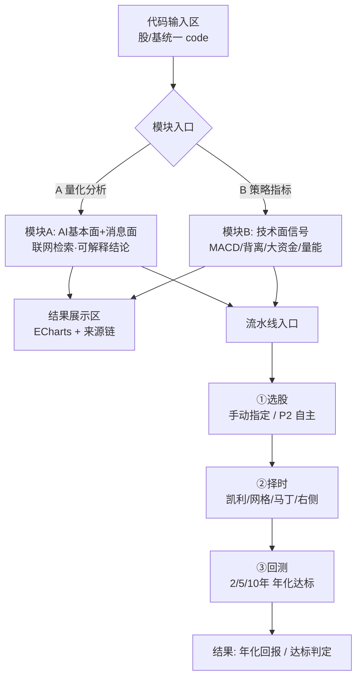

# 智能分析中心 产品需求文档（简单 PRD）

> 版本 v0.1 · 作者 许清楚（Xu）· 日期 2026-08-08
> 范围：quantfolio 新模块「智能分析中心」首版（MVP）需求定义，**不含实现代码**，仅定义需求与边界。

---

## 1. 项目信息

- **Language**：中文（与用户需求一致）
- **Programming Language / 技术栈**（沿用现状，复用既有资产，不重复造轮子）：
  - 后端：Express + SQLite（better-sqlite3）+ JWT + **智谱 GLM-4-flash**（AI）
  - 前端：Vite + React + MUI + Tailwind CSS + ECharts + react-router
  - 可复用基础：`server/src/services/indicatorService.js`（技术指标）、`scoreService.js`（评分）、`rebalanceService.js`（再平衡）、`server/src/providers/`（数据提供方抽象，含 `dataProvider.js` 接口契约与 `sqliteProvider`、`httpProvider` 实现）
  - 现状补注：前端实际为 React + TypeScript；AI 默认走 SiliconFlow DeepSeek-V4-Flash 且支持 BYOK（用户可在「模型设置」页选智谱）。本 PRD 沿用团队确认的智谱 GLM-4-flash，模型一致性细节见 O6。
- **Project Name**：`analysis_center`（snake_case）
- **原始需求复述**：
  在 quantfolio（持仓管理 + 智能选股平台）上新增网站形态的「智能分析中心」，包含**并列且性质不同**的两个分析模块，以及一条承前启后的流水线：
  - **模块 A 量化分析（AI 基本面/消息面）**：输入一个股票/基金代码，AI 联网收集财报、人员配比、资金流、产业链表现（如铜→找过去一段时间铜的行情）、新闻/消息面，给出可解释结论。适用科技潜力股、价值投资、消息面敏感股（铜/油/金，受特朗普发言、港口等影响）。
  - **模块 B 策略指标（技术面）**：输入一个代码，只看盘面已形成的指标——MACD 金叉/死叉、顶/底背离、过去 N 日大资金流入、过去 30 日持续上涨/下跌/横盘震荡、缩量/放量等，只给买卖信号（如 MACD 金叉+上涨→买入信号），不评公司好坏。适用红利、高速、黑白家电等稳定经营类（偏技术、少消息面）。
  - **流水线（做网站而非脚本的核心原因）**：选股（板块→龙头/潜力股，价值 or 趋势）→ 择时（买入/卖出择时，凯利/网格/马丁格尔/右侧止盈）→ 回测（2/5/10 年，年化回报、预期回报是否达标）；步骤间数据传递（如 ETF 埋伏 → 转龙头 → 择时买 → 择时卖）。
  - 股票/基金统一以 code 处理（东方财富接口两者皆支持），模块按 code 统一处理，无需区分。
  - **关键约束**：行情接东方财富实时/历史；AI 情报必须**实时联网检索**，严禁旧闻滞后（用户原话：拿到一个月前的旧闻就会滞后、给错结论）。

---

## 2. 产品定义

### 2.1 Product Goals（3 个正交目标）

- **G1 统一分析入口**：把"基本面/消息面 AI 分析"与"技术面指标信号"两类性质不同的能力，以统一的 code 入口（股票/基金通吃）集成进网站，替代割裂的脚本/散点工具。
- **G2 数据真实且实时**：用东方财富行情（历史 K 线 + 实时报价）替换/增强现有派生数据；量化分析 AI 必须实时联网检索情报，杜绝"拿到一个月前旧闻给错结论"。
- **G3 流水线闭环可复用**：打通"选股→择时→回测"，让前序结论（如 ETF 埋伏→转龙头）作为后序输入，形成网站化投研流水线，而非一次性脚本。

### 2.2 User Stories

- **US1（消息面投资者）**：As a 关注铜/油/金等消息敏感股的投资者，I want 输入一个代码让 AI 收集财报/资金流/产业链/新闻并给出可解释结论，so that 我能快速判断基本面与消息面驱动。
- **US2（技术派投资者）**：As a 偏好红利/家电等稳定经营类的技术派，I want 输入代码只看盘面指标（MACD/背离/大资金/30 日趋势/量能）并拿到买卖信号，so that 我不受公司好坏干扰地获得买卖点。
- **US3（全流程投资者）**：As a 想验证策略的投资者，I want 把分析出的标的送入"选股→择时→回测"流水线，so that 我能确认凯利/网格/马丁/右侧止盈在 2/5/10 年的年化回报是否达标。
- **US4（普通用户）**：As a 普通用户，I want 股票/基金用同一个输入框（都是 code）分析，so that 我无需关心标的类型。
- **US5（时效敏感者）**：As a 怀疑 AI 时效的用户，I want 看到情报的"检索时间 + 来源链接"，so that 我能判断结论是否基于最新消息。

---

## 3. 技术规范

### 3.1 MVP 分期与需求池（优先级 + 依赖）

**分期原则（按团队已拍板决策）**：**先建共享地基（东方财富数据提供方 + 联网检索能力），再让两个模块并行长在上面；流水线入口与步骤导航随模块同期搭好，回测等重逻辑后置。两个模块并行起步，但实现有明确先后依赖。**

| 阶段 | 内容 | 优先级 | 依赖 |
|---|---|---|---|
| **P0 共享地基** | 东方财富数据提供方 + 实时联网检索能力 + 页面骨架/路由 | P0（必须） | 无 |
| **P1 双模块起步** | 模块 A 量化分析 + 模块 B 策略指标 + 流水线入口 + 可视化 | P1（应当） | P0 |
| **P2 增强** | AI 自主选股 / 择时模板库 / 回测引擎 / 多用户隔离 / 时效告警 | P2（可选） | P0/P1 |

#### P0 — 共享地基（Must have，P1 的前置依赖）

- **P0-1** 新增 `eastmoneyProvider` 实现现有 `dataProvider.js` 接口契约（`PROVIDER_METHODS`：getQuote / getQuotes / getDailyKline / listSecurities / getSectorInfo / getLatestSnapshot），经 `DATA_PROVIDER=eastmoney` 切换；历史 K 线 + 实时报价来自东方财富。复用既有 `PROVIDER_METHODS` 契约与 `getProvider` 工厂，不破坏业务层调用。
- **P0-2** 东方财富适配层：限频 / 本地缓存 / 重试 / 降级策略（KEY 与限频策略见 O1）；行情落 `daily_quotes` 与实时缓存，打 `data_origin=real` 合规标注（沿用现有 meta 合规体系）。
- **P0-3** 实时联网检索服务封装：供模块 A 调用，返回结果**必须带来源链接 + 检索时间戳**；方案选型见 O2（智谱内置 web_search / 东方财富新闻接口 / 通用搜索 API；本机代理 127.0.0.1:7890 是否走待定）。
- **P0-4** 「智能分析中心」页面骨架 + react-router 路由：含模块 A/B 入口、统一 code 输入区（股/基不分）、结果展示区、流水线入口与步骤导航。复用《UI 设计优化方案》的 `PageHeader` / `SectionCard` / `EmptyState` 与深色「金融终端」主题（红涨绿跌 `COLORS` 为唯一来源）。

#### P1 — 两个模块并行（Should have，依赖 P0）

- **P1-A** 模块 A 量化分析（AI 基本面+消息面）：取本地方技术指标/评分 + 东方财富行情 + 联网情报 → GLM-4-flash 生成**结构化可解释结论**（JSON：结论 / 置信度 / 引用来源+时间 / 检索时间）。适用 US1 / US5。
- **P1-B** 模块 B 策略指标（技术面）：复用 `indicatorService`（`tech_indicators` 表）+ `money_flow`（大资金流入）+ 衍生规则（顶/底背离、30 日趋势、缩量放量）；按规则给买卖信号（如 MACD 金叉+上涨→买入），不评公司。适用 US2。
- **P1-C** 流水线入口与步骤导航（选股→择时→回测），前序产出（标的/信号）作为后序输入；选股首版建议"用户手动指定代码，AI 仅分析"（AI 自主选股见 O3）。适用 US3 / US4。
- **P1-D** 结果可视化（ECharts）：K 线 + 指标叠加（模块 B）、结论卡片/来源链（模块 A）、流水线步骤进度条。统一红涨绿跌配色，等宽数字。

#### P2 — 增强（Nice to have，依赖 P0/P1）

- **P2-1** 选股阶段 AI 自主选股（板块→龙头/潜力股，价值/趋势）。
- **P2-2** 择时策略库可选模板（凯利 / 网格 / 马丁格尔 / 右侧止盈）。
- **P2-3** 回测引擎（2/5/10 年，年化回报 / 预期回报达标判定）；数据来源与指标组合见 O4。
- **P2-4** 登录/多用户隔离（现有 JWT）：分析记录与流水线存档按账号；是否强制登录见 O5。
- **P2-5** 情报时效告警：结论基于 >N 天旧闻时高亮提示。

**依赖关系**：`P0 → {P1-A, P1-B, P1-C}`（三者相互独立，可并行）；`P1-C` 依赖 `P1-A/P1-B` 产出的标的；`P2-3` 依赖 `P0` 行情 + `P1-B` 指标；`P2-4` 在 `P0` 之后任意阶段可接入。

### 3.2 UI 设计稿（智能分析中心）

**ASCII 布局（桌面端，深色金融终端风格）**

```
┌───────────────────────────────────────────────────────────────────────┐
│ TopBar: 量化分析中心 | 合规提示条(行情来源/数据真实性) | 模型设置       │
├──────┬────────────────────────────────────────────────────────────────┤
│ Side │  页面标题 [智能分析中心]  (PageHeader)                           │
│ Bar  │  ┌──────────────────────────────────────────────────────────┐  │
│      │  │ 代码输入区: [ 000878 云南铜业 ] [分析]  股/基统一·回车即分析 │  │
│      │  └──────────────────────────────────────────────────────────┘  │
│      │  ┌─────────────── 模块入口(Tab/Toggle) ─────────────────────┐  │
│      │  │ [A 量化分析]  [B 策略指标]                               │  │
│      │  └──────────────────────────────────────────────────────────┘  │
│      │  ┌────────── 结果展示区(SectionCard) ───────────────────────┐  │
│      │  │ A: 结论卡片 + 置信度 + 来源链(链接+检索时间) + ECharts     │  │
│      │  │ B: ECharts K线+MACD叠加 + 买卖信号徽标 + 指标明细表       │  │
│      │  └──────────────────────────────────────────────────────────┘  │
│      │  ┌────────── 流水线入口(步骤导航) ──────────────────────────┐  │
│      │  │ ①选股 → ②择时 → ③回测   [把当前标的送入流水线]          │  │
│      │  └──────────────────────────────────────────────────────────┘  │
└──────┴───────────────────────────────────────────────────────────────┘
```

**Mermaid 页面结构与流水线导航（flowchart）**



### 3.3 待确认问题（Open Questions）

- **O1 东方财富接口选型与限频/KEY 策略**：用官方 push2 行情接口还是第三方封装？是否需要 KEY/签名？限频（次/分、次/日）与本地缓存/重试/降级策略如何定？是否付费？
- **O2 实时联网检索方案**：智谱内置 web_search / 东方财富新闻接口 / 通用搜索 API（SerpAPI、Bing 等）？本机代理 127.0.0.1:7890 是否需走？GLM-4-flash 是否支持工具调用联网检索？返回如何保证带来源链接 + 时间戳？
- **O3 选股阶段范围**：MVP 仅做"用户手动指定代码、AI 只分析"，还是同时做"AI 自主选股（板块→龙头/潜力股，价值/趋势）"？建议首版只做手动指定，AI 自主选股放 P2-1。
- **O4 回测引擎**：数据来源（东方财富历史 K 线需覆盖 2/5/10 年，接口深度/频率？还是派生 K 线？）；指标组合（技术面信号如何定义回测买卖规则）；与现有 `scoreService` / `rebalanceService` 的关系。
- **O5 是否需要登录/多用户（现有 JWT）**：分析中心是否强制登录？游客只读 vs 登录后存档/历史？还是暂不做多用户、单机本地用？
- **O6 AI 模型一致性**：团队背景写"智谱 GLM-4-flash"，但现有平台默认 SiliconFlow DeepSeek-V4-Flash 且支持 BYOK（用户可在模型设置选智谱）。模块 A/B 是否沿用现有 BYOK 框架（用户可选智谱），还是锁定智谱 GLM-4-flash？
- **O7 行情合规标注**：接东方财富实时数据后，顶部"行情截至 X 收盘 / 历史 K 线为模拟"提示条如何更新？real 数据的免责声明文案。
