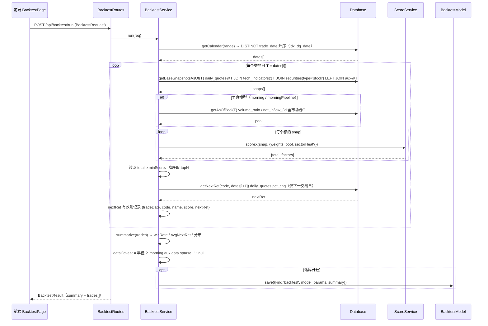
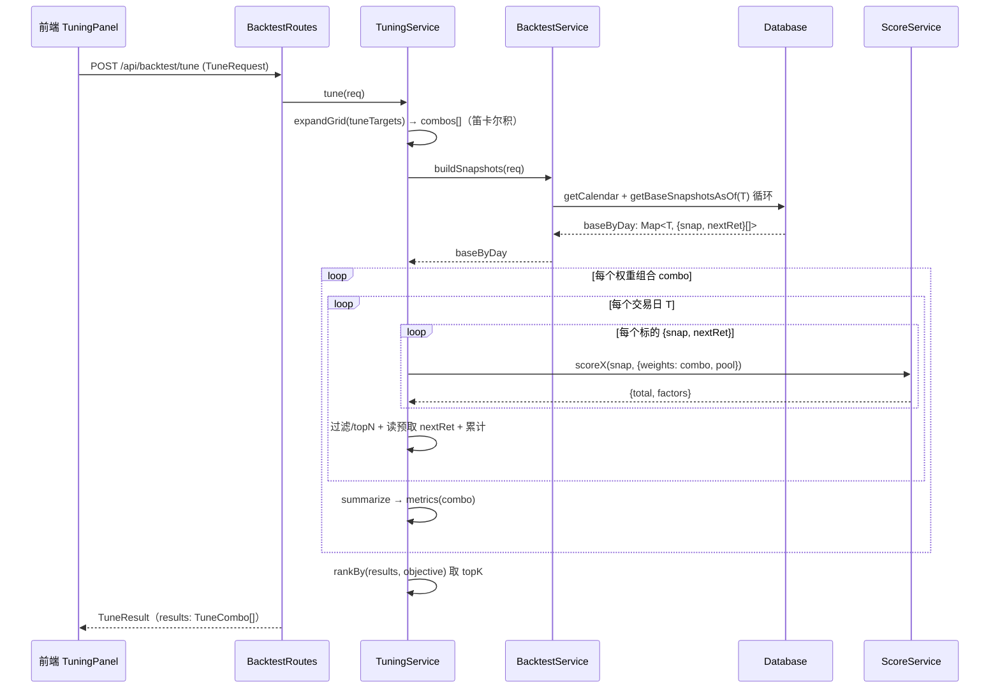
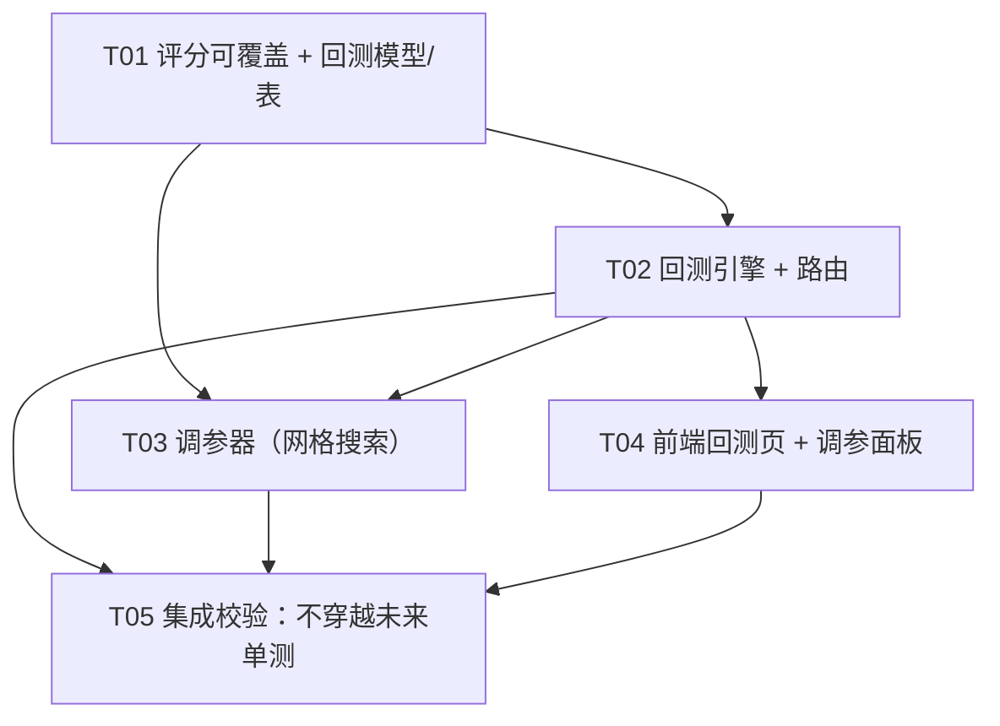

# Quantfolio 回测 + 调参 系统架构设计（Bob / 高见远）

> 范围：后端回测引擎 + 调参器 + 路由 + 结果表；前端回测结果页 + 调参面板。
> 原则：复用现有栈（Express + driver 抽象 + zod；React + TS + MUI + Tailwind + Vite），**零新增框架/依赖**。
> 最高优先级正确性约束：**不穿越未来（No Look-ahead）**。

---

## Part A：系统设计

### 1. 实现方案（Implementation Approach）

#### 1.1 核心技术难点
| 难点 | 说明 | 对策 |
|------|------|------|
| **不穿越未来** | T 日只能用到 T 及之前的数据；`scoreService.getPool()` 当前用 `MAX(trade_date)`（最新日）做分位归一化，回测若复用会**泄漏未来** | 所有 AS-OF-T 查询用 `trade_date = T` 等值；早盘分位池改为**注入 AS-OF-T 全市场池**（见 §3 / 共享知识） |
| **性能（~145 万次打分）** | 243 交易日 × ~6000 只 = 1,458,000 次 score 调用 | ① 按交易日分块（每天 ~6000 行，避免全表物化）；② 用 `driver.iterate` 流式读数；③ **调参复用快照**：权重与快照解耦，每个 T 的快照只物化一次，多组合仅重算评分 |
| **早盘辅助数据稀疏** | money_flow/auction/limit/hot_sectors 历史近乎缺失 → 早盘评分大量 fallback 到中性/0 分 | 引擎照常跑，但 `summary.dataCaveat` 标注 `'morning aux data sparse, results not faithful'`；前端红色横幅提示 |
| **调参可解释性** | 因子权重即旋钮 | 网格搜索（Grid Search）：固定部分权重，对目标因子按步长枚举组合，每组合跑回测，按 objective 排序返回 Top K |

#### 1.2 框架 / 库选型（**零新增**）
- **后端**：Express（现有）、`zod`（现有，路由校验复用）、`driver.js` 统一 DB API（**业务层只能经此文件**）、`ok()/unwrap()` 响应封装（现有 `util/response.js` + 前端 `api/http.ts`）。
- **前端**：React + TS + MUI + Tailwind（现有）；图表复用 `components/charts/*`（DonutChart/RadarChart 等，基于 recharts）；API 客户端复用 `api/http.ts` 的 `http` + `unwrap`。
- **无强理由引入新框架**。若未来回测变慢，再考虑异步任务（taskId + 轮询），本期不做。

#### 1.3 架构模式
- 后端：**Service 层**（backtestService / tuningService）+ **Route 层**（backtestRoutes）+ **Model 层**（backtestModel）+ **Driver 适配层**（driver.js，唯一 DB 入口）。与现有 `screenerRoutes → screenerService → db` 一致。
- 引擎**模型无关**：统一接口 `scoreX(snap, ctx)` 同时支持 `morning / closing / closingPipeline / morningPipeline`，通过 `model` 字段路由。
- 前端：**页面（BacktestPage）+ 面板组件（TuningPanel / BacktestResultCards / TradeTable / DataCaveatBanner）**，状态用本地 `useState`/`useQuery` 即可，不引入新状态库。

---

### 2. 文件清单（相对路径，标注 新增 / 修改）

| 路径 | 状态 | 说明 |
|------|------|------|
| `server/src/services/backtestService.js` | **新增** | 回测引擎：日历、AS-OF-T 快照构造、评分、过滤/topN、次日收益、汇总、dataCaveat；导出 `buildSnapshots(req)` 供调参复用 |
| `server/src/services/tuningService.js` | **新增** | 调参器：网格展开、按 objective 排序、采样加速 |
| `server/src/config/tuning.js` | **新增** | 调参默认配置：各模型可调因子白名单、objective→metric 映射、默认采样步长 |
| `server/src/util/gridSearch.js` | **新增** | 纯函数：笛卡尔积展开 `expandGrid(targets)` + 排序 `rankBy(results, objective)`（可单测） |
| `server/src/services/scoreService.js` | **修改** | `scoreMorning/scoreClosing/scoreClosingPipeline/scoreMorningPipeline` 增加 `weights` 入参（默认 null→用 config）；早盘函数支持 `ctx.pool`（AS-OF-T 分位池）与 `ctx.sectorHeat/ctx.mainlineTier`（AS-OF-T 板块热度） |
| `server/src/config/scoring.js` | **修改** | 保持为默认值来源；新增 `DEFAULT_WEIGHTS_BY_MODEL` 映射（morning→MORNING_WEIGHTS 等），供前端滑块与调参白名单复用 |
| `server/src/routes/backtestRoutes.js` | **新增** | `POST /backtest/run`、`POST /backtest/tune`、`GET /backtest/models` |
| `server/src/models/backtestModel.js` | **新增** | `backtests` 表 CRUD（存汇总+参数，逐笔不入） |
| `server/src/db/schema.js` | **修改** | 追加 `backtests` 表 DDL + `initSchema` 幂等迁移 |
| `server/src/app.js` | **修改** | 注册 `app.use('/api/backtest', createBacktestRoutes(db))` |
| `client/src/api/backtest.ts` | **新增** | `backtestApi.run / tune / models` |
| `client/src/pages/BacktestPage.tsx` | **新增** | 回测结果页：选模型/区间/topN/阈值 → 跑 → 指标卡 + 收益分布 + 逐笔表 |
| `client/src/components/backtest/TuningPanel.tsx` | **新增** | 权重滑块（暴露 MORNING_WEIGHTS/CLOSING_WEIGHTS 各因子）→ 批量跑 → 指标对比 → 保存为策略 |
| `client/src/components/backtest/BacktestResultCards.tsx` | **新增** | 胜率 / 平均次日收益 / 赢家均收益 指标卡（复用 `StatCard`） |
| `client/src/components/backtest/TradeTable.tsx` | **新增** | 逐笔列表（虚拟滚动/分页，红涨绿跌） |
| `client/src/components/backtest/DataCaveatBanner.tsx` | **新增** | 早盘红色「数据待补」横幅 |
| `client/src/App.tsx` | **修改** | 增加 `/backtest` 路由 |
| `client/src/components/layout/SideBar.tsx` | **修改** | `NAV_ITEMS` 增加「回测 / 调参」导航项 |
| `docs/system_design.md` | **新增** | 本文档 |
| `docs/sequence-diagram.mermaid` | **新增** | 时序图（回测 / 调参） |
| `docs/class-diagram.mermaid` | **新增** | 类图 |

---

### 3. 数据模型与接口

#### 3.1 类图（Mermaid，详见 `docs/class-diagram.mermaid`）

```mermaid
classDiagram
    class BacktestRequest {
      +model: 'morning'|'closing'|'closingPipeline'|'morningPipeline'
      +range: [string, string]
      +topN: number
      +minScore: number
      +weightsOverride: object|null
      +nextDayReturnField: string
      +sampling: {step:number}|null
    }
    class BacktestResult {
      +model: string
      +dataCaveat: string|null
      +summary: BacktestSummary
      +trades: TradeRow[]
      +params: object
    }
    class BacktestSummary {
      +days: number
      +picks: number
      +winRate: number
      +avgNextRet: number
      +avgWinRet: number
      +avgLossRet: number
      +retDistribution: RetBucket[]
    }
    class TradeRow {
      +tradeDate: string
      +code: string
      +name: string
      +score: number
      +nextRet: number
    }
    class TuneRequest {
      +model: string
      +range: [string,string]
      +topN: number
      +minScore: number
      +tuneTargets: object
      +objective: 'winRate'|'avgRet'
      +sampling: {step:number}
      +topK: number
    }
    class TuneResult {
      +model: string
      +objective: string
      +combinations: number
      +results: TuneCombo[]
      +dataCaveat: string|null
    }
    class TuneCombo {
      +rank: number
      +weights: object
      +metrics: BacktestSummary
    }
    class BacktestService {
      +run(req: BacktestRequest): BacktestResult
      +buildSnapshots(req): Map~date,Snap[]~
      -getCalendar(range): string[]
      -getBaseSnapshotsAsOf(T): Snap[]
      -getAsOfPool(T): Pool
      -scoreAll(snaps, model, weights, pool): Scored[]
      -summarize(trades): BacktestSummary
    }
    class TuningService {
      +tune(req: TuneRequest): TuneResult
      -expandGrid(targets): object[]
      -evaluateCombo(combo, base): BacktestSummary
    }
    class ScoreService {
      +scoreMorning(snap, ctx): ScoreDetail
      +scoreClosing(snap, weights?): ScoreDetail
      +scoreClosingPipeline(snap): ScoreDetail
      +scoreMorningPipeline(snap, ctx): ScoreDetail
    }
    class BacktestModel {
      +save(row): number
      +list(userId, kind): BacktestRecord[]
      +getById(id): BacktestRecord
    }
    class BacktestRoutes {
      +POST /backtest/run
      +POST /backtest/tune
      +GET /backtest/models
    }
    class Database {
      +all(sql, params): object[]
      +get(sql, params): object
      +prepare(sql): Statement
      +transaction(fn): fn
    }

    BacktestRoutes --> BacktestService : calls
    BacktestRoutes --> TuningService : calls
    BacktestService --> ScoreService : score each snap
    BacktestService --> Database : read as-of-T
    BacktestService --> BacktestModel : optional save
    TuningService --> BacktestService : buildSnapshots + run per combo
    BacktestModel ..> Database : read/write
```

#### 3.2 回测入参 / 出参（JSON Schema）

**POST `/api/backtest/run` — Request**
```json
{
  "model": "closing",
  "range": ["2025-08-12", "2026-08-10"],
  "topN": 20,
  "minScore": 60,
  "weightsOverride": null,
  "nextDayReturnField": "pct_chg",
  "sampling": null
}
```
- `model`：枚举 `morning | closing | closingPipeline | morningPipeline`。
- `range`：`[start, end]` 闭区间，YYYY-MM-DD，落在 `daily_quotes` 交易日历内。
- `topN`：每交易日入选标的数（默认 20）。
- `minScore`：入选分数阈值（默认 0 = 全选后取 topN）。
- `weightsOverride`：`null` 用 config 默认；否则传 `{factorKey: weight}` 部分覆盖（仅对加权模型 `morning/closing` 生效；pipeline 模型为点数制，忽略权重）。
- `nextDayReturnField`：次日收益字段，默认 `pct_chg`（来自 `daily_quotes` 在下一交易日的值）。
- `sampling`：`null` 全量；`{step: N}` 每 N 个交易日取 1 个（调参用，注明采样）。

**POST `/api/backtest/run` — Response（经 `ok()` 包裹）**
```json
{
  "model": "closing",
  "dataCaveat": null,
  "summary": {
    "days": 242,
    "picks": 4840,
    "winRate": 0.58,
    "avgNextRet": 0.42,
    "avgWinRet": 1.85,
    "avgLossRet": -1.32,
    "retDistribution": [
      {"bucket": "[-inf,-5)", "count": 120},
      {"bucket": "[-5,-3)",   "count": 310},
      {"bucket": "[-3,-1)",   "count": 720},
      {"bucket": "[-1,0)",    "count": 980},
      {"bucket": "[0,1)",     "count": 1020},
      {"bucket": "[1,3)",     "count": 900},
      {"bucket": "[3,5)",     "count": 520},
      {"bucket": "[5,inf)",   "count": 270}
    ]
  },
  "trades": [
    {"tradeDate": "2025-08-12", "code": "600000", "name": "浦发银行", "score": 82.5, "nextRet": 1.2},
    {"tradeDate": "2025-08-12", "code": "000001", "name": "平安银行", "score": 78.0, "nextRet": -0.4}
  ],
  "params": { "model": "closing", "range": ["2025-08-12","2026-08-10"], "topN": 20, "minScore": 60, "weightsOverride": null, "sampling": null }
}
```
- `dataCaveat`：早盘模型为 `'morning aux data sparse, results not faithful'`；尾盘模型为 `null`。
- `days`：实际产生有效（含次日收益）入选的交易日数（末交易日无 T+1，不计入）。
- `picks`：有次日收益的入选笔数（= `trades.length`）。
- `winRate`：`nextRet > 0` 占比。
- `retDistribution`：次日收益分桶计数（桶边界可配，默认如上 8 桶）。
- `trades`：逐笔；可能 ~5000 行，前端虚拟滚动/分页；如需减小响应可加 `cap` 参数（仅返回最近 N 笔 + 全量 summary）。

**GET `/api/backtest/models` — Response**
```json
{
  "models": [
    {"key": "closing",          "label": "尾盘 C-11", "faithful": true,  "dataCaveat": null,
     "factorKeys": ["trend","momentum","volume","valuation"], "weightsSource": "CLOSING_WEIGHTS"},
    {"key": "closingPipeline",  "label": "尾盘五步法", "faithful": true,  "dataCaveat": null,
     "factorKeys": ["volume_streak","pct_chg","turnover","ma_bullish","high_60d"], "weightsSource": "point-system"},
    {"key": "morning",          "label": "早盘 M-03", "faithful": false, "dataCaveat": "morning aux data sparse, results not faithful",
     "factorKeys": ["volume_ratio","auction","net_inflow","limit_up","turnover","sector_heat"], "weightsSource": "MORNING_WEIGHTS"},
    {"key": "morningPipeline",  "label": "早盘七步法", "faithful": false, "dataCaveat": "morning aux data sparse, results not faithful",
     "factorKeys": ["volume_ratio_rank","auction_pct","auction_vol_ratio","limit_up","sector_heat","first_trade_vol"], "weightsSource": "point-system"}
  ]
}
```

#### 3.3 调参入参 / 出参（JSON Schema）

**POST `/api/backtest/tune` — Request**
```json
{
  "model": "closing",
  "range": ["2025-08-12", "2026-08-10"],
  "topN": 20,
  "minScore": 60,
  "tuneTargets": { "trend": [0.25, 0.35, 0.45], "momentum": [0.15, 0.25, 0.35] },
  "objective": "winRate",
  "sampling": { "step": 5 },
  "topK": 10
}
```
- `tuneTargets`：`{ factorKey: [v1, v2, ...] }`，仅对加权模型（`morning/closing`）生效；其余因子权重用 config 默认。
- `objective`：`winRate`（天天红）| `avgRet`（平均多赚）。
- `sampling.step`：调参默认 `5`（每 5 交易日取 1，~49 天），加速网格。
- `topK`：返回排序后的组合数（默认 10）。

**POST `/api/backtest/tune` — Response**
```json
{
  "model": "closing",
  "objective": "winRate",
  "combinations": 9,
  "dataCaveat": null,
  "results": [
    {"rank": 1, "weights": {"trend":0.45,"momentum":0.35,"volume":0.25,"valuation":0.15},
     "metrics": {"winRate":0.61,"avgNextRet":0.40,"avgWinRet":1.90,"avgLossRet":-1.40,"days":49,"picks":980}},
    {"rank": 2, "weights": {"trend":0.35,"momentum":0.35,"volume":0.25,"valuation":0.15},
     "metrics": {"winRate":0.60,"avgNextRet":0.38,"avgWinRet":1.88,"avgLossRet":-1.42,"days":49,"picks":980}}
  ]
}
```

#### 3.4 可选 `backtests` 结果表（落库汇总 + 参数，逐笔不入）

```sql
CREATE TABLE IF NOT EXISTS backtests (
  id         INTEGER PRIMARY KEY AUTOINCREMENT,
  user_id    INTEGER,
  kind       TEXT NOT NULL CHECK (kind IN ('backtest','tune')),
  model      TEXT NOT NULL,
  params     TEXT NOT NULL,          -- JSON：请求体
  summary    TEXT NOT NULL,          -- JSON：summary（tune 时为最优组合 metrics）
  objective  TEXT,                   -- tune 专用
  best_weights TEXT,                 -- tune 专用：Top1 组合权重
  created_at TEXT NOT NULL DEFAULT (datetime('now')),
  FOREIGN KEY (user_id) REFERENCES users(id) ON DELETE CASCADE
);
CREATE INDEX IF NOT EXISTS idx_backtests_user ON backtests(user_id, kind);
```
- **逐笔 `trades` 不落库**（体积大，前端按需重跑或内存展示）。
- 落库为**可选开关**（默认开启汇总落库，便于回看/对比）；可通过 `env.BACKTEST_PERSIST` 关闭。
- 调参结果 `kind='tune'`，`summary` 存最优组合 metrics，`best_weights` 存 Top1 权重，供「保存为策略」直接读取。

---

### 4. 程序调用流程（详见 `docs/sequence-diagram.mermaid`）

#### 4.1 一次回测请求流（Backtest run）



#### 4.2 一次调参请求流（Tune）



---

### 5. 待明确事项（Anything Unclear）

1. **`daily_quotes.pe_ttm` / `circ_mv` 历史填充覆盖率未知**：表结构含该字段（估值因子 `CLOSING_WEIGHTS.valuation = 0.6×PE + 0.4×mv` 可用），但数据核查仅确认 `close/pre_close/pct_chg/volume_ratio/turnover_rate` 全量。若 `pe_ttm/circ_mv` 历史大量缺失，尾盘估值子因子会 fallback 到 `MISSING_SCORE_CLOSING=50`（中性），影响忠实度但**仅限 valuation 子项**。→ 建议回测前跑一次覆盖率核查（COUNT where not null / total）。
2. **前端独立页 vs 并入分析中心**：建议**独立页 `/backtest`**（功能独立、含长表单与滑块、与「分析中心」的 quant/signal 定位不同）。若主理人倾向并入，可放在 AnalysisCenter 下 Tab，但路由/导航改动相同。
3. **回测结果是否落库**：建议**汇总+参数落 `backtests` 表（默认开），逐笔不入**。待主理人确认默认开关与是否需「回看历史列表」UI。
4. **同步 vs 异步执行**：243 天全量回测预估数秒~数十秒。本期**同步**（前端 loading + 放宽超时）；若实测偏慢，再升级为异步 taskId + 轮询（不在本期）。
5. **`trades` 响应体积**：可能 ~5000 行。默认全量返回 + 前端虚拟滚动；若需减小，加 `cap` 参数（仅返回最近 N 笔，summary 仍全量）。待确认是否要 `cap`。
6. **调参采样默认值**：默认 `step=5`（约 49 天）。是否足够有代表性待实测；可调。
7. **「保存为策略」写入字段**：调参选定组合 → 写 `strategies` 表（`type` 对应 morning/closing，`conditions` 存权重 JSON）。复用 `strategyModel.create`，需确认 `type` 取值与前端策略页兼容（现有 type 枚举：morning/closing/pipeline_morning/pipeline_closing）。

---

## Part B：任务分解

### 6. 依赖包清单（Required Packages）

**零新增**。全部复用现有栈：

```
# 后端（已存在，无需安装）
express            # Web 框架
zod                # 路由入参校验（screenerRoutes 已用）
# 数据库经由 server/src/db/driver.js（better-sqlite3 / node:sqlite 降级，本机实际 node:sqlite）

# 前端（已存在，无需安装）
react / react-dom  # UI
typescript         # 类型
@mui/material      # 组件（StatCard / Slider / Table 等）
tailwindcss        # 样式
recharts           # 图表（收益分布直方图/胜率环图，复用 components/charts）
vite               # 构建（Express 托管 dist）
```

> 无任何新依赖；若现有图表组件不足以画「收益分布直方图」，优先用现有 BarChart 封装，不引入新库。

---

### 7. 任务清单（有序、含依赖、≤5 个，按实现顺序）

| Task ID | 任务名称 | 源文件（来自 §2） | 依赖 | 优先级 | 服务于「早盘数据待补」 |
|---------|----------|-------------------|------|--------|------------------------|
| **T01** | 评分可覆盖 + 回测数据模型与表（共享基础） | `scoreService.js`(改)、`config/scoring.js`(改)、`db/schema.js`(改)、`models/backtestModel.js`(新) | 无 | P0 | ✅ 早盘 `ctx.pool` AS-OF-T 注入是「结果可忠实标注」的前提 |
| **T02** | 回测引擎 + 路由 | `backtestService.js`(新)、`routes/backtestRoutes.js`(新)、`app.js`(改) | T01 | P0 | ✅ `dataCaveat` 标注 + 不穿越未来主实现 |
| **T03** | 调参器（网格搜索） | `tuningService.js`(新)、`config/tuning.js`(新)、`util/gridSearch.js`(新) | T01, T02 | P1 | —（调参对象含早盘时继承其 dataCaveat） |
| **T04** | 前端回测页 + 调参面板 | `api/backtest.ts`(新)、`pages/BacktestPage.tsx`(新)、`components/backtest/TuningPanel.tsx`(新)、`components/backtest/BacktestResultCards.tsx`(新)、`components/backtest/TradeTable.tsx`(新)、`components/backtest/DataCaveatBanner.tsx`(新)、`App.tsx`(改)、`SideBar.tsx`(改) | T02 | P1 | ✅ **直接责任**：早盘红色「数据待补」横幅 |
| **T05** | 集成校验：不穿越未来单测 + 端到端 | `tests/backtest.test.js`(新)、`tests/tuning.test.js`(新)、`tests/no-lookahead.test.js`(新) | T02, T03, T04 | P2 | ✅ 断言早盘 dataCaveat + 无未来泄漏 |

**任务说明（实现顺序即上表顺序）**：
- **T01** 是全部后端任务的地基：把写死的 `scoreMorning/scoreClosing` 改为支持 `weights` 覆盖 + 早盘 `ctx.pool` 注入；同时建好 `backtests` 表与 Model，使 T02/T03 可落库。
- **T02** 实现核心回测引擎与不穿越未来约束，并暴露 `GET /models`（含 `faithful`/`dataCaveat` 标记）。
- **T03** 复用 T02 的 `buildSnapshots`（快照与权重解耦，一次物化、多组合重算），做网格搜索。
- **T04** 落地 UI，其中 `DataCaveatBanner` 直接消费 `GET /models` 的 `faithful` 标记，对早盘显示红色「数据待补」。
- **T05** 是质量关卡：断言「T 日查询只用 trade_date=T」「末日无 T+1 不计入」「早盘 dataCaveat 非空」「调参按 objective 正确排序」。

---

### 8. 共享知识（Shared Knowledge / 跨文件约定）

1. **AS-OF-T 快照构造规则（不穿越未来的根基）**
   - 所有「截至 T 日」的数据查询**一律用 `trade_date = T`（等值）**，绝不用 `trade_date <= T`。等值查询天然无法看到 T 之后的数据。
   - 基础快照：`daily_quotes@T JOIN tech_indicators@T JOIN securities(type='stock')`；辅助表 `money_flow / auction_data / limit_records / hot_sectors` 同样用 `trade_date = T` **LEFT JOIN**，缺失即回落到对应 fallback 分数（与实时选股一致）。
   - 下一交易日收益：用交易日历 `dates[i+1]` 取该 code 的 `pct_chg`；若无 T+1 或缺失，则该 pick **不计入**统计（不臆造收益）。

2. **权重 override 透传约定**
   - `scoreMorning(snap, ctx)`、`scoreClosing(snap, weights?)`、`scoreClosingPipeline(snap)`、`scoreMorningPipeline(snap, ctx)` 统一新增可选权重对象：
     - `weights` 为 `null/undefined` → 用 `config/scoring.js` 默认（`MORNING_WEIGHTS` / `CLOSING_WEIGHTS`）。
     - 传部分键 → 仅覆盖对应因子，其余用默认。
   - pipeline 模型为「点数制」，`weights` 忽略（文档注明），调参仅对 `morning/closing` 生效。
   - `backtestService` 负责把 `weightsOverride` 透传进对应 score 函数；`config/scoring.js` 的 `DEFAULT_WEIGHTS_BY_MODEL` 提供前端滑块与调参白名单的默认值来源。

3. **早盘分位池（AS-OF-T）注入约定（关键正确性点）**
   - 早盘的 `volume_ratio`、`net_inflow_3d` 用 `percentileScore(value, pool)` 归一化。
   - **回测必须注入 `ctx.pool = { volumeRatio: [...@T...], netInflow3d: [...@T...] }`**（T 日全市场池），**禁止复用 `scoreService` 内部 `getPool()` 的「最新日」池**（会穿越未来）。
   - `backtestService.getAsOfPool(T)` 负责物化该池（一次/日）。

4. **数据可用性 fallback（与实时一致）**
   - 早盘辅助因子缺失 → `MISSING_SCORE_MORNING = 40`；涨停缺失 → 规则缺省（0/低分）；板块热度缺失 → `40`。
   - 这些 fallback 在回测中与实时选股一致；但因历史缺失，早盘评分会系统性偏中性/偏高 → 这正是 `dataCaveat` 要标注的「结果不忠实」。

5. **`signalRules.evaluate` 备用信号路径（cursor 用法）**
   - 若未来改用 `signalRules.evaluate(ctx)` 作为替代评分：传 `ctx.cursor = T 在 K 线序列中的索引`，内部 `bars.slice(0, cursor+1)`，**只用前 cursor+1 根，不穿越**。
   - 本期主路径用 `scoreService`；cursor 路径作为可替换信号层保留，不实现。

6. **响应 / 解包封装**
   - 后端统一 `res.json(ok(payload, 'ok'))`（`util/response.js`）；前端 `api/http.ts` 用 `unwrap<T>()` 解包。
   - 回测/调参路由校验用 `zod` + `validateBody`（与 `screenerRoutes` 一致）。

7. **模型 faithfulness 标记契约**
   - `GET /backtest/models` 返回每个模型的 `faithful: boolean` 与 `dataCaveat: string|null`。
   - 前端据此：早盘模型顶部显示红色「数据待补，结果仅供参考」横幅；尾盘模型不显示。

8. **调参性能约定**
   - 快照与权重**解耦**：`buildSnapshots(req)` 仅按 `sampling` 物化 AS-OF-T 快照（含预取 `nextRet`）一次；每个权重组合只重算 `scoreX`，不重复查库。
   - 调参默认 `sampling.step=5`，结果标注 `sampling` 以明示非全量。

---

### 9. 任务依赖图（Mermaid）



> 说明：T02/T03/T04/T05 均直接或间接依赖 T01（地基）；T03 依赖 T02（调参复用 `buildSnapshots`）；T05 为终态质量关卡，依赖前四项。
